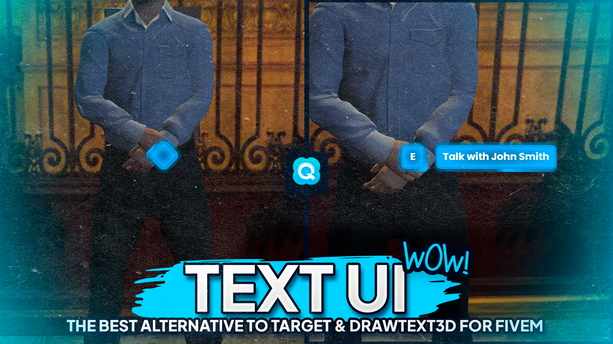

# Text UI

**Quasar Text UI** is an optimized floating text system that replaces outdated **DrawText3D** and **target systems**. It provides a clean, smooth, and efficient interface to enhance the visual and interactive experience in FiveM.&#x20;

<figure><figcaption></figcaption></figure>
