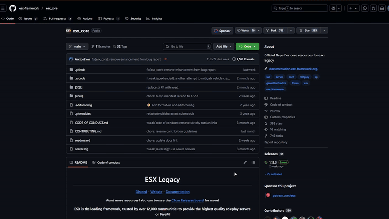
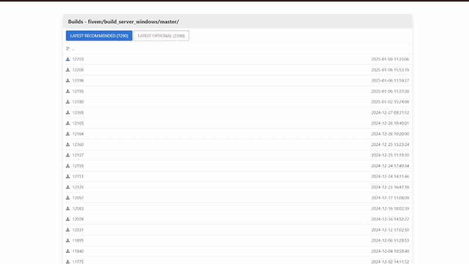
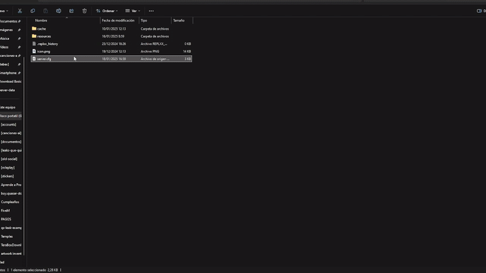

# How to update my server

To ensure your FiveM server runs smoothly and avoids critical issues, it’s essential to keep your framework, artifacts, and gamebuild up to date. Here's a detailed guide:



### Framework

Your server framework is the most important thing, we will always recommend the great ESX, but here is a small guide on how to update it correctly.



### Artifacts

Artifacts are everything on our server, they are the brain of it.



### Gamebuild

The gamebuild is the version of the game or DLC that we will run, we always recommend the latest version.



***

## Framework Update: qb-core or es\_extended

Updating your framework is a crucial step before proceeding with artifacts and gamebuild updates. Follow these steps carefully:



### Download the Official Framework

* For **QBCore**, visit the official [QBCore GitHub repository](https://github.com/qbcore-framework/qb-core).
* For **ES\_Extended**, visit the official [ESX GitHub repository](https://github.com/esx-framework/esx_core).



### Replace Your Current Framework Folder

Completely remove your existing framework folder and replace it with the latest version from GitHub. Avoid merging files as this may cause unexpected issues.



### Do Not Rename the Framework Folder

Keep the folder name exactly as provided by the official repository (e.g., qb-core or es\_extended). Renaming it can lead to severe compatibility problems with scripts, as they rely on specific folder names for proper integration. Renaming your framework does not make it "custom"—it makes it dysfunctional.



<figure><figcaption></figcaption></figure>

***

## Update Artifacts

Artifacts are the core files needed to run your server. Keeping them updated is essential for compatibility with the latest FiveM features.



### **Remove Old Artifacts**

Delete your current `artifacts` folder entirely to avoid leftover files causing issues.



### Download Latest Artifacts

Get the latest version of artifacts for your operating system from the official FiveM links:

* [Windows Artifacts](https://runtime.fivem.net/artifacts/fivem/build_server_windows/master/)
* [Linux Artifacts](https://runtime.fivem.net/artifacts/fivem/build_proot_linux/master/)



### Extract and Replace

Extract the downloaded artifacts and replace your old artifacts folder completely.



<figure><figcaption></figcaption></figure>

***

## Update Gamebuild

Using the latest gamebuild ensures access to new features and prevents compatibility errors.



### Open Your server.cfg file

Find your server.cfg file and open it. In the header add your gamebuild.



### Edit Your Server Configuration

Open the `server.cfg` file and add the following line:

```lua
sv_enforceGameBuild 3258
```

This sets the gamebuild to the latest stable version supported by FiveM.



<figure><figcaption></figcaption></figure>

***

## Why Is This Important?

* Keeping your framework, artifacts, and gamebuild updated ensures your server is compatible with the latest scripts and features.
* Not updating can lead to crashes, bugs, or incomplete functionality.
* Avoid renaming folders or using unofficial versions of frameworks, as this often causes critical errors.

By following these steps, you ensure a stable, well-functioning server that minimizes common issues.
