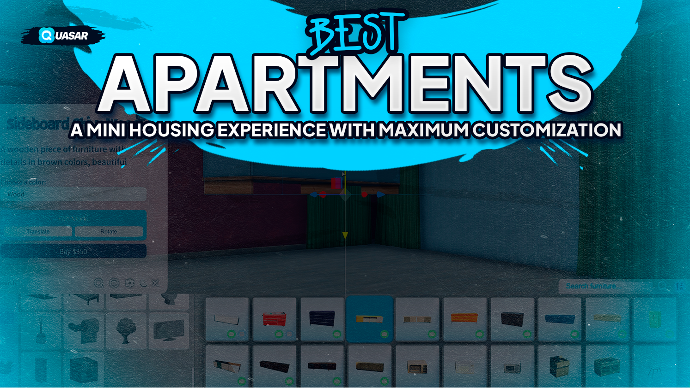

# Apartments

Quasar Apartments redefines housing in FiveM with a compact yet powerful system, bringing a mini Quasar Housing experience. Offering full compatibility with qs-multicharacter and qb-multicharacter, it allows players to select their starting apartment, purchase new properties, and relocate across the city seamlessly.

Each apartment comes with essential features, including stash, wardrobe, and smartphone chargers, along with integration with qs-weed for drug cultivation. The highlight of Quasar Apartments is its decoration system, enabling players to fully customize their spaces, making each home feel unique while maintaining a smooth and immersive roleplay experience.

<figure><figcaption></figcaption></figure>
