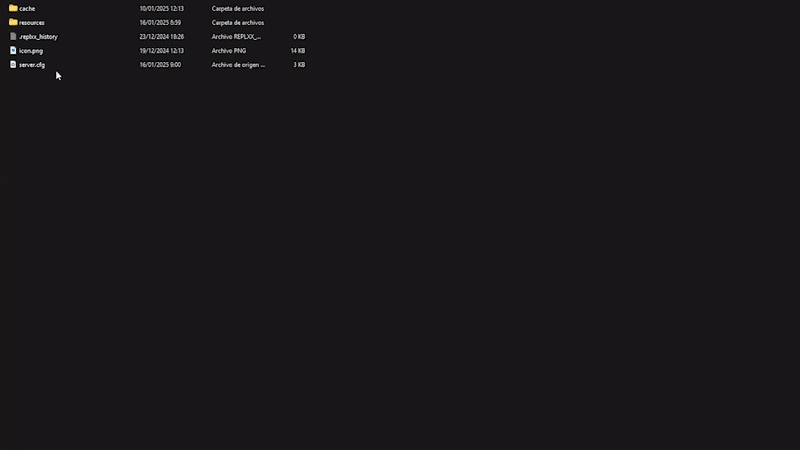

# Installation

## Script Download

Before starting, you must log in to the CFX portal to download the asset. You will be able to download it as many times as you want on the official CFX page. Just as you download it the first time, you will also download it multiple times in the future to get updates.



### Logging in to the CFX Portal

First, log in to the official CFX portal by [clicking here](https://portal.cfx.re/assets/granted-assets).



### Finding Your Assets

Once logged in, navigate to the **Granted Assets** section to access your purchased assets. You can download them by clicking the **"Download"** button.



Remember, if you encounter any issues or errors when starting the asset, you can check here to see if the problem is related.


[what-is-cfx-auth.md](../../getting-started/what-is-cfx-auth.md)


<div data-full-width="false"><figure><figcaption></figcaption></figure></div>

***

## Downloading Dependencies

The dependencies for this asset are mandatory, so please follow the dependency guide completely and use all required files.

When downloading a dependency, ensure the file is properly unzipped and does not include **"-main"** at the end of its name. If it does, please remove it.



### bob74\_ipl





<figure><figcaption></figcaption></figure>

***

## Update artifacts and gamebuild

Updating to the latest **artifacts** and **gamebuild** is essential to avoid common server issues. Here's how to do it properly:



### Update Artifacts

> To find the best FiveM artifact, visit [artifacts.jgscripts.com](https://artifacts.jgscripts.com). Thanks to JG Scripts.

Completely replace your current artifacts with the latest version. Download the appropriate artifacts for your operating system from the official links:

* **Windows**: [Windows Artifacts](https://runtime.fivem.net/artifacts/fivem/build_server_windows/master/).
* **Linux**: [Linux Artifacts](https://runtime.fivem.net/artifacts/fivem/build_proot_linux/master/).



### Update Gamebuild

Using gamebuild 3095 is recommended as it is the most stable version, ensuring optimal performance and avoiding compatibility issues.

Edit the `server.cfg` file and add the following line:

```plaintext
sv_enforceGameBuild 3095
```



You can see the complete guide to update your server here:


[how-to-update-my-server.md](../../development-guides/before-you-start/how-to-update-my-server.md)


<figure><figcaption></figcaption></figure>

***

## Server.cfg Positioning

For best results, place dependencies and **qs-motels-creator** in the same `[motels]` folder. If not, ensure dependencies are started before **qs-motels-creator** to guarantee proper functionality. This script should always be started under your inventory system.

<figure><figcaption></figcaption></figure>

***

## **Database Installation**

For this step, we highly recommend using **HeidiSQL** to avoid issues, as it provides an updated version of MariaDB. We have a guide that explains step-by-step how to use HeidiSQL. If you choose to use phpMyAdmin, we will not be responsible for any errors that may occur in your database.


[how-to-install-heidisql.md](../../development-guides/before-you-start/how-to-install-heidisql.md)


Select the framework you are using and then execute the SQL in your HeidiSQL. If you encounter errors, ensure you are using the most current version of MariaDB. You can refer to our guide above or search online.

<details>

<summary>Database for esx</summary>

```sql
ALTER TABLE
    `users`
ADD
    COLUMN IF NOT EXISTS `currentRoom` VARCHAR(90) NOT NULL DEFAULT '' COLLATE 'utf8mb4_general_ci';
    
DROP TABLE IF EXISTS `motels`;

CREATE TABLE `motels` (
    `owner` VARCHAR(90) NOT NULL COLLATE 'utf8mb4_general_ci',
    `pay` INT(11) NOT NULL DEFAULT '0',
    `motel` VARCHAR(50) NULL DEFAULT NULL COLLATE 'utf8mb4_general_ci',
    `roomId` INT(5) NOT NULL,
    `uniq` VARCHAR(50) NOT NULL DEFAULT '' COLLATE 'utf8mb4_general_ci',
    `requests` TEXT NOT NULL COLLATE 'utf8mb4_general_ci',
    `suspended` INT(2) NOT NULL DEFAULT '0',
    `shared` TEXT NOT NULL COLLATE 'utf8mb4_general_ci',
    `startTime` INT(12) NULL DEFAULT NULL,
    `endTime` INT(12) NULL DEFAULT NULL,
    `warn` TEXT NULL DEFAULT NULL COLLATE 'utf8mb4_general_ci',
    `roomUniqueId` VARCHAR(50) NULL DEFAULT NULL COLLATE 'utf8mb4_general_ci',
    PRIMARY KEY (`owner`) USING BTREE
) COLLATE = 'utf8mb4_general_ci' ENGINE = InnoDB;

DROP TABLE IF EXISTS `motels_bills`;

CREATE TABLE `motels_bills` (
    `owner` VARCHAR(50) NOT NULL COLLATE 'armscii8_bin',
    `data` TEXT NOT NULL COLLATE 'armscii8_bin',
    PRIMARY KEY (`owner`) USING BTREE,
    INDEX `owner` (`owner`) USING BTREE
) COLLATE = 'armscii8_bin' ENGINE = InnoDB;

DROP TABLE IF EXISTS `motels_items`;

CREATE TABLE `motels_items` (
    `id` VARCHAR(50) NOT NULL DEFAULT 'AUTO_INCREMENT' COLLATE 'utf8mb4_general_ci',
    `items` TEXT NULL DEFAULT NULL COLLATE 'utf8mb4_general_ci',
    `limit` INT(11) NOT NULL,
    PRIMARY KEY (`id`) USING BTREE
) COLLATE = 'utf8mb4_general_ci' ENGINE = InnoDB;

DROP TABLE IF EXISTS `motels_owners`;

CREATE TABLE `motels_owners` (
    `owner` VARCHAR(50) NOT NULL COLLATE 'armscii8_bin',
    `motel` VARCHAR(50) NOT NULL DEFAULT '' COLLATE 'armscii8_bin',
    PRIMARY KEY (`motel`) USING BTREE
) COLLATE = 'armscii8_bin' ENGINE = InnoDB;

DROP TABLE IF EXISTS `motels_storages`;

CREATE TABLE `motels_storages` (
    `motel` VARCHAR(50) NOT NULL COLLATE 'armscii8_bin',
    `money` INT(11) NOT NULL DEFAULT '0',
    PRIMARY KEY (`motel`) USING BTREE
) COLLATE = 'armscii8_bin' ENGINE = InnoDB;

DROP TABLE IF EXISTS `motels_workers`;

CREATE TABLE `motels_workers` (
    `employee` VARCHAR(50) NOT NULL DEFAULT '' COLLATE 'armscii8_bin',
    `motel` VARCHAR(50) NOT NULL COLLATE 'armscii8_bin',
    `salary` INT(11) NOT NULL,
    `pay` INT(11) NOT NULL,
    `permissions` TEXT NOT NULL COLLATE 'armscii8_bin',
    PRIMARY KEY (`employee`) USING BTREE
) COLLATE = 'armscii8_bin' ENGINE = InnoDB;
```

</details>

<details>

<summary>Database for qbcore</summary>

```sql
ALTER TABLE
    `players`
ADD
    COLUMN IF NOT EXISTS `currentRoom` VARCHAR(90) NOT NULL DEFAULT '' COLLATE 'utf8mb4_general_ci';

DROP TABLE IF EXISTS `motels`;

CREATE TABLE `motels` (
    `owner` VARCHAR(90) NOT NULL COLLATE 'utf8mb4_general_ci',
    `pay` INT(11) NOT NULL DEFAULT '0',
    `motel` VARCHAR(50) NULL DEFAULT NULL COLLATE 'utf8mb4_general_ci',
    `roomId` INT(5) NOT NULL,
    `uniq` VARCHAR(50) NOT NULL DEFAULT '' COLLATE 'utf8mb4_general_ci',
    `requests` TEXT NOT NULL COLLATE 'utf8mb4_general_ci',
    `suspended` INT(2) NOT NULL DEFAULT '0',
    `shared` TEXT NOT NULL COLLATE 'utf8mb4_general_ci',
    `startTime` INT(12) NULL DEFAULT NULL,
    `endTime` INT(12) NULL DEFAULT NULL,
    `warn` TEXT NULL DEFAULT NULL COLLATE 'utf8mb4_general_ci',
    `roomUniqueId` VARCHAR(50) NULL DEFAULT NULL COLLATE 'utf8mb4_general_ci',
    PRIMARY KEY (`owner`) USING BTREE
) COLLATE = 'utf8mb4_general_ci' ENGINE = InnoDB;

DROP TABLE IF EXISTS `motels_bills`;

CREATE TABLE `motels_bills` (
    `owner` VARCHAR(50) NOT NULL COLLATE 'armscii8_bin',
    `data` TEXT NOT NULL COLLATE 'armscii8_bin',
    PRIMARY KEY (`owner`) USING BTREE,
    INDEX `owner` (`owner`) USING BTREE
) COLLATE = 'armscii8_bin' ENGINE = InnoDB;

DROP TABLE IF EXISTS `motels_items`;

CREATE TABLE `motels_items` (
    `id` VARCHAR(50) NOT NULL DEFAULT 'AUTO_INCREMENT' COLLATE 'utf8mb4_general_ci',
    `items` TEXT NULL DEFAULT NULL COLLATE 'utf8mb4_general_ci',
    `limit` INT(11) NOT NULL,
    PRIMARY KEY (`id`) USING BTREE
) COLLATE = 'utf8mb4_general_ci' ENGINE = InnoDB;

DROP TABLE IF EXISTS `motels_owners`;

CREATE TABLE `motels_owners` (
    `owner` VARCHAR(50) NOT NULL COLLATE 'armscii8_bin',
    `motel` VARCHAR(50) NOT NULL DEFAULT '' COLLATE 'armscii8_bin',
    PRIMARY KEY (`motel`) USING BTREE
) COLLATE = 'armscii8_bin' ENGINE = InnoDB;

DROP TABLE IF EXISTS `motels_storages`;

CREATE TABLE `motels_storages` (
    `motel` VARCHAR(50) NOT NULL COLLATE 'armscii8_bin',
    `money` INT(11) NOT NULL DEFAULT '0',
    PRIMARY KEY (`motel`) USING BTREE
) COLLATE = 'armscii8_bin' ENGINE = InnoDB;

DROP TABLE IF EXISTS `motels_workers`;

CREATE TABLE `motels_workers` (
    `employee` VARCHAR(50) NOT NULL DEFAULT '' COLLATE 'armscii8_bin',
    `motel` VARCHAR(50) NOT NULL COLLATE 'armscii8_bin',
    `salary` INT(11) NOT NULL,
    `pay` INT(11) NOT NULL,
    `permissions` TEXT NOT NULL COLLATE 'armscii8_bin',
    PRIMARY KEY (`employee`) USING BTREE
) COLLATE = 'armscii8_bin' ENGINE = InnoDB;
```

</details>

<figure><figcaption></figcaption></figure>

***

## Items and Stash configuration


If you are using qs-inventory you don't need to change anything.


The stash items are not dependent on the players. It depends on the rooms. So if a player leaves the room, room's items are not deleted.

* There are four inventory supported by the motel. If you are not using one of these, you can use the motel's inventory
* If you don't change the Config.stashSettings. Stashes is automatically changed by the motel.



## This is a menu based inventory. <a href="#this-is-a-menu-based-inventory" id="this-is-a-menu-based-inventory"></a>

So, it doesn't need an inventory hud. If you have an unsupported inventory, don't worry! I have something good for you.

### Limit <a href="#limit" id="limit"></a>

```
You can specify a stash limit.
```

### qs-motels-creator/shared/config.lua <a href="#qs-motels-creator-shared-config.lua" id="qs-motels-creator-shared-config.lua"></a>

```lua
inventoryLimit = 100 -- How much inventory space will the motel have? [just for standalone inventory]
```



## **There are two things you need to do.**

* Add the item you used on Config.metaitem to your item list. By default it's motelkey.
* Change the Config.stashSettings. You can get reference below.

## References <a href="#references" id="references"></a>

### **Items** <a href="#references-1" id="references-1"></a>

Add your item to qb-core > shared.lua

```lua
["motelkey"] = {
    ["name"] = "motelkey",
    ["label"] = "Motel Key",
    ["weight"] = 0,
    ["type"] = "item",
    ["image"] = "motelkey.png",
    ["unique"] = true,
    ["useable"] = true,
    ["shouldClose"] = true,
    ["combinable"] = nil,
    ["description"] = "Motel Key"
},
```

### **Stash Config** <a href="#stash-config" id="stash-config"></a>

In qs-motels-creator > shared > config.lua

```lua
stashSettings = {
    maxweight = 4000000,
    slots = 500,
},
```

## OPTIONAL <a href="#optional" id="optional"></a>

```
You don't have to do this. 
If you do, it will show the room number in the item information.
```

### Go to qb-inventory > html > js > app.js (Function Name: FormatItemInfo)

```javascript
} else if (itemData.name == 'motelkey') {
    $(".item-info-title").html('<p>'+itemData.label+'</p>');
    $(".item-info-description").html('<p>Motel Key: ' + itemData.info.motel + '</p>');
```

<figure><figcaption></figcaption></figure>



## Same with the qb-inventory, two things. <a href="#same-with-the-qb-inventory-two-things" id="same-with-the-qb-inventory-two-things"></a>

* Add the item you used on Config.metaitem to your item list. By default it's motelkey.
* Change the Config.stashSettings. You can get reference below.

## References <a href="#references-1-1" id="references-1-1"></a>

### **Items** <a href="#items" id="items"></a>

Add your item to `ox_inventory > data > items.lua`

```lua
['motelkey'] = {
    label = 'Motel Key',
    weight = 0.250,
    stack = true,
    close = true,
    client = { export = 'qs-motels-creator.motels:UseKey' }
},
```

### Stash Config <a href="#stash-config-1" id="stash-config-1"></a>

qs-motels-creator > shared > config.lua

```lua
stashSettings = {
    maxweight = 4000000,
    slots = 500,
},
```



***

## Key bind manipulation

All Quasar Store assets use the same process for modifying Key Binds to ensure consistency and optimized performance across all resources.&#x20;

Below is a clear and detailed guide on how to adjust them to your preferences.


[how-to-change-key-bindings.md](../../development-guides/configure-your-scripts/how-to-change-key-bindings.md)

