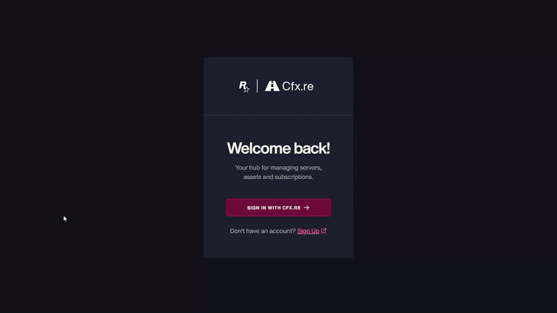

# Installation

## Script Download

Before starting, you must log in to the CFX portal to download the asset. You will be able to download it as many times as you want on the official CFX page. Just as you download it the first time, you will also download it multiple times in the future to get updates.



### Logging in to the CFX Portal

First, log in to the official CFX portal by [clicking here](https://portal.cfx.re/assets/granted-assets).



### Finding Your Assets

Once logged in, navigate to the **Granted Assets** section to access your purchased assets. You can download them by clicking the **"Download"** button.



Remember, if you encounter any issues or errors when starting the asset, you can check here to see if the problem is related.


[what-is-cfx-auth.md](../../getting-started/what-is-cfx-auth.md)


<div data-full-width="false"><figure><figcaption></figcaption></figure></div>

***

## Downloading Dependencies

The dependencies for this asset are mandatory, so please follow the dependency guide completely and use all required files.

When downloading a dependency, ensure the file is properly unzipped and does not include **"-main"** at the end of its name. If it does, please remove it.



### oxmysql





### ox\_lib





### screenshot-basic





<figure><figcaption></figcaption></figure>

***

## Remove Old clothing resources



### Delete the following from your resources folders:

* esx\_skin
* skinchanger
* fivem-appearance
* esx\_barbershop
* esx\_clotheshop
* illenium-appearance
* rcore\_clothing



### Also delete any tattoo shop resources e.g., `esx_tattooshop` from your resources folder.



***

## Compatibility With esx\_skin and skinchanger


This step is only for esx, if you use qb-core you don't need this, you can skip it, in case of esx it is necessary.


To avoid conflicts with older appearance systems like `esx_skin` or `skinchanger`, you need to make sure these are either removed or properly redirected to work with `qs-appearance`.

To ensure smooth operation, do **one** of the following:



### Remove References

Search through all your `fxmanifest.lua` files across your resources and **delete any lines that include `esx_skin` or `skinchanger`** in the `dependencies` or `requires` sections.



### Declare Provided Services

Open the file `qs-appearance/fxmanifest.lua` and **add the following line at the end**:

```lua
provides { "esx_skin", "skinchanger" }
```

This tells the server that `qs-appearance` will act as a replacement for those older systems, resolving dependency issues without having to modify every resource manually.



***

## Update artifacts and gamebuild

Updating to the latest **artifacts** and **gamebuild** is essential to avoid common server issues. Here's how to do it properly:



### Update Artifacts

> To find the best FiveM artifact, visit [artifacts.jgscripts.com](https://artifacts.jgscripts.com). Thanks to JG Scripts.

Completely replace your current artifacts with the latest version. Download the appropriate artifacts for your operating system from the official links:

* **Windows**: [Windows Artifacts](https://runtime.fivem.net/artifacts/fivem/build_server_windows/master/).
* **Linux**: [Linux Artifacts](https://runtime.fivem.net/artifacts/fivem/build_proot_linux/master/).



### Update Gamebuild

Using gamebuild 3095 is recommended as it is the most stable version, ensuring optimal performance and avoiding compatibility issues.

Edit the `server.cfg` file and add the following line:

```plaintext
sv_enforceGameBuild 3095
```



You can see the complete guide to update your server here:


[how-to-update-my-server.md](../../development-guides/before-you-start/how-to-update-my-server.md)


<figure><figcaption></figcaption></figure>

***

## Server.cfg Positioning


#### **IMPORTANT**

`greenscreen-map` should be stopped by default, as explained in the next step.


To ensure everything works correctly, the script must be started right after your framework (e.g., `ensure [appearance]`), and `screenshot-basic` must be started **before** both. If you see error spam in the console, it's likely due to a faulty installation of `screenshot-basic`—simply delete the `cache` folder and restart the server to fix it. Below is an example of the correct order in `server.cfg`.&#x20;

Here we attach a small example of how the start order should look:

```lua
ensure es_extended
ensure ox_lib
ensure screenshot-basic
ensure [appearance]
stop greenscreen-map # IMPORTANT, READ THE NEXT STEP
```

<figure><figcaption></figcaption></figure>

***

## Greenscreen Map Activation (greenscreen-map)


#### **IMPORTANT**

Do **not keep `greenscreen-map` running** if you're not using it for screenshots. It may consume unnecessary resources and serves no purpose outside of the `/save-images` process. **It should only be active during the image capturing process.**


The `**greenscreen-map**` resource is intended **exclusively** for use when capturing images of new clothing sets using the `/save-images` command. If you have already made all the images and are not going to use the command anymore, stop it, otherwise there will be visual problems in the peds.

#### How to use it?

You must manually start the resource before using the /save-images command, with:

```
start greenscreen-map
```

Once you’re done capturing the images, you must **manually stop or remove** the resource with:

```
stop greenscreen-map
```

***

## **Database Installation**

For this step, we highly recommend using **HeidiSQL** to avoid issues, as it provides an updated version of MariaDB. We have a guide that explains step-by-step how to use HeidiSQL. If you choose to use phpMyAdmin, we will not be responsible for any errors that may occur in your database.


[how-to-install-heidisql.md](../../development-guides/before-you-start/how-to-install-heidisql.md)


Select the framework you are using and then execute the SQL in your HeidiSQL. If you encounter errors, ensure you are using the most current version of MariaDB. You can refer to our guide above or search online.

<details>

<summary>Database for qb and esx</summary>

```sql
DROP TABLE IF EXISTS `clothing_stores`;
DROP TABLE IF EXISTS `clothing_player_outfits`;
DROP TABLE IF EXISTS `clothing_job_outfits`;
DROP TABLE IF EXISTS `management_outfits`;
DROP TABLE IF EXISTS `player_outfits`;
DROP TABLE IF EXISTS `playerskins`;

CREATE TABLE IF NOT EXISTS `clothing_stores` (
	`id` INT(11) NOT NULL AUTO_INCREMENT,
	`creator` VARCHAR(80) NULL DEFAULT '0' COLLATE 'utf8mb3_general_ci',
	`name` VARCHAR(50) NULL DEFAULT '0' COLLATE 'utf8mb3_general_ci',
	`type` VARCHAR(50) NULL DEFAULT '0' COLLATE 'utf8mb3_general_ci',
	`zone` TEXT NULL DEFAULT NULL COLLATE 'utf8mb3_general_ci',
	`show_blip` TINYINT(1) NULL DEFAULT '0',
	`config` TEXT NULL DEFAULT NULL COLLATE 'utf8mb3_general_ci',
	PRIMARY KEY (`id`) USING BTREE
)
COLLATE='utf8mb3_general_ci'
ENGINE=InnoDB
;

CREATE TABLE IF NOT EXISTS `clothing_player_outfits` (
	`id` INT(11) NOT NULL AUTO_INCREMENT,
	`owner` VARCHAR(80) NOT NULL DEFAULT '0' COLLATE 'utf8mb3_general_ci',
	`label` VARCHAR(80) NOT NULL DEFAULT '0' COLLATE 'utf8mb3_general_ci',
	`model` VARCHAR(80) NOT NULL DEFAULT '0' COLLATE 'utf8mb3_general_ci',
	`components` TEXT NULL DEFAULT NULL COLLATE 'utf8mb3_general_ci',
	`props` TEXT NULL DEFAULT NULL COLLATE 'utf8mb3_general_ci',
	PRIMARY KEY (`id`) USING BTREE
)
COLLATE='utf8mb3_general_ci'
ENGINE=InnoDB
AUTO_INCREMENT=1
;

CREATE TABLE IF NOT EXISTS `clothing_job_outfits` (
	`id` INT(11) NOT NULL AUTO_INCREMENT,
	`creator` VARCHAR(80) NOT NULL DEFAULT '0' COLLATE 'utf8mb3_general_ci',
	`label` VARCHAR(80) NOT NULL DEFAULT '' COLLATE 'utf8mb3_general_ci',
	`job` VARCHAR(50) NOT NULL DEFAULT '0' COLLATE 'utf8mb3_general_ci',
	`grades` TEXT NOT NULL COLLATE 'utf8mb3_general_ci',
	`model` VARCHAR(80) NOT NULL DEFAULT '' COLLATE 'utf8mb3_general_ci',
	`components` TEXT NOT NULL COLLATE 'utf8mb3_general_ci',
	`props` TEXT NOT NULL COLLATE 'utf8mb3_general_ci',
	PRIMARY KEY (`id`) USING BTREE
)
COLLATE='utf8mb3_general_ci'
ENGINE=InnoDB
AUTO_INCREMENT=1
;

CREATE TABLE IF NOT EXISTS `player_outfits` (
  `id` int(11) NOT NULL AUTO_INCREMENT,
  `citizenid` varchar(50) DEFAULT NULL,
  `outfitname` varchar(50) NOT NULL DEFAULT '0',
  `model` varchar(50) DEFAULT NULL,
  `props` varchar(1000) DEFAULT NULL,
  `components` varchar(1500) DEFAULT NULL,
  PRIMARY KEY (`id`),
  UNIQUE KEY `citizenid_outfitname_model` (`citizenid`,`outfitname`,`model`),
  KEY `citizenid` (`citizenid`)
) ENGINE=InnoDB AUTO_INCREMENT=26 DEFAULT CHARSET=utf8mb4;

CREATE TABLE IF NOT EXISTS `playerskins` (
  `id` int(11) NOT NULL AUTO_INCREMENT,
  `citizenid` varchar(255) NOT NULL,
  `model` varchar(255) NOT NULL,
  `skin` text NOT NULL,
  `active` tinyint(4) NOT NULL DEFAULT 1,
  PRIMARY KEY (`id`),
  KEY `citizenid` (`citizenid`),
  KEY `active` (`active`)
) ENGINE=InnoDB AUTO_INCREMENT=1 DEFAULT CHARSET=latin1;

```

</details>

<figure><figcaption></figcaption></figure>

***

## Support With Other Multichar Systems

This script fully overrides and handles all core events from `illenium-appearance`, making it automatically compatible with any multicharacter system that uses `illenium-appearance` as its configuration—such as `qs-multicharacter`, `qb-multicharacter`, or similar—without requiring manual integration. It detects and adapts seamlessly to these systems out of the box.

Additionally, you can easily retrieve a player’s appearance using a simple function like this:

```lua
function Appearance:GetAppearanceFromPed(ped)
    if not DoesEntityExist(ped) then
        Error('Ped does not exist', ped)
        return nil
    end
    local appearance = exports['qs-appearance']:getPedAppearance(ped)
    if not appearance then
        Error('Failed to get appearance from ped', ped)
        return nil
    end
    Debug('Got appearance from ped', appearance)
    return appearance
end
```

This makes it straightforward to extract and reuse a ped’s appearance in any part of your system.

***

## Skin Migration Support


If you're using a script with **FiveM escrow encryption**, you’ll need to contact its original developer to assist with the migration process, as we cannot access or interpret protected formats.



If your server uses **`illenium-appearance`**, **no migration is needed** — `qs-appearance` is fully compatible and will take over automatically.


We understand that many servers previously used other clothing systems, so we’ve built official migration support for all open-code scripts where formats can be analyzed and converted reliably.

If you're using **`qb-clothing`**, **`esx_skin`**, or **`fivem-appearance`**, you can migrate all existing player skins using the guide below:


[skin-migration-system.md](skin-migration-system.md)


***

## Saving Clothing Images & Token

When you finish generating and saving clothing images, you **must disable** the option:

```lua
Config.ImageSaver.enable = false
```

If you leave it enabled, your **FiveManage token** could be exposed and players may steal it.

Your token must be placed here:

```lua
-- qs-appearance/config/fivemanage.lua  
Config.FiveManageToken = "your_token_here"
```

Always make sure to keep your token private and disable the image saver once the process is complete. If you want to know more, continue here:


[add-new-clothing-and-images.md](user-guide/add-new-clothing-and-images.md)

