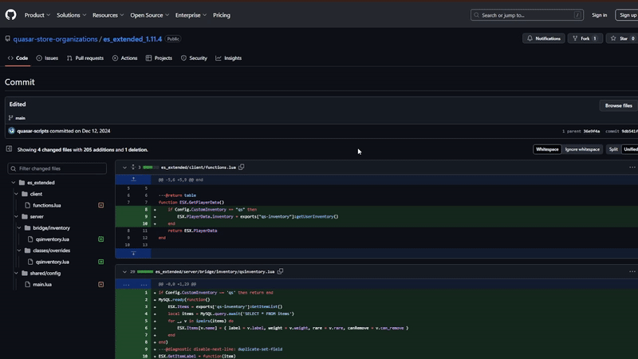

---
layout:
  width: default
  title:
    visible: true
  description:
    visible: false
  tableOfContents:
    visible: true
  outline:
    visible: true
  pagination:
    visible: false
  metadata:
    visible: true
---

# Installation

## Script Download

Before starting, you must log in to the CFX portal to download the asset. You will be able to download it as many times as you want on the official CFX page. Just as you download it the first time, you will also download it multiple times in the future to get updates.



### Logging in to the CFX Portal

First, log in to the official CFX portal by [clicking here](https://portal.cfx.re/assets/granted-assets).



### Finding Your Assets

Once logged in, navigate to the **Granted Assets** section to access your purchased assets. You can download them by clicking the **"Download"** button.



Remember, if you encounter any issues or errors when starting the asset, you can check here to see if the problem is related.


[what-is-cfx-auth.md](../../getting-started/what-is-cfx-auth.md)


<div data-full-width="false"><figure><figcaption></figcaption></figure></div>

***

## Downloading Dependencies

The dependencies for this asset are mandatory, so please follow the dependency guide completely and use all required files.

When downloading a dependency, ensure the file is properly unzipped and does not include **"-main"** at the end of its name. If it does, please remove it.



### oxmysql





### ox\_lib





<figure><figcaption></figcaption></figure>

***

## Update artifacts and gamebuild

Updating to the latest **artifacts** and **gamebuild** is essential to avoid common server issues. Here's how to do it properly:



### Update Artifacts

> To find the best FiveM artifact, visit [artifacts.jgscripts.com](https://artifacts.jgscripts.com). Thanks to JG Scripts.

Completely replace your current artifacts with the latest version. Download the appropriate artifacts for your operating system from the official links:

* **Windows**: [Windows Artifacts](https://runtime.fivem.net/artifacts/fivem/build_server_windows/master/).
* **Linux**: [Linux Artifacts](https://runtime.fivem.net/artifacts/fivem/build_proot_linux/master/).



### Update Gamebuild

Using gamebuild 3095 is recommended as it is the most stable version, ensuring optimal performance and avoiding compatibility issues.

Edit the `server.cfg` file and add the following line:

```plaintext
sv_enforceGameBuild 3095
```



You can see the complete guide to update your server here:


[how-to-update-my-server.md](../../development-guides/before-you-start/how-to-update-my-server.md)


<figure><figcaption></figcaption></figure>

***

## Server.cfg Positioning

This asset must always be started below your framework and inventory. Make sure that **\[inventory]** is placed directly under your framework in the startup order. Any script that requires the use of items, such as **\[smartphone]**, should also be started below the inventory to ensure proper functionality.

<figure><figcaption></figcaption></figure>

***

## **Database Installation**

For this step, we highly recommend using **HeidiSQL** to avoid issues, as it provides an updated version of MariaDB. We have a guide that explains step-by-step how to use HeidiSQL. If you choose to use phpMyAdmin, we will not be responsible for any errors that may occur in your database.


[how-to-install-heidisql.md](../../development-guides/before-you-start/how-to-install-heidisql.md)


Select the framework you are using and then execute the SQL in your HeidiSQL. If you encounter errors, ensure you are using the most current version of MariaDB. You can refer to our guide above or search online.

<details>

<summary>Database for esx</summary>

```sql
UPDATE `users` SET `inventory` = '[]' WHERE identifier IS NOT NULL;
ALTER TABLE `users` ADD IF NOT EXISTS `metadata` mediumtext DEFAULT NULL;

DROP TABLE IF EXISTS `inventory_glovebox`;
CREATE TABLE IF NOT EXISTS `inventory_glovebox` (
  `id` int(11) NOT NULL AUTO_INCREMENT, 
  `plate` varchar(255) DEFAULT NULL, 
  `items` longtext CHARACTER SET utf8mb4 COLLATE utf8mb4_bin DEFAULT NULL, 
  PRIMARY KEY (`plate`), 
  KEY `id` (`id`)
) ENGINE = InnoDB AUTO_INCREMENT = 1 DEFAULT CHARSET = latin1;

DROP TABLE IF EXISTS `inventory_stash`;
CREATE TABLE IF NOT EXISTS `inventory_stash` (
  `id` int(11) NOT NULL AUTO_INCREMENT, 
  `stash` varchar(255) DEFAULT NULL, 
  `items` longtext CHARACTER SET utf8mb4 COLLATE utf8mb4_bin DEFAULT NULL, 
  PRIMARY KEY (`stash`), 
  KEY `id` (`id`)
) ENGINE = InnoDB AUTO_INCREMENT = 1 DEFAULT CHARSET = latin1;

DROP TABLE IF EXISTS `inventory_trunk`;
CREATE TABLE IF NOT EXISTS `inventory_trunk` (
  `id` int(11) NOT NULL AUTO_INCREMENT, 
  `plate` varchar(255) DEFAULT NULL, 
  `items` longtext CHARACTER SET utf8mb4 COLLATE utf8mb4_bin DEFAULT NULL, 
  PRIMARY KEY (`plate`), 
  KEY `id` (`id`)
) ENGINE = InnoDB AUTO_INCREMENT = 1 DEFAULT CHARSET = latin1;

DROP TABLE IF EXISTS `inventory_metadata`;
CREATE TABLE IF NOT EXISTS `inventory_metadata` (
  `id` INT(11) NOT NULL AUTO_INCREMENT, 
  `identifier` VARCHAR(50) NULL DEFAULT NULL COLLATE 'utf8mb4_unicode_ci', 
  `data` TEXT NULL DEFAULT NULL COLLATE 'utf8mb4_unicode_ci', 
  PRIMARY KEY (`id`) USING BTREE
) COLLATE = 'utf8mb4_unicode_ci' ENGINE = InnoDB;

DROP TABLE IF EXISTS `inventory_clothes`;
CREATE TABLE IF NOT EXISTS `inventory_clothes` (
  `id` INT(11) NOT NULL AUTO_INCREMENT, 
  `identifier` VARCHAR(50) NOT NULL DEFAULT '' COLLATE 'utf8mb4_general_ci', 
  `items` TEXT NULL DEFAULT NULL COLLATE 'utf8mb4_general_ci', 
  PRIMARY KEY (`identifier`) USING BTREE, 
  INDEX `id` (`id`) USING BTREE
) COLLATE = 'utf8mb4_general_ci' ENGINE = InnoDB AUTO_INCREMENT = 6;
```

</details>

<details>

<summary>Database for qbcore</summary>

```sql
DROP TABLE IF EXISTS `inventory_glovebox`;
CREATE TABLE IF NOT EXISTS `inventory_glovebox` (
  `id` int(11) NOT NULL AUTO_INCREMENT, 
  `plate` varchar(255) DEFAULT NULL, 
  `items` longtext CHARACTER SET utf8mb4 COLLATE utf8mb4_bin DEFAULT NULL, 
  PRIMARY KEY (`plate`), 
  KEY `id` (`id`)
) ENGINE = InnoDB AUTO_INCREMENT = 1 DEFAULT CHARSET = latin1;

DROP TABLE IF EXISTS `inventory_stash`;
CREATE TABLE IF NOT EXISTS `inventory_stash` (
  `id` int(11) NOT NULL AUTO_INCREMENT, 
  `stash` varchar(255) DEFAULT NULL, 
  `items` longtext CHARACTER SET utf8mb4 COLLATE utf8mb4_bin DEFAULT NULL, 
  PRIMARY KEY (`stash`), 
  KEY `id` (`id`)
) ENGINE = InnoDB AUTO_INCREMENT = 1 DEFAULT CHARSET = latin1;

DROP TABLE IF EXISTS `inventory_trunk`;
CREATE TABLE IF NOT EXISTS `inventory_trunk` (
  `id` int(11) NOT NULL AUTO_INCREMENT, 
  `plate` varchar(255) DEFAULT NULL, 
  `items` longtext CHARACTER SET utf8mb4 COLLATE utf8mb4_bin DEFAULT NULL, 
  PRIMARY KEY (`plate`), 
  KEY `id` (`id`)
) ENGINE = InnoDB AUTO_INCREMENT = 1 DEFAULT CHARSET = latin1;

DROP TABLE IF EXISTS `inventory_metadata`;
CREATE TABLE IF NOT EXISTS `inventory_metadata` (
  `id` INT(11) NOT NULL AUTO_INCREMENT, 
  `identifier` VARCHAR(50) NULL DEFAULT NULL COLLATE 'utf8mb4_unicode_ci', 
  `data` TEXT NULL DEFAULT NULL COLLATE 'utf8mb4_unicode_ci', 
  PRIMARY KEY (`id`) USING BTREE
) COLLATE = 'utf8mb4_unicode_ci' ENGINE = InnoDB;

DROP TABLE IF EXISTS `inventory_clothes`;
CREATE TABLE IF NOT EXISTS `inventory_clothes` (
  `id` INT(11) NOT NULL AUTO_INCREMENT, 
  `identifier` VARCHAR(50) NOT NULL DEFAULT '' COLLATE 'utf8mb4_general_ci', 
  `items` TEXT NULL DEFAULT NULL COLLATE 'utf8mb4_general_ci', 
  PRIMARY KEY (`identifier`) USING BTREE, 
  INDEX `id` (`id`) USING BTREE
) COLLATE = 'utf8mb4_general_ci' ENGINE = InnoDB AUTO_INCREMENT = 6;
```

</details>

<figure><figcaption></figcaption></figure>

***

## Framework modifications

Quasar Inventory requires you to make specific modifications to your framework. To assist with this step, we provide links to the required changes in our personal GitHub repository. Please select your framework and apply the changes as specified.

We strongly recommend downloading the full version of the framework provided in the links rather than modifying your existing version. Using an outdated or improperly configured framework may result in breaking the asset or causing compatibility issues. Always ensure you are working with the most up-to-date and complete version to guarantee smooth functionality.

If your framework is not the most recent version, please [look for your version](https://github.com/orgs/quasar-store-organizations/repositories) in the provided resources.



### ESX





### QBCore





## QBX





### Other versions

If you are using a different version, please [search for your version here](https://github.com/orgs/quasar-store-organizations/repositories), we have all versions of esx and qbcore, just search for them.



<figure><figcaption></figcaption></figure>

***

## Add, modify or delete items


Please read the items logic in qs-inventory carefully before continuing.


This step is essential and must not be skipped, as it covers how to add and edit items in both QBCore and ESX. Each framework handles this process differently, so follow the instructions carefully.

In **qs-inventory**, items are not managed through SQL as they typically are in other frameworks. Instead, they are defined directly in a configuration file for easier management:



### Items for ESX

Items are located in **qs-inventory/shared/items.lua**.



### Items for QBCore

Items should be added in **qb-core/shared/items.lua**.



If you encounter issues while using items in QBCore, it may be due to corrupted items in your configuration. To resolve this, you should replace your existing **qb-core/shared/items.lua** file with the updated version provided.



***

## Add the clothes as an item


If you use the **items.lua** file recommended for QBCore in the previous step, these clothing items will already be included.


For the clothing system to work fully and avoid overwhelming your clothing system with unnecessary items, refer to the **Features Guide** after completing the documentation. This will guide you on how to add the required exports to your clothing store for seamless integration.

**Quasar Inventory** includes a comprehensive clothing system that can be fully configured via **config.lua** using the following configurations:

```lua
Config.Clothing = true -- Disable clothing system, this will disable the button too
Config.EnableScreenPed = false -- Disable the zoom pad and display it on your screen
Config.TakePreviousClothes = true -- Decide if previous clothes go to the inventory or are removed
```



### Clothing items for ESX&#x20;

If you are using ESX then you do not need to add the clothes as they are included in qs-inventory/shared/items.lua.



### Clothing items for QBCore

If you are using QBCore, you will need to manually add clothing to your qb-core/shared/items.lua unless you have downloaded the qb-core items or qb-core recommended above. Right below you will find the list of clothing items for QBCore.



<details>

<summary>Clothing items for qbcore (if you are esx, ignore this step)</summary>

```lua
tshirt = {
    ['name'] = 'tshirt',
    ['label'] = 'T-shirt',
    ['weight'] = 0,
    ['type'] = 'item',
    ['image'] = 'tshirt.png',
    ['unique'] = true,
    ['useable'] = true,
    ['shouldClose'] = true,
    ['combinable'] = nil,
    ['description'] = 'A nice piece of clothing'
},
torso = {
    ['name'] = 'torso',
    ['label'] = 'Torso',
    ['weight'] = 0,
    ['type'] = 'item',
    ['image'] = 'torso.png',
    ['unique'] = true,
    ['useable'] = true,
    ['shouldClose'] = true,
    ['combinable'] = nil,
    ['description'] = 'A nice piece of clothing'
},
arms = {
    ['name'] = 'arms',
    ['label'] = 'Arms',
    ['weight'] = 0,
    ['type'] = 'item',
    ['image'] = 'arms.png',
    ['unique'] = true,
    ['useable'] = true,
    ['shouldClose'] = true,
    ['combinable'] = nil,
    ['description'] = 'A nice piece of clothing'
},
jeans = {
    ['name'] = 'jeans',
    ['label'] = 'Jeans',
    ['weight'] = 0,
    ['type'] = 'item',
    ['image'] = 'jeans.png',
    ['unique'] = true,
    ['useable'] = true,
    ['shouldClose'] = true,
    ['combinable'] = nil,
    ['description'] = 'A nice piece of clothing'
},
shoes = {
    ['name'] = 'shoes',
    ['label'] = 'Shoes',
    ['weight'] = 0,
    ['type'] = 'item',
    ['image'] = 'shoes.png',
    ['unique'] = true,
    ['useable'] = true,
    ['shouldClose'] = true,
    ['combinable'] = nil,
    ['description'] = 'A nice piece of clothing'
},
mask = {
    ['name'] = 'mask',
    ['label'] = 'Mask',
    ['weight'] = 0,
    ['type'] = 'item',
    ['image'] = 'mask.png',
    ['unique'] = true,
    ['useable'] = true,
    ['shouldClose'] = true,
    ['combinable'] = nil,
    ['description'] = 'A nice piece of clothing'
},
ears = {
    ['name'] = 'ears',
    ['label'] = 'Ears',
    ['weight'] = 0,
    ['type'] = 'item',
    ['image'] = 'ears.png',
    ['unique'] = true,
    ['useable'] = true,
    ['shouldClose'] = true,
    ['combinable'] = nil,
    ['description'] = 'A nice piece of clothing'
},
glasses = {
    ['name'] = 'glasses',
    ['label'] = 'Glasses',
    ['weight'] = 0,
    ['type'] = 'item',
    ['image'] = 'glasses.png',
    ['unique'] = true,
    ['useable'] = true,
    ['shouldClose'] = true,
    ['combinable'] = nil,
    ['description'] = 'A nice piece of clothing'
},
helmet = {
    ['name'] = 'helmet',
    ['label'] = 'Helmet',
    ['weight'] = 0,
    ['type'] = 'item',
    ['image'] = 'helmet.png',
    ['unique'] = true,
    ['useable'] = true,
    ['shouldClose'] = true,
    ['combinable'] = nil,
    ['description'] = 'A nice piece of clothing'
},
bag = {
    ['name'] = 'bag',
    ['label'] = 'Bag',
    ['weight'] = 0,
    ['type'] = 'item',
    ['image'] = 'bag.png',
    ['unique'] = true,
    ['useable'] = true,
    ['shouldClose'] = true,
    ['combinable'] = nil,
    ['description'] = 'A nice piece of clothing'
},
chain = {
    ['name'] = 'chain',
    ['label'] = 'Chain',
    ['weight'] = 100,
    ['type'] = 'item',
    ['image'] = 'goldchain.png',
    ['unique'] = true,
    ['useable'] = true,
    ['shouldClose'] = false,
    ['combinable'] = nil,
    ['rare'] = 'epic',
    ['description'] = 'It is very fragile, watch out'
},
vest = {
    ['name'] = 'vest',
    ['label'] = 'Vest',
    ['weight'] = 100,
    ['type'] = 'item',
    ['image'] = 'vest.png',
    ['unique'] = true,
    ['useable'] = true,
    ['shouldClose'] = false,
    ['combinable'] = nil,
    ['rare'] = 'epic',
    ['description'] = 'Body Armor'
},
bracelets = {
    ['name'] = 'bracelets',
    ['label'] = 'Bracelets',
    ['weight'] = 100,
    ['type'] = 'item',
    ['image'] = 'bracelets.png',
    ['unique'] = true,
    ['useable'] = true,
    ['shouldClose'] = false,
    ['combinable'] = nil,
    ['rare'] = 'epic',
    ['description'] = 'It is very fragile, watch out'
},
watch = {
    ['name'] = 'watch',
    ['label'] = 'Watch',
    ['weight'] = 100,
    ['type'] = 'item',
    ['image'] = 'rolex.png',
    ['unique'] = false,
    ['useable'] = false,
    ['shouldClose'] = false,
    ['combinable'] = nil,
    ['rare'] = 'epic',
    ['description'] = 'It is very fragile, watch out'
}
```

</details>

Before running the game, follow these steps to avoid receiving multiple random clothing items in your inventory.


[clothing-items-events.md](user-guide/clothing-items-events.md)


***

## Losing items when dying <a href="#losing-items-when-dying" id="losing-items-when-dying"></a>

This step is for adding events that will remove items after a player's death. If you are using QBCore, this step is not necessary.

Please follow the instructions in the provided link and avoid opening support tickets regarding this process. This step is specifically for **ESX ambulances** and requires basic knowledge of Lua to implement correctly.


[clear-player-inventory.md](user-guide/clear-player-inventory.md)


***

## Weapons and Attachments


We kindly ask that you do not open a support ticket regarding custom weapons.


If you wish to add custom weapons or attachments, we do not provide support for this feature. However, you can add them manually by following this documentation fragment. If you are unable to understand it, you will need to find a developer or someone with basic programming knowledge to assist you.


[weapon-and-attachments.md](user-guide/weapon-and-attachments.md)


***

## Key Bind Manipulation

All Quasar Store assets use the same process for modifying Key Binds to ensure consistency and optimized performance across all resources.&#x20;

Below is a clear and detailed guide on how to adjust them to your preferences.


[how-to-change-key-bindings.md](../../development-guides/configure-your-scripts/how-to-change-key-bindings.md)

