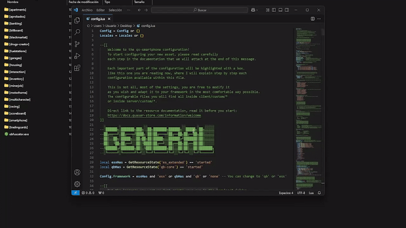

# Installation

## Script Download

Before starting, you must log in to the CFX portal to download the asset. You will be able to download it as many times as you want on the official CFX page. Just as you download it the first time, you will also download it multiple times in the future to get updates.



### Logging in to the CFX Portal

First, log in to the official CFX portal by [clicking here](https://portal.cfx.re/assets/granted-assets).



### Finding Your Assets

Once logged in, navigate to the **Granted Assets** section to access your purchased assets. You can download them by clicking the **"Download"** button.



Remember, if you encounter any issues or errors when starting the asset, you can check here to see if the problem is related.


[what-is-cfx-auth.md](../../getting-started/what-is-cfx-auth.md)


<div data-full-width="false"><figure><figcaption></figcaption></figure></div>

***

## Downloading Dependencies

The dependencies for this asset are mandatory, so please follow the dependency guide completely and use all required files.

When downloading a dependency, ensure the file is properly unzipped and does not include **"-main"** at the end of its name. If it does, please remove it.



### PolyZone





### xsound





### screenshot-basic





<figure><figcaption></figcaption></figure>

***

## Update artifacts and gamebuild

Updating to the latest **artifacts** and **gamebuild** is essential to avoid common server issues. Here's how to do it properly:



### Update Artifacts

> To find the best FiveM artifact, visit [artifacts.jgscripts.com](https://artifacts.jgscripts.com). Thanks to JG Scripts.

Completely replace your current artifacts with the latest version. Download the appropriate artifacts for your operating system from the official links:

* **Windows**: [Windows Artifacts](https://runtime.fivem.net/artifacts/fivem/build_server_windows/master/).
* **Linux**: [Linux Artifacts](https://runtime.fivem.net/artifacts/fivem/build_proot_linux/master/).



### Update Gamebuild

Using gamebuild 3095 is recommended as it is the most stable version, ensuring optimal performance and avoiding compatibility issues.

Edit the `server.cfg` file and add the following line:

```plaintext
sv_enforceGameBuild 3095
```



You can see the complete guide to update your server here:


[how-to-update-my-server.md](../../development-guides/before-you-start/how-to-update-my-server.md)


<figure><figcaption></figcaption></figure>

***

## Server.cfg Positioning

This asset must always be started below your framework and inventory. If you do not do this, you will encounter issues when using it or even critical errors. It is recommended to start the entire download folder using **"ensure \[smartphone]"** to maintain a clean order and proper initialization.

<figure><figcaption></figcaption></figure>

***

## **Database Installation**

For this step, we highly recommend using **HeidiSQL** to avoid issues, as it provides an updated version of MariaDB. We have a guide that explains step-by-step how to use HeidiSQL. If you choose to use phpMyAdmin, we will not be responsible for any errors that may occur in your database.


[how-to-install-heidisql.md](../../development-guides/before-you-start/how-to-install-heidisql.md)


Select the framework you are using and then execute the SQL in your HeidiSQL. If you encounter errors, ensure you are using the most current version of MariaDB. You can refer to our guide above or search online.

<details>

<summary>Database for esx</summary>

```sql
ALTER TABLE `users` ADD IF NOT EXISTS `apps` TEXT;
ALTER TABLE `users` ADD IF NOT EXISTS `widget` TEXT;
ALTER TABLE `users` ADD IF NOT EXISTS `bt` TEXT;
ALTER TABLE `users` ADD IF NOT EXISTS `charinfo` TEXT;
ALTER TABLE `users` ADD IF NOT EXISTS `metadata` mediumtext;
ALTER TABLE `users` ADD IF NOT EXISTS `cryptocurrency` longtext;
ALTER TABLE `users` ADD IF NOT EXISTS `cryptocurrencytransfers` TEXT;
ALTER TABLE `users` ADD IF NOT EXISTS `phonePos` TEXT;
ALTER TABLE `users` ADD IF NOT EXISTS `spotify` TEXT;
ALTER TABLE `users` ADD IF NOT EXISTS `ringtone` TEXT;
ALTER TABLE `users` ADD IF NOT EXISTS `first_screen_showed` INT(11) DEFAULT NULL;

DROP TABLE IF EXISTS `insta_stories`;
CREATE TABLE `insta_stories` (
  `username` varchar(50),
  `location` varchar(50),
  `filter` varchar(50),
  `description` varchar(50),
  `image` text,
  `created` time
) ENGINE = InnoDB DEFAULT CHARSET = utf8mb4;

DROP TABLE IF EXISTS `instagram_stories`;
CREATE TABLE `instagram_stories` (
  `owner` varchar(50) COLLATE armscii8_bin,
  `data` text COLLATE armscii8_bin,
  PRIMARY KEY (`owner`) USING BTREE
) ENGINE = InnoDB DEFAULT CHARSET = armscii8 COLLATE = armscii8_bin;

DROP TABLE IF EXISTS `instagram_account`;
CREATE TABLE `instagram_account` (
  `id` varchar(90) NOT NULL,
  `name` varchar(50) NOT NULL,
  `phone` varchar(50) NOT NULL,
  `username` varchar(50) NOT NULL,
  `password` varchar(50) NOT NULL,
  `avatar` text,
  `description` text,
  `verify` INT(11) NOT NULL DEFAULT '0'
) ENGINE = InnoDB DEFAULT CHARSET = utf8mb4;

DROP TABLE IF EXISTS `instagram_followers`;
CREATE TABLE `instagram_followers` (
  `username` varchar(50) NOT NULL,
  `followed` varchar(50) NOT NULL
) ENGINE = InnoDB DEFAULT CHARSET = utf8mb4;

DROP TABLE IF EXISTS `instagram_posts`;
CREATE TABLE `instagram_posts` (
  `id` int(11) NOT NULL AUTO_INCREMENT,
  `username` varchar(50) NOT NULL,
  `image` text NOT NULL,
  `description` varchar(255) NOT NULL,
  `location` varchar(50) NOT NULL DEFAULT 'Los Santos',
  `filter` varchar(50) NOT NULL,
  `created` timestamp NOT NULL,
  `likes` TEXT COLLATE 'utf8mb4_general_ci',
  PRIMARY KEY (`id`)
) ENGINE = InnoDB AUTO_INCREMENT = 14 DEFAULT CHARSET = utf8mb4;

DROP TABLE IF EXISTS `player_mails`;
CREATE TABLE `player_mails` (
  `id` INT(11) NOT NULL AUTO_INCREMENT,
  `identifier` VARCHAR(50) NULL COLLATE 'utf8mb4_general_ci',
  `sender` VARCHAR(50) NULL COLLATE 'utf8mb4_general_ci',
  `subject` VARCHAR(50) NULL COLLATE 'utf8mb4_general_ci',
  `message` TEXT NULL COLLATE 'utf8mb4_general_ci',
  `read` TINYINT(4) NULL,
  `mailid` INT(11) NULL,
  `date` TIMESTAMP NULL DEFAULT current_timestamp(),
  `button` TEXT COLLATE 'utf8mb4_general_ci',
  PRIMARY KEY (`id`) USING BTREE,
  INDEX `identifier` (`identifier`) USING BTREE
) COLLATE = 'utf8mb4_general_ci' ENGINE = InnoDB AUTO_INCREMENT = 2;

DROP TABLE IF EXISTS `tinder_accounts`;
CREATE TABLE `tinder_accounts` (
  `id` int(11) NOT NULL AUTO_INCREMENT,
  `phone` varchar(50) NOT NULL DEFAULT '0',
  `pp` text NOT NULL,
  `name` varchar(50) NOT NULL DEFAULT '0',
  `gender` varchar(50) NOT NULL,
  `targetGender` varchar(50) NOT NULL DEFAULT '0',
  `hobbies` varchar(50) NOT NULL DEFAULT '0',
  `age` varchar(50) NOT NULL DEFAULT '0',
  `description` varchar(50) NOT NULL DEFAULT '0',
  `password` varchar(50) NOT NULL,
  PRIMARY KEY (`id`)
) ENGINE = InnoDB AUTO_INCREMENT = 17 DEFAULT CHARSET = utf8mb4;

DROP TABLE IF EXISTS `tinder_likes`;
CREATE TABLE `tinder_likes` (
  `id` int(11) NOT NULL AUTO_INCREMENT,
  `phone` varchar(1024) NOT NULL,
  `likeds` mediumtext NOT NULL,
  PRIMARY KEY (`id`)
) ENGINE = InnoDB AUTO_INCREMENT = 4 DEFAULT CHARSET = utf8mb4;

DROP TABLE IF EXISTS `phone_invoices`;
CREATE TABLE `phone_invoices` (
  `id` int(10) NOT NULL AUTO_INCREMENT,
  `citizenid` varchar(50) DEFAULT NULL,
  `amount` int(11) NOT NULL DEFAULT 0,
  `society` tinytext DEFAULT NULL,
  `sender` varchar(50) NULL,
  `sendercitizenid` varchar(50) DEFAULT NULL,
  PRIMARY KEY (id)
) ENGINE = InnoDB DEFAULT CHARSET = utf8;

DROP TABLE IF EXISTS `phone_accounts`;
CREATE TABLE `phone_accounts` (
  `app` varchar(50) NOT NULL,
  `id` varchar(80) NOT NULL,
  `name` varchar(50) NOT NULL,
  `password` varchar(50) NOT NULL,
  `birthdate` varchar(50) NOT NULL,
  `gender` varchar(50) NOT NULL,
  `interested` text NOT NULL,
  `avatar` text NOT NULL
) ENGINE = InnoDB DEFAULT CHARSET = utf8mb4;

DROP TABLE IF EXISTS `phone_chats`;
CREATE TABLE `phone_chats` (
  `app` varchar(50) NOT NULL,
  `author` varchar(50) NOT NULL,
  `number` varchar(50) NOT NULL,
  `created` varchar(50) NOT NULL
) ENGINE = InnoDB DEFAULT CHARSET = utf8mb4;

DROP TABLE IF EXISTS `phone_messages`;
CREATE TABLE `phone_messages` (
  `id` int(11) NOT NULL AUTO_INCREMENT,
  `phone` varchar(50),
  `number` varchar(50) NOT NULL,
  `owner` varchar(50),
  `messages` text NOT NULL,
  `type` varchar(50),
  `read` int(11),
  `created` varchar(50),
  PRIMARY KEY (`id`)
) ENGINE = InnoDB AUTO_INCREMENT = 20 DEFAULT CHARSET = utf8mb4;

DROP TABLE IF EXISTS `phone_notifies`;
CREATE TABLE `phone_notifies` (
  `id` int(11) NOT NULL AUTO_INCREMENT,
  `phone` varchar(50) NOT NULL,
  `msg_content` text NOT NULL,
  `msg_head` varchar(50) NOT NULL DEFAULT '',
  `app_name` text NOT NULL,
  `msg_time` varchar(50) NOT NULL,
  PRIMARY KEY (`id`)
) ENGINE = InnoDB AUTO_INCREMENT = 64 DEFAULT CHARSET = utf8mb4;

DROP TABLE IF EXISTS `player_contacts`;
CREATE TABLE `player_contacts` (
  `id` INT(11) NOT NULL AUTO_INCREMENT,
  `identifier` VARCHAR(50) NULL DEFAULT NULL COLLATE 'utf8mb4_general_ci',
  `name` VARCHAR(50) NULL DEFAULT NULL COLLATE 'utf8mb4_general_ci',
  `number` VARCHAR(50) NULL DEFAULT NULL COLLATE 'utf8mb4_general_ci',
  `iban` VARCHAR(50) NOT NULL DEFAULT '0' COLLATE 'utf8mb4_general_ci',
  `display` VARCHAR(50) COLLATE 'utf8mb4_general_ci',
  `note` TEXT NOT NULL COLLATE 'utf8mb4_general_ci',
  `pp` TEXT NOT NULL COLLATE 'utf8mb4_general_ci',
  `isBlocked` INT(11) NULL,
  PRIMARY KEY (`id`) USING BTREE,
  INDEX `identifier` (`identifier`) USING BTREE
) COLLATE = 'utf8mb4_general_ci' ENGINE = InnoDB AUTO_INCREMENT = 38;

DROP TABLE IF EXISTS `player_gallery`;
CREATE TABLE `player_gallery` (
  `id` INT(11) NOT NULL AUTO_INCREMENT,
  `identifier` TEXT NOT NULL COLLATE 'utf8mb4_general_ci',
  `resim` TEXT NOT NULL COLLATE 'utf8mb4_general_ci',
  `data` TEXT NOT NULL COLLATE 'utf8mb4_general_ci',
  `created_at` TIMESTAMP NOT NULL DEFAULT current_timestamp() ON UPDATE current_timestamp(),
  PRIMARY KEY (`id`) USING BTREE
) COLLATE = 'utf8mb4_general_ci' ENGINE = InnoDB AUTO_INCREMENT = 11;

DROP TABLE IF EXISTS `tinder_messages`;
CREATE TABLE `tinder_messages` (
  `id` int(11) NOT NULL AUTO_INCREMENT,
  `phone` varchar(50) NOT NULL,
  `number` longtext NOT NULL,
  `messages` longtext DEFAULT '{}',
  PRIMARY KEY (`id`) USING BTREE
) ENGINE = InnoDB AUTO_INCREMENT = 11;

DROP TABLE IF EXISTS `twitter_account`;
CREATE TABLE `twitter_account` (
  `id` varchar(90) NOT NULL,
  `name` varchar(50) NOT NULL,
  `phone` varchar(50) NOT NULL,
  `username` varchar(50) NOT NULL,
  `password` varchar(50) NOT NULL,
  `avatar` text NOT NULL
) ENGINE = InnoDB DEFAULT CHARSET = utf8mb4;

DROP TABLE IF EXISTS `twitter_hashtags`;
CREATE TABLE `twitter_hashtags` (
  `id` int(11) NOT NULL AUTO_INCREMENT,
  `name` varchar(80) NOT NULL,
  `created` varchar(50) NOT NULL,
  `count` int(11) NULL,
  PRIMARY KEY (`id`)
) ENGINE = InnoDB AUTO_INCREMENT = 8 DEFAULT CHARSET = utf8mb4;

DROP TABLE IF EXISTS `twitter_mentions`;
CREATE TABLE `twitter_mentions` (
  `id` INT(11) NOT NULL AUTO_INCREMENT COLLATE 'utf8mb4_general_ci',
  `id_tweet` INT(11) NOT NULL COLLATE 'utf8mb4_general_ci',
  `username` VARCHAR(50) NOT NULL COLLATE 'utf8mb4_general_ci',
  `mentioned` TEXT NOT NULL COLLATE 'utf8mb4_general_ci',
  `created` VARCHAR(50) NOT NULL COLLATE 'utf8mb4_general_ci',
  PRIMARY KEY (`id`) USING BTREE
) COLLATE = 'utf8mb4_general_ci' ENGINE = InnoDB AUTO_INCREMENT = 4;

DROP TABLE IF EXISTS `twitter_tweets`;
CREATE TABLE `twitter_tweets` (
  `id` int(5) NOT NULL AUTO_INCREMENT,
  `username` varchar(80) NOT NULL,
  `message` longtext NOT NULL,
  `hashtags` varchar(50) NOT NULL,
  `mentions` varchar(50) NOT NULL,
  `created` varchar(50) NOT NULL,
  `image` text NOT NULL,
  `likes` TEXT NULL COLLATE 'utf8mb4_general_ci',
  PRIMARY KEY (`id`)
) ENGINE = InnoDB AUTO_INCREMENT = 24 DEFAULT CHARSET = utf8mb4;

DROP TABLE IF EXISTS `whatsapp_accounts`;
CREATE TABLE `whatsapp_accounts` (
  `id` varchar(100) NOT NULL COLLATE UTF8MB4_UNICODE_CI,
  `name` varchar(50) NOT NULL COLLATE UTF8MB4_UNICODE_CI,
  `phone` varchar(50) NOT NULL COLLATE UTF8MB4_UNICODE_CI,
  `password` varchar(50) NOT NULL COLLATE UTF8MB4_UNICODE_CI,
  `avatar` text NOT NULL COLLATE UTF8MB4_UNICODE_CI
) ENGINE = InnoDB DEFAULT CHARSET = utf8mb4;

DROP TABLE IF EXISTS `whatsapp_chats`;
CREATE TABLE `whatsapp_chats` (
  `id` int(11) NOT NULL AUTO_INCREMENT,
  `phone` varchar(50) NOT NULL,
  `number` varchar(50) NOT NULL,
  `created` varchar(50) NOT NULL,
  `messages` text NOT NULL,
  PRIMARY KEY (`id`)
) ENGINE = InnoDB AUTO_INCREMENT = 43 DEFAULT CHARSET = utf8mb4;

DROP TABLE IF EXISTS `whatsapp_chats_messages`;
CREATE TABLE `whatsapp_chats_messages` (
  `id` int(11) NOT NULL AUTO_INCREMENT,
  `id_chat` int(11) NOT NULL,
  `owner` varchar(50) NOT NULL,
  `type` varchar(50) NOT NULL,
  `created` varchar(50) NOT NULL,
  `message` text NOT NULL,
  `readed` int(1) NOT NULL,
  PRIMARY KEY (`id`)
) ENGINE = InnoDB DEFAULT CHARSET = utf8;

DROP TABLE IF EXISTS `whatsapp_groups`;
CREATE TABLE `whatsapp_groups` (
  `id` int(11) AUTO_INCREMENT,
  `phone` varchar(50) NOT NULL,
  `number` varchar(50) NOT NULL,
  `type` varchar(50) NOT NULL,
  `name` varchar(50) NOT NULL,
  `image` text NOT NULL,
  `created` varchar(50) NOT NULL,
  PRIMARY KEY (`id`)
) ENGINE = InnoDB AUTO_INCREMENT = 8 DEFAULT CHARSET = utf8mb4;

DROP TABLE IF EXISTS `whatsapp_groups_messages`;
CREATE TABLE `whatsapp_groups_messages` (
  `id` int(11) NOT NULL AUTO_INCREMENT,
  `id_group` varchar(50) COLLATE utf8mb4_unicode_ci NOT NULL,
  `owner` varchar(50) COLLATE utf8mb4_unicode_ci NOT NULL,
  `type` varchar(50) COLLATE utf8mb4_unicode_ci NOT NULL,
  `message` text COLLATE utf8mb4_unicode_ci NOT NULL,
  `created` varchar(50) COLLATE utf8mb4_unicode_ci NOT NULL,
  `read` int(11) NOT NULL,
  `name` varchar(50) COLLATE utf8mb4_unicode_ci NOT NULL,
  PRIMARY KEY (`id`)
) ENGINE = InnoDB DEFAULT CHARSET = utf8mb4 COLLATE = utf8mb4_unicode_ci;

DROP TABLE IF EXISTS `whatsapp_groups_users`;
CREATE TABLE `whatsapp_groups_users` (
  `number_group` varchar(50) NOT NULL COLLATE UTF8MB4_UNICODE_CI,
  `admin` int(11) NOT NULL COLLATE UTF8MB4_UNICODE_CI,
  `phone` varchar(50) NOT NULL COLLATE UTF8MB4_UNICODE_CI
) ENGINE = InnoDB DEFAULT CHARSET = utf8mb4;

DROP TABLE IF EXISTS `player_notes`;
CREATE TABLE `player_notes` (
  `id` int(11) NOT NULL AUTO_INCREMENT,
  `identifier` text NOT NULL,
  `baslik` text NOT NULL,
  `aciklama` text NOT NULL,
  PRIMARY KEY (`id`)
) ENGINE = InnoDB DEFAULT CHARSET = utf8mb4;

DROP TABLE IF EXISTS `whatsapp_stories`;
CREATE TABLE `whatsapp_stories` (
  `phone` varchar(50) NOT NULL,
  `image` text NOT NULL,
  `created` varchar(50) NOT NULL,
  `description` varchar(50),
  `location` varchar(50),
  `filter` varchar(50)
) ENGINE = InnoDB DEFAULT CHARSET = utf8mb4;

DROP TABLE IF EXISTS `darkchat_messages`;
CREATE TABLE `darkchat_messages` (
  `id` INT(11) NOT NULL AUTO_INCREMENT,
  `password` text NOT NULL,
  `owner` VARCHAR(50) NULL DEFAULT NULL COLLATE 'utf8mb4_general_ci',
  `name` VARCHAR(50) NULL DEFAULT '' COLLATE 'utf8mb4_general_ci',
  `messages` TEXT NULL COLLATE 'utf8mb4_general_ci',
  PRIMARY KEY (`id`) USING BTREE,
  INDEX `id` (`id`) USING BTREE
) COLLATE = 'utf8mb4_general_ci' ENGINE = InnoDB AUTO_INCREMENT = 10;

DROP TABLE IF EXISTS `phone_alertjobs`;
CREATE TABLE `phone_alertjobs` (
  `id` int(11) NOT NULL,
  `job` varchar(255) NOT NULL,
  `alerts` longtext NULL,
  `date` timestamp NULL DEFAULT current_timestamp()
) ENGINE = InnoDB DEFAULT CHARSET = utf8mb4;

DROP TABLE IF EXISTS `yellowpages_posts`;
CREATE TABLE `yellowpages_posts` (
    `id` INT AUTO_INCREMENT PRIMARY KEY,
    `message` TEXT,
    `name` VARCHAR(255),
    `number` VARCHAR(20),
    `url` VARCHAR(255)
);

DROP TABLE IF EXISTS `phone_news`;
CREATE TABLE `phone_news` (
  `id` INT(11) NOT NULL AUTO_INCREMENT,
  `owner` VARCHAR(50) NULL DEFAULT NULL COLLATE 'utf8mb4_unicode_ci',
  `title` VARCHAR(50) NULL DEFAULT NULL COLLATE 'utf8mb4_unicode_ci',
  `content` TEXT NULL COLLATE 'utf8mb4_unicode_ci',
  `image` TEXT NULL COLLATE 'utf8mb4_unicode_ci',
  `created` VARCHAR(50) NULL DEFAULT '' COLLATE 'utf8mb4_unicode_ci',
  PRIMARY KEY (`id`) USING BTREE
)
COLLATE='utf8mb4_unicode_ci' ENGINE=InnoDB AUTO_INCREMENT=5;

DROP TABLE IF EXISTS `tiktok_users`;
CREATE TABLE `tiktok_users` (
    `id` INT(11) NOT NULL AUTO_INCREMENT,
    `username` VARCHAR(50) NOT NULL DEFAULT '0' COLLATE 'utf8mb4_general_ci',
    `phone` VARCHAR(50) NOT NULL DEFAULT '0' COLLATE 'utf8mb4_general_ci',
    `pp` TEXT NULL COLLATE 'utf8mb4_general_ci',
    `name` VARCHAR(50) NOT NULL DEFAULT '0' COLLATE 'utf8mb4_general_ci',
    `bio` TEXT NOT NULL DEFAULT '' COLLATE 'utf8mb4_general_ci',
    `birthday` VARCHAR(50) NOT NULL DEFAULT '0' COLLATE 'utf8mb4_general_ci',
    `videos` TEXT NOT NULL DEFAULT '{}' COLLATE 'utf8mb4_general_ci',
    `followers` TEXT NOT NULL COLLATE 'utf8mb4_general_ci',
    `following` TEXT NOT NULL COLLATE 'utf8mb4_general_ci',
    `liked` TEXT NOT NULL COLLATE 'utf8mb4_general_ci',
    PRIMARY KEY (`id`) USING BTREE,
    INDEX `id` (`id`) USING BTREE
)
COLLATE='utf8mb4_general_ci'
ENGINE=InnoDB
AUTO_INCREMENT=13
;

DROP TABLE IF EXISTS `tiktok_videos`;
CREATE TABLE `tiktok_videos` (
    `id` INT(11) NOT NULL AUTO_INCREMENT,
    `userID` INT(11) NULL DEFAULT NULL,
    `created` VARCHAR(50) NOT NULL DEFAULT '00:00:00' COLLATE 'utf8mb4_unicode_ci',
    `data` TEXT NULL COLLATE 'utf8mb4_unicode_ci',
    `phone` VARCHAR(50) NULL DEFAULT NULL COLLATE 'utf8mb4_unicode_ci',
    PRIMARY KEY (`id`) USING BTREE
)
COLLATE='utf8mb4_unicode_ci'
ENGINE=InnoDB
AUTO_INCREMENT=440
;

ALTER TABLE `phone_alertjobs` ADD PRIMARY KEY (`id`), ADD UNIQUE KEY `job` (`job`);

ALTER TABLE `phone_alertjobs`
  MODIFY `id` int(11) NOT NULL AUTO_INCREMENT;
COMMIT;

ALTER TABLE whatsapp_groups_messages CONVERT TO CHARACTER SET utf8mb4 COLLATE UTF8MB4_UNICODE_CI;
ALTER TABLE whatsapp_groups_users CONVERT TO CHARACTER SET utf8mb4 COLLATE UTF8MB4_UNICODE_CI;
ALTER TABLE whatsapp_accounts CONVERT TO CHARACTER SET utf8mb4 COLLATE UTF8MB4_UNICODE_CI;
ALTER TABLE whatsapp_chats_messages CONVERT TO CHARACTER SET utf8mb4 COLLATE UTF8MB4_UNICODE_CI;
```

</details>

<details>

<summary>Database for qbcore</summary>

```sql
ALTER TABLE `players` ADD IF NOT EXISTS `apps` TEXT;
ALTER TABLE `players` ADD IF NOT EXISTS `widget` TEXT;
ALTER TABLE `players` ADD IF NOT EXISTS `bt` TEXT;
ALTER TABLE `players` ADD IF NOT EXISTS `charinfo` TEXT;
ALTER TABLE `players` ADD IF NOT EXISTS `metadata` mediumtext;
ALTER TABLE `players` ADD IF NOT EXISTS `cryptocurrency` longtext;
ALTER TABLE `players` ADD IF NOT EXISTS `cryptocurrencytransfers` TEXT;
ALTER TABLE `players` ADD IF NOT EXISTS `phonePos` TEXT;
ALTER TABLE `players` ADD IF NOT EXISTS `spotify` TEXT;
ALTER TABLE `players` ADD IF NOT EXISTS `ringtone` TEXT;
ALTER TABLE `players` ADD IF NOT EXISTS `first_screen_showed` INT(11) DEFAULT NULL;

DROP TABLE IF EXISTS `insta_stories`;
CREATE TABLE `insta_stories` (
  `username` varchar(50),
  `location` varchar(50),
  `filter` varchar(50),
  `description` varchar(50),
  `image` text,
  `created` time
) ENGINE = InnoDB DEFAULT CHARSET = utf8mb4;

DROP TABLE IF EXISTS `instagram_stories`;
CREATE TABLE `instagram_stories` (
  `owner` varchar(50) COLLATE armscii8_bin,
  `data` text COLLATE armscii8_bin,
  PRIMARY KEY (`owner`) USING BTREE
) ENGINE = InnoDB DEFAULT CHARSET = armscii8 COLLATE = armscii8_bin;

DROP TABLE IF EXISTS `instagram_account`;
CREATE TABLE `instagram_account` (
  `id` varchar(90) NOT NULL,
  `name` varchar(50) NOT NULL,
  `phone` varchar(50) NOT NULL,
  `username` varchar(50) NOT NULL,
  `password` varchar(50) NOT NULL,
  `avatar` text,
  `description` text,
  `verify` INT(11) NOT NULL DEFAULT '0'
) ENGINE = InnoDB DEFAULT CHARSET = utf8mb4;

DROP TABLE IF EXISTS `instagram_followers`;
CREATE TABLE `instagram_followers` (
  `username` varchar(50) NOT NULL,
  `followed` varchar(50) NOT NULL
) ENGINE = InnoDB DEFAULT CHARSET = utf8mb4;

DROP TABLE IF EXISTS `instagram_posts`;
CREATE TABLE `instagram_posts` (
  `id` int(11) NOT NULL AUTO_INCREMENT,
  `username` varchar(50) NOT NULL,
  `image` text NOT NULL,
  `description` varchar(255) NOT NULL,
  `location` varchar(50) NOT NULL DEFAULT 'Los Santos',
  `filter` varchar(50) NOT NULL,
  `created` timestamp NOT NULL,
  `likes` TEXT COLLATE 'utf8mb4_general_ci',
  PRIMARY KEY (`id`)
) ENGINE = InnoDB AUTO_INCREMENT = 14 DEFAULT CHARSET = utf8mb4;

DROP TABLE IF EXISTS `player_mails`;
CREATE TABLE `player_mails` (
  `id` INT(11) NOT NULL AUTO_INCREMENT,
  `identifier` VARCHAR(50) NULL COLLATE 'utf8mb4_general_ci',
  `citizenid` varchar(50) DEFAULT NULL, 
  `sender` VARCHAR(50) NULL COLLATE 'utf8mb4_general_ci',
  `subject` VARCHAR(50) NULL COLLATE 'utf8mb4_general_ci',
  `message` TEXT NULL COLLATE 'utf8mb4_general_ci',
  `read` TINYINT(4) NULL,
  `mailid` INT(11) NULL,
  `date` TIMESTAMP NULL DEFAULT current_timestamp(),
  `button` TEXT COLLATE 'utf8mb4_general_ci',
  PRIMARY KEY (`id`) USING BTREE,
  INDEX `identifier` (`identifier`) USING BTREE
) COLLATE = 'utf8mb4_general_ci' ENGINE = InnoDB AUTO_INCREMENT = 2;

DROP TABLE IF EXISTS `tinder_accounts`;
CREATE TABLE `tinder_accounts` (
  `id` int(11) NOT NULL AUTO_INCREMENT,
  `phone` varchar(50) NOT NULL DEFAULT '0',
  `pp` text NOT NULL,
  `name` varchar(50) NOT NULL DEFAULT '0',
  `gender` varchar(50) NOT NULL,
  `targetGender` varchar(50) NOT NULL DEFAULT '0',
  `hobbies` varchar(50) NOT NULL DEFAULT '0',
  `age` varchar(50) NOT NULL DEFAULT '0',
  `description` varchar(50) NOT NULL DEFAULT '0',
  `password` varchar(50) NOT NULL,
  PRIMARY KEY (`id`)
) ENGINE = InnoDB AUTO_INCREMENT = 17 DEFAULT CHARSET = utf8mb4;

DROP TABLE IF EXISTS `tinder_likes`;
CREATE TABLE `tinder_likes` (
  `id` int(11) NOT NULL AUTO_INCREMENT,
  `phone` varchar(1024) NOT NULL,
  `likeds` mediumtext NOT NULL,
  PRIMARY KEY (`id`)
) ENGINE = InnoDB AUTO_INCREMENT = 4 DEFAULT CHARSET = utf8mb4;

DROP TABLE IF EXISTS `phone_invoices`;
CREATE TABLE `phone_invoices` (
  `id` int(10) NOT NULL AUTO_INCREMENT,
  `citizenid` varchar(50) DEFAULT NULL,
  `amount` int(11) NOT NULL DEFAULT 0,
  `society` tinytext DEFAULT NULL,
  `sender` varchar(50) NULL,
  `sendercitizenid` varchar(50) DEFAULT NULL,
  PRIMARY KEY (id)
) ENGINE = InnoDB DEFAULT CHARSET = utf8;

DROP TABLE IF EXISTS `phone_accounts`;
CREATE TABLE `phone_accounts` (
  `app` varchar(50) NOT NULL,
  `id` varchar(80) NOT NULL,
  `name` varchar(50) NOT NULL,
  `password` varchar(50) NOT NULL,
  `birthdate` varchar(50) NOT NULL,
  `gender` varchar(50) NOT NULL,
  `interested` text NOT NULL,
  `avatar` text NOT NULL
) ENGINE = InnoDB DEFAULT CHARSET = utf8mb4;

DROP TABLE IF EXISTS `phone_chats`;
CREATE TABLE `phone_chats` (
  `app` varchar(50) NOT NULL,
  `author` varchar(50) NOT NULL,
  `number` varchar(50) NOT NULL,
  `created` varchar(50) NOT NULL
) ENGINE = InnoDB DEFAULT CHARSET = utf8mb4;

DROP TABLE IF EXISTS `phone_messages`;
CREATE TABLE `phone_messages` (
  `id` int(11) NOT NULL AUTO_INCREMENT,
  `citizenid` varchar(46) DEFAULT NULL,
  `phone` varchar(50),
  `number` varchar(50) NOT NULL,
  `owner` varchar(50),
  `messages` text NOT NULL,
  `type` varchar(50),
  `read` int(11),
  `created` varchar(50),
  PRIMARY KEY (`id`)
) ENGINE = InnoDB AUTO_INCREMENT = 20 DEFAULT CHARSET = utf8mb4;

DROP TABLE IF EXISTS `phone_notifies`;
CREATE TABLE `phone_notifies` (
  `id` int(11) NOT NULL AUTO_INCREMENT,
  `phone` varchar(50) NOT NULL,
  `msg_content` text NOT NULL,
  `msg_head` varchar(50) NOT NULL DEFAULT '',
  `app_name` text NOT NULL,
  `msg_time` varchar(50) NOT NULL,
  PRIMARY KEY (`id`)
) ENGINE = InnoDB AUTO_INCREMENT = 64 DEFAULT CHARSET = utf8mb4;

DROP TABLE IF EXISTS `player_contacts`;
CREATE TABLE `player_contacts` (
  `id` INT(11) NOT NULL AUTO_INCREMENT,
  `identifier` VARCHAR(50) NULL DEFAULT NULL COLLATE 'utf8mb4_general_ci',
  `citizenid` varchar(50) DEFAULT NULL, 
  `name` VARCHAR(50) NULL DEFAULT NULL COLLATE 'utf8mb4_general_ci',
  `number` VARCHAR(50) NULL DEFAULT NULL COLLATE 'utf8mb4_general_ci',
  `iban` VARCHAR(50) NOT NULL DEFAULT '0' COLLATE 'utf8mb4_general_ci',
  `display` VARCHAR(50) COLLATE 'utf8mb4_general_ci',
  `note` TEXT NOT NULL COLLATE 'utf8mb4_general_ci',
  `pp` TEXT NOT NULL COLLATE 'utf8mb4_general_ci',
  `isBlocked` INT(11) NULL,
  PRIMARY KEY (`id`) USING BTREE,
  INDEX `identifier` (`identifier`) USING BTREE
) COLLATE = 'utf8mb4_general_ci' ENGINE = InnoDB AUTO_INCREMENT = 38;

DROP TABLE IF EXISTS `player_gallery`;
CREATE TABLE `player_gallery` (
  `id` INT(11) NOT NULL AUTO_INCREMENT,
  `identifier` TEXT NOT NULL COLLATE 'utf8mb4_general_ci',
  `resim` TEXT NOT NULL COLLATE 'utf8mb4_general_ci',
  `data` TEXT NOT NULL COLLATE 'utf8mb4_general_ci',
  `created_at` TIMESTAMP NOT NULL DEFAULT current_timestamp() ON UPDATE current_timestamp(),
  PRIMARY KEY (`id`) USING BTREE
) COLLATE = 'utf8mb4_general_ci' ENGINE = InnoDB AUTO_INCREMENT = 11;

DROP TABLE IF EXISTS `tinder_messages`;
CREATE TABLE `tinder_messages` (
  `id` int(11) NOT NULL AUTO_INCREMENT,
  `phone` varchar(50) NOT NULL,
  `number` longtext NOT NULL,
  `messages` longtext DEFAULT '{}',
  PRIMARY KEY (`id`) USING BTREE
) ENGINE = InnoDB AUTO_INCREMENT = 11;

DROP TABLE IF EXISTS `twitter_account`;
CREATE TABLE `twitter_account` (
  `id` varchar(90) NOT NULL,
  `name` varchar(50) NOT NULL,
  `phone` varchar(50) NOT NULL,
  `username` varchar(50) NOT NULL,
  `password` varchar(50) DEFAULT NULL,
  `avatar` text NOT NULL
) ENGINE = InnoDB DEFAULT CHARSET = utf8mb4;

DROP TABLE IF EXISTS `twitter_hashtags`;
CREATE TABLE `twitter_hashtags` (
  `id` int(11) NOT NULL AUTO_INCREMENT,
  `name` varchar(80) NOT NULL,
  `created` varchar(50) NOT NULL,
  `count` int(11) NULL,
  PRIMARY KEY (`id`)
) ENGINE = InnoDB AUTO_INCREMENT = 8 DEFAULT CHARSET = utf8mb4;

DROP TABLE IF EXISTS `twitter_mentions`;
CREATE TABLE `twitter_mentions` (
  `id` INT(11) NOT NULL AUTO_INCREMENT COLLATE 'utf8mb4_general_ci',
  `id_tweet` INT(11) NOT NULL COLLATE 'utf8mb4_general_ci',
  `username` VARCHAR(50) NOT NULL COLLATE 'utf8mb4_general_ci',
  `mentioned` TEXT NOT NULL COLLATE 'utf8mb4_general_ci',
  `created` VARCHAR(50) NOT NULL COLLATE 'utf8mb4_general_ci',
  PRIMARY KEY (`id`) USING BTREE
) COLLATE = 'utf8mb4_general_ci' ENGINE = InnoDB AUTO_INCREMENT = 4;

DROP TABLE IF EXISTS `twitter_tweets`;
CREATE TABLE `twitter_tweets` (
  `id` int(5) NOT NULL AUTO_INCREMENT,
  `username` varchar(80) NOT NULL,
  `message` longtext NOT NULL,
  `hashtags` varchar(50) NOT NULL,
  `mentions` varchar(50) NOT NULL,
  `created` varchar(50) NOT NULL,
  `image` text NOT NULL,
  `likes` TEXT NULL COLLATE 'utf8mb4_general_ci',
  PRIMARY KEY (`id`)
) ENGINE = InnoDB AUTO_INCREMENT = 24 DEFAULT CHARSET = utf8mb4;

DROP TABLE IF EXISTS `whatsapp_accounts`;
CREATE TABLE `whatsapp_accounts` (
  `id` varchar(100) NOT NULL COLLATE UTF8MB4_UNICODE_CI,
  `name` varchar(50) NOT NULL COLLATE UTF8MB4_UNICODE_CI,
  `phone` varchar(50) NOT NULL COLLATE UTF8MB4_UNICODE_CI,
  `password` varchar(50) NOT NULL COLLATE UTF8MB4_UNICODE_CI,
  `avatar` text NOT NULL COLLATE UTF8MB4_UNICODE_CI
) ENGINE = InnoDB DEFAULT CHARSET = utf8mb4;

DROP TABLE IF EXISTS `whatsapp_chats`;
CREATE TABLE `whatsapp_chats` (
  `id` int(11) NOT NULL AUTO_INCREMENT,
  `phone` varchar(50) NOT NULL,
  `number` varchar(50) NOT NULL,
  `created` varchar(50) NOT NULL,
  `messages` text NOT NULL,
  PRIMARY KEY (`id`)
) ENGINE = InnoDB AUTO_INCREMENT = 43 DEFAULT CHARSET = utf8mb4;

DROP TABLE IF EXISTS `whatsapp_chats_messages`;
CREATE TABLE `whatsapp_chats_messages` (
  `id` int(11) NOT NULL AUTO_INCREMENT,
  `id_chat` int(11) NOT NULL,
  `owner` varchar(50) NOT NULL,
  `type` varchar(50) NOT NULL,
  `created` varchar(50) NOT NULL,
  `message` text NOT NULL,
  `readed` int(1) NOT NULL,
  PRIMARY KEY (`id`)
) ENGINE = InnoDB DEFAULT CHARSET = utf8;

DROP TABLE IF EXISTS `whatsapp_groups`;
CREATE TABLE `whatsapp_groups` (
  `id` int(11) AUTO_INCREMENT,
  `phone` varchar(50) NOT NULL,
  `number` varchar(50) NOT NULL,
  `type` varchar(50) NOT NULL,
  `name` varchar(50) NOT NULL,
  `image` text NOT NULL,
  `created` varchar(50) NOT NULL,
  PRIMARY KEY (`id`)
) ENGINE = InnoDB AUTO_INCREMENT = 8 DEFAULT CHARSET = utf8mb4;

DROP TABLE IF EXISTS `whatsapp_groups_messages`;
CREATE TABLE `whatsapp_groups_messages` (
  `id` int(11) NOT NULL AUTO_INCREMENT,
  `id_group` varchar(50) COLLATE utf8mb4_unicode_ci NOT NULL,
  `owner` varchar(50) COLLATE utf8mb4_unicode_ci NOT NULL,
  `type` varchar(50) COLLATE utf8mb4_unicode_ci NOT NULL,
  `message` text COLLATE utf8mb4_unicode_ci NOT NULL,
  `created` varchar(50) COLLATE utf8mb4_unicode_ci NOT NULL,
  `read` int(11) NOT NULL,
  `name` varchar(50) COLLATE utf8mb4_unicode_ci NOT NULL,
  PRIMARY KEY (`id`)
) ENGINE = InnoDB DEFAULT CHARSET = utf8mb4 COLLATE = utf8mb4_unicode_ci;

DROP TABLE IF EXISTS `whatsapp_groups_users`;
CREATE TABLE `whatsapp_groups_users` (
  `number_group` varchar(50) NOT NULL COLLATE UTF8MB4_UNICODE_CI,
  `admin` int(11) NOT NULL COLLATE UTF8MB4_UNICODE_CI,
  `phone` varchar(50) NOT NULL COLLATE UTF8MB4_UNICODE_CI
) ENGINE = InnoDB DEFAULT CHARSET = utf8mb4;

DROP TABLE IF EXISTS `player_notes`;
CREATE TABLE `player_notes` (
  `id` int(11) NOT NULL AUTO_INCREMENT,
  `identifier` text NOT NULL,
  `baslik` text NOT NULL,
  `aciklama` text NOT NULL,
  PRIMARY KEY (`id`)
) ENGINE = InnoDB DEFAULT CHARSET = utf8mb4;

DROP TABLE IF EXISTS `whatsapp_stories`;
CREATE TABLE `whatsapp_stories` (
  `phone` varchar(50) NOT NULL,
  `image` text NOT NULL,
  `created` varchar(50) NOT NULL,
  `description` varchar(50),
  `location` varchar(50),
  `filter` varchar(50)
) ENGINE = InnoDB DEFAULT CHARSET = utf8mb4;

DROP TABLE IF EXISTS `darkchat_messages`;
CREATE TABLE `darkchat_messages` (
  `id` INT(11) NOT NULL AUTO_INCREMENT,
  `password` text NOT NULL,
  `owner` VARCHAR(50) NULL DEFAULT NULL COLLATE 'utf8mb4_general_ci',
  `name` VARCHAR(50) NULL DEFAULT '' COLLATE 'utf8mb4_general_ci',
  `messages` TEXT NULL COLLATE 'utf8mb4_general_ci',
  PRIMARY KEY (`id`) USING BTREE,
  INDEX `id` (`id`) USING BTREE
) COLLATE = 'utf8mb4_general_ci' ENGINE = InnoDB AUTO_INCREMENT = 10;

DROP TABLE IF EXISTS `phone_alertjobs`;
CREATE TABLE `phone_alertjobs` (
  `id` int(11) NOT NULL,
  `job` varchar(255) NOT NULL,
  `alerts` longtext NULL,
  `date` timestamp NULL DEFAULT current_timestamp()
) ENGINE = InnoDB DEFAULT CHARSET = utf8mb4;

DROP TABLE IF EXISTS `yellowpages_posts`;
CREATE TABLE `yellowpages_posts` (
    `id` INT AUTO_INCREMENT PRIMARY KEY,
    `message` TEXT,
    `name` VARCHAR(255),
    `number` VARCHAR(20),
    `url` VARCHAR(255)
);

DROP TABLE IF EXISTS `phone_news`;
CREATE TABLE `phone_news` (
  `id` INT(11) NOT NULL AUTO_INCREMENT,
  `owner` VARCHAR(50) NULL DEFAULT NULL COLLATE 'utf8mb4_unicode_ci',
  `title` VARCHAR(50) NULL DEFAULT NULL COLLATE 'utf8mb4_unicode_ci',
  `content` TEXT NULL COLLATE 'utf8mb4_unicode_ci',
  `image` TEXT NULL COLLATE 'utf8mb4_unicode_ci',
  `created` VARCHAR(50) NULL DEFAULT '' COLLATE 'utf8mb4_unicode_ci',
  PRIMARY KEY (`id`) USING BTREE
)
COLLATE='utf8mb4_unicode_ci' ENGINE=InnoDB AUTO_INCREMENT=5;

DROP TABLE IF EXISTS `tiktok_users`;
CREATE TABLE `tiktok_users` (
    `id` INT(11) NOT NULL AUTO_INCREMENT,
    `username` VARCHAR(50) NOT NULL DEFAULT '0' COLLATE 'utf8mb4_general_ci',
    `phone` VARCHAR(50) NOT NULL DEFAULT '0' COLLATE 'utf8mb4_general_ci',
    `pp` TEXT NULL COLLATE 'utf8mb4_general_ci',
    `name` VARCHAR(50) NOT NULL DEFAULT '0' COLLATE 'utf8mb4_general_ci',
    `bio` TEXT NOT NULL DEFAULT '' COLLATE 'utf8mb4_general_ci',
    `birthday` VARCHAR(50) NOT NULL DEFAULT '0' COLLATE 'utf8mb4_general_ci',
    `videos` TEXT NOT NULL DEFAULT '{}' COLLATE 'utf8mb4_general_ci',
    `followers` TEXT NOT NULL COLLATE 'utf8mb4_general_ci',
    `following` TEXT NOT NULL COLLATE 'utf8mb4_general_ci',
    `liked` TEXT NOT NULL COLLATE 'utf8mb4_general_ci',
    PRIMARY KEY (`id`) USING BTREE,
    INDEX `id` (`id`) USING BTREE
)
COLLATE='utf8mb4_general_ci'
ENGINE=InnoDB
AUTO_INCREMENT=13
;

DROP TABLE IF EXISTS `tiktok_videos`;
CREATE TABLE `tiktok_videos` (
    `id` INT(11) NOT NULL AUTO_INCREMENT,
    `userID` INT(11) NULL DEFAULT NULL,
    `created` VARCHAR(50) NOT NULL DEFAULT '00:00:00' COLLATE 'utf8mb4_unicode_ci',
    `data` TEXT NULL COLLATE 'utf8mb4_unicode_ci',
    `phone` VARCHAR(50) NULL DEFAULT NULL COLLATE 'utf8mb4_unicode_ci',
    PRIMARY KEY (`id`) USING BTREE
)
COLLATE='utf8mb4_unicode_ci'
ENGINE=InnoDB
AUTO_INCREMENT=440
;

ALTER TABLE `phone_alertjobs` ADD PRIMARY KEY (`id`), ADD UNIQUE KEY `job` (`job`);

ALTER TABLE `phone_alertjobs`
  MODIFY `id` int(11) NOT NULL AUTO_INCREMENT;
COMMIT;

ALTER TABLE whatsapp_groups_messages CONVERT TO CHARACTER SET utf8mb4 COLLATE UTF8MB4_UNICODE_CI;
ALTER TABLE whatsapp_groups_users CONVERT TO CHARACTER SET utf8mb4 COLLATE UTF8MB4_UNICODE_CI;
ALTER TABLE whatsapp_accounts CONVERT TO CHARACTER SET utf8mb4 COLLATE UTF8MB4_UNICODE_CI;
ALTER TABLE whatsapp_chats_messages CONVERT TO CHARACTER SET utf8mb4 COLLATE UTF8MB4_UNICODE_CI;
```

</details>

<figure><figcaption></figcaption></figure>

***

## Installation for Photos

This step is crucial, as skipping it will prevent you from taking photos, and even **screenshot-basic** will not work correctly. Make sure to follow it completely to be able to take photos.



### Download and Replace CFX-Natives

To obtain the new CFX-Natives, download the relevant files from this GitHub repository: [CFX-Natives GitHub Link](https://github.com/citizenfx/cfx-server-data/tree/master/resources).

Locate the folder containing your current files (they look identical) and delete them to replace them with the new ones. All servers have these files; it is not possible to start the game without them. If you cannot find them, use the Windows search engine to locate them.



### Delete Your Server Cacher

After placing the new CFX-Natives, delete your server's cache, typically located in the same directory as your **server.cfg** file. This folder is named **"cache"**. Once deleted and the server is started, it will reinstall the natives and **screenshot-basic**.



### Token Integration for Photos and Videos

EIn this final step, we will place our **Fivemanage.com Token** inside **qs-smartphone/server/custom/webhooks/webhooks.lua** in "Config.Webhook". It is also necessary to add this webhook to **qs-videos/config/config.js** in the same "Config.Webhook". Do not use Discord Webhooks to host images and videos.



You can see the complete guide about Fivemanage.com and its tokens:


[how-to-set-webhook-system.md](../../development-guides/configure-your-scripts/how-to-set-webhook-system.md)


<figure><figcaption></figcaption></figure>

***

## Voice Configuration

To ensure our voice system works properly, always keep it updated. Our humble recommendation is to use [**"pma-voice"**](https://github.com/AvarianKnight/pma-voice), as it is the most efficient and optimal option.



### Accessing Folders

To add our voice system, go to **qs-smartphone/config/config.lua** and look for "Config.Voice". Here, you will specify your voice system.



### Voice Folder Name

If you have renamed the voice folder at any point, you can set the folder name in **"Config.VoiceScriptName"**, located in the same section of **config.lua**.



### **Using Another Voice System**

If your voice system is not working or you are using a custom one, you can access **client/custom/misc/calls.lua** or **server/custom/misc/calls.lua** to add or modify the existing configurations, as the call code is completely open-source.



<figure><figcaption></figcaption></figure>

***

## Key Bind Manipulation

All Quasar Store assets use the same process for modifying Key Binds to ensure consistency and optimized performance across all resources.&#x20;

Below is a clear and detailed guide on how to adjust them to your preferences.


[how-to-change-key-bindings.md](../../development-guides/configure-your-scripts/how-to-change-key-bindings.md)

