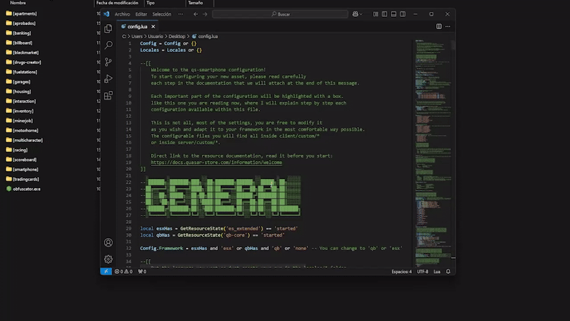

# Installation

## Script Download

Before starting, you must log in to the CFX portal to download the asset. You will be able to download it as many times as you want on the official CFX page. Just as you download it the first time, you will also download it multiple times in the future to get updates.



### Logging in to the CFX Portal

First, log in to the official CFX portal by [clicking here](https://portal.cfx.re/assets/granted-assets).



### Finding Your Assets

Once logged in, navigate to the **Granted Assets** section to access your purchased assets. You can download them by clicking the **"Download"** button.



Remember, if you encounter any issues or errors when starting the asset, you can check here to see if the problem is related.


[what-is-cfx-auth.md](../../getting-started/what-is-cfx-auth.md)


<div data-full-width="false"><figure><figcaption></figcaption></figure></div>

***

## Downloading Dependencies

The dependencies for this asset are mandatory, so please follow the dependency guide completely and use all required files.

When downloading a dependency, ensure the file is properly unzipped and does not include **"-main"** at the end of its name. If it does, please remove it.



### ox\_lib





### oxmysql





### xsound





### mhacking





### MariaDB (latest)

Please do not ignore this as it is the most important dependency.





<figure><figcaption></figcaption></figure>

***

## Update artifacts and gamebuild

Updating to the latest **artifacts** and **gamebuild** is essential to avoid common server issues. Here's how to do it properly:



### Update Artifacts

> To find the best FiveM artifact, visit [artifacts.jgscripts.com](https://artifacts.jgscripts.com). Thanks to JG Scripts.

Completely replace your current artifacts with the latest version. Download the appropriate artifacts for your operating system from the official links:

* **Windows**: [Windows Artifacts](https://runtime.fivem.net/artifacts/fivem/build_server_windows/master/).
* **Linux**: [Linux Artifacts](https://runtime.fivem.net/artifacts/fivem/build_proot_linux/master/).



### Update Gamebuild

Using gamebuild 3095 is recommended as it is the most stable version, ensuring optimal performance and avoiding compatibility issues.

Edit the `server.cfg` file and add the following line:

```plaintext
sv_enforceGameBuild 3095
```



You can see the complete guide to update your server here:


[how-to-update-my-server.md](../../development-guides/before-you-start/how-to-update-my-server.md)


<figure><figcaption></figcaption></figure>

***

## Server.cfg Positioning


Please note that this asset has two downloads. One is "Smartphone PRO \[main]" and the other is "Smartphone PRO \[props]", you can start both in the same folder.


This asset must always be started below your framework and inventory. If you do not do this, you will encounter issues when using it or even critical errors. It is recommended to start the entire download folder using **"ensure \[smartphone]"** to maintain a clean order and proper initialization.

<figure><figcaption></figcaption></figure>

***

## **Database Installation**

For this step, we highly recommend using **HeidiSQL** to avoid issues, as it provides an updated version of MariaDB. We have a guide that explains step-by-step how to use HeidiSQL. If you choose to use phpMyAdmin, we will not be responsible for any errors that may occur in your database.


[how-to-install-heidisql.md](../../development-guides/before-you-start/how-to-install-heidisql.md)


Select the framework you are using and then execute the SQL in your HeidiSQL. If you encounter errors, ensure you are using the most current version of MariaDB. You can refer to our guide above or search online.

<details>

<summary>Database for esx</summary>

```sql
ALTER TABLE
    `users`
ADD
    IF NOT EXISTS `cryptocurrency` LONGTEXT NOT NULL DEFAULT '',
ADD
    IF NOT EXISTS `crypto_wallet` INT(11) NULL DEFAULT '0',
ADD
    IF NOT EXISTS `phone_number` VARCHAR(25) NULL;

DROP TABLE IF EXISTS `crypto_transactions`;

CREATE TABLE `crypto_transactions` (
    `id` INT(11) NOT NULL AUTO_INCREMENT,
    `citizenid` VARCHAR(50) NULL DEFAULT NULL COLLATE 'utf8mb4_general_ci',
    `title` VARCHAR(50) NULL DEFAULT NULL COLLATE 'utf8mb4_general_ci',
    `message` TEXT NULL DEFAULT NULL COLLATE 'utf8mb4_general_ci',
    `date` TIMESTAMP NULL DEFAULT current_timestamp(),
    PRIMARY KEY (`id`) USING BTREE,
    INDEX `citizenid` (`citizenid`) USING BTREE
) COLLATE = 'utf8mb4_general_ci' ENGINE = InnoDB AUTO_INCREMENT = 1;

DROP TABLE IF EXISTS `darkchat_messages`;

CREATE TABLE `darkchat_messages` (
    `id` int(11) NOT NULL AUTO_INCREMENT,
    `owner` varchar(46) DEFAULT NULL,
    `name` varchar(50) DEFAULT '',
    `messages` text DEFAULT NULL,
    `password` varchar(50) DEFAULT NULL,
    PRIMARY KEY (`id`) USING BTREE,
    KEY `id` (`id`) USING BTREE
) ENGINE = InnoDB AUTO_INCREMENT = 13 DEFAULT CHARSET = utf8mb4;

DROP TABLE IF EXISTS `instagram_accounts`;

CREATE TABLE `instagram_accounts` (
    `id` int(11) NOT NULL AUTO_INCREMENT,
    `phone` varchar(50) NOT NULL DEFAULT '0',
    `owner` varchar(120) DEFAULT NULL,
    `name` varchar(50) DEFAULT NULL,
    `username` varchar(50) DEFAULT '0',
    `password` varchar(50) NOT NULL DEFAULT '0',
    `avatar` text DEFAULT NULL,
    `bio` text DEFAULT NULL,
    `verified` int(11) DEFAULT NULL,
    PRIMARY KEY (`id`) USING BTREE,
    UNIQUE KEY `username` (`username`) USING BTREE,
    KEY `phone` (`phone`) USING BTREE,
    KEY `id` (`id`) USING BTREE
) ENGINE = InnoDB AUTO_INCREMENT = 1 DEFAULT CHARSET = utf8mb4 COLLATE = utf8mb4_unicode_ci;

DROP TABLE IF EXISTS `instagram_follow`;

CREATE TABLE `instagram_follow` (
    `id` int(11) NOT NULL AUTO_INCREMENT,
    `follower` int(11) NOT NULL DEFAULT 0,
    `following` int(11) NOT NULL DEFAULT 0,
    `updatedDate` timestamp NULL DEFAULT current_timestamp() ON UPDATE current_timestamp(),
    PRIMARY KEY (`id`)
) ENGINE = InnoDB AUTO_INCREMENT = 104 DEFAULT CHARSET = utf8mb4 COLLATE = utf8mb4_unicode_ci;

DROP TABLE IF EXISTS `instagram_messages`;

CREATE TABLE `instagram_messages` (
    `id` INT(11) NOT NULL AUTO_INCREMENT,
    `sender` INT(11) NOT NULL DEFAULT '0',
    `receiver` INT(11) NOT NULL DEFAULT '0',
    `time` TIMESTAMP NULL DEFAULT current_timestamp() ON UPDATE current_timestamp(),
    `messages` LONGTEXT NOT NULL COLLATE 'utf8mb4_unicode_ci',
    PRIMARY KEY (`id`) USING BTREE
) COLLATE = 'utf8mb4_unicode_ci' ENGINE = InnoDB AUTO_INCREMENT = 1;

DROP TABLE IF EXISTS `instagram_notifications`;

CREATE TABLE `instagram_notifications` (
    `id` int(11) NOT NULL AUTO_INCREMENT,
    `userId` int(11) NOT NULL DEFAULT 0,
    `targetId` int(11) NOT NULL DEFAULT 0,
    `type` varchar(50) COLLATE utf8mb4_unicode_ci NOT NULL DEFAULT '0',
    `time` timestamp NOT NULL DEFAULT current_timestamp() ON UPDATE current_timestamp(),
    `content` text COLLATE utf8mb4_unicode_ci DEFAULT NULL,
    PRIMARY KEY (`id`)
) ENGINE = InnoDB AUTO_INCREMENT = 116 DEFAULT CHARSET = utf8mb4 COLLATE = utf8mb4_unicode_ci;

DROP TABLE IF EXISTS `instagram_posts`;

CREATE TABLE `instagram_posts` (
    `id` int(11) NOT NULL AUTO_INCREMENT,
    `time` timestamp NULL DEFAULT current_timestamp() ON UPDATE current_timestamp(),
    `userId` int(11) DEFAULT NULL,
    `data` longtext DEFAULT NULL,
    `content` text DEFAULT NULL,
    `description` text DEFAULT NULL,
    `type` tinytext DEFAULT NULL,
    `likes` text DEFAULT NULL,
    `filter` tinytext DEFAULT NULL,
    `commentCount` int(11) DEFAULT 0,
    PRIMARY KEY (`id`)
) ENGINE = InnoDB AUTO_INCREMENT = 525 DEFAULT CHARSET = utf8mb4 COLLATE = utf8mb4_unicode_ci;

CREATE TABLE IF NOT EXISTS `instagram_post_comments` (
    `id` int(11) NOT NULL AUTO_INCREMENT,
    `userId` int(11) DEFAULT NULL,
    `postId` int(11) DEFAULT NULL,
    `comment` text DEFAULT NULL,
    `time` timestamp NULL DEFAULT current_timestamp() ON UPDATE current_timestamp(),
    PRIMARY KEY (`id`),
    KEY `postId` (`postId`)
) ENGINE = InnoDB AUTO_INCREMENT = 4405 COLLATE = utf8mb4_unicode_ci;

DROP TRIGGER IF EXISTS `instagram_decrement_comment_count`;

SET @OLDTMP_SQL_MODE=@@SQL_MODE, SQL_MODE='STRICT_TRANS_TABLES,ERROR_FOR_DIVISION_BY_ZERO,NO_AUTO_CREATE_USER,NO_ENGINE_SUBSTITUTION';
DELIMITER //
CREATE TRIGGER `instagram_decrement_comment_count` AFTER DELETE ON `instagram_post_comments` FOR EACH ROW BEGIN
    UPDATE instagram_posts SET commentCount = commentCount + 1 WHERE id = OLD.postId;
END//
DELIMITER ;
SET SQL_MODE=@OLDTMP_SQL_MODE;

DROP TRIGGER IF EXISTS `instagram_increment_comment_count`;

SET @OLDTMP_SQL_MODE=@@SQL_MODE, SQL_MODE='STRICT_TRANS_TABLES,ERROR_FOR_DIVISION_BY_ZERO,NO_AUTO_CREATE_USER,NO_ENGINE_SUBSTITUTION';
DELIMITER //
CREATE TRIGGER `instagram_increment_comment_count` AFTER INSERT ON `instagram_post_comments` FOR EACH ROW BEGIN
    UPDATE instagram_posts SET commentCount = commentCount + 1 WHERE id = NEW.postId;
END//
DELIMITER ;
SET SQL_MODE=@OLDTMP_SQL_MODE;

DROP TABLE IF EXISTS `instagram_stories`;

CREATE TABLE `instagram_stories` (
    `id` int(11) NOT NULL AUTO_INCREMENT,
    `userId` int(11) NOT NULL DEFAULT 0,
    `updatedDate` timestamp NOT NULL DEFAULT current_timestamp() ON UPDATE current_timestamp(),
    `data` text COLLATE armscii8_bin NOT NULL,
    PRIMARY KEY (`id`) USING BTREE
) ENGINE = InnoDB AUTO_INCREMENT = 14 DEFAULT CHARSET = armscii8 COLLATE = armscii8_bin;

DROP TABLE IF EXISTS `mail_accounts`;

CREATE TABLE `mail_accounts` (
    `id` INT(11) NOT NULL AUTO_INCREMENT,
    `owner` VARCHAR(50) NULL DEFAULT '0' COLLATE 'utf8mb4_unicode_ci',
    `mail` VARCHAR(50) NULL DEFAULT '0' COLLATE 'utf8mb4_unicode_ci',
    `name` VARCHAR(50) NULL DEFAULT '0' COLLATE 'utf8mb4_unicode_ci',
    `password` VARCHAR(50) NULL DEFAULT '' COLLATE 'utf8mb4_unicode_ci',
    `phone` VARCHAR(50) NULL DEFAULT '0' COLLATE 'utf8mb4_unicode_ci',
    PRIMARY KEY (`id`) USING BTREE
) COLLATE = 'utf8mb4_unicode_ci' ENGINE = InnoDB AUTO_INCREMENT = 14;

DROP TABLE IF EXISTS `phone_gallery`;

CREATE TABLE `phone_gallery` (
    `id` INT(11) NOT NULL AUTO_INCREMENT,
    `identifier` VARCHAR(46) NULL DEFAULT NULL COLLATE 'utf8mb4_general_ci',
    `content` TEXT NOT NULL COLLATE 'utf8mb4_general_ci',
    `type` VARCHAR(15) NOT NULL DEFAULT '' COLLATE 'utf8mb4_general_ci',
    `data` LONGTEXT NOT NULL DEFAULT '' COLLATE 'utf8mb4_general_ci',
    `created_at` TIMESTAMP NOT NULL DEFAULT current_timestamp() ON UPDATE current_timestamp(),
    `filter` TEXT NULL DEFAULT NULL COLLATE 'utf8mb4_general_ci',
    PRIMARY KEY (`id`) USING BTREE,
    INDEX `type` (`type`) USING BTREE,
    INDEX `identifier` (`identifier`) USING BTREE
) COLLATE = 'utf8mb4_general_ci' ENGINE = InnoDB AUTO_INCREMENT = 1;

DROP TABLE IF EXISTS `phone_messages`;

CREATE TABLE `phone_messages` (
    `id` INT(11) NOT NULL AUTO_INCREMENT,
    `phone` VARCHAR(50) NOT NULL DEFAULT '' COLLATE 'utf8mb4_general_ci',
    `number` VARCHAR(50) NULL DEFAULT NULL COLLATE 'utf8mb4_general_ci',
    `messages` LONGTEXT NULL DEFAULT NULL COLLATE 'utf8mb4_general_ci',
    `created` TIMESTAMP NULL DEFAULT current_timestamp() ON UPDATE current_timestamp(),
    `unreaded` INT(11) NULL DEFAULT NULL,
    PRIMARY KEY (`id`) USING BTREE
) COLLATE = 'utf8mb4_general_ci' ENGINE = InnoDB AUTO_INCREMENT = 150;

DROP TABLE IF EXISTS `phone_notifies`;

CREATE TABLE `phone_notifies` (
    `id` INT(11) NOT NULL AUTO_INCREMENT,
    `phone` VARCHAR(50) NULL DEFAULT NULL COLLATE 'utf8mb4_general_ci',
    `msg_content` TEXT NULL DEFAULT NULL COLLATE 'utf8mb4_general_ci',
    `msg_head` VARCHAR(50) NOT NULL DEFAULT '' COLLATE 'utf8mb4_general_ci',
    `app_name` TEXT NULL DEFAULT NULL COLLATE 'utf8mb4_general_ci',
    `msg_time` TIMESTAMP NULL DEFAULT current_timestamp(),
    PRIMARY KEY (`id`) USING BTREE
) COLLATE = 'utf8mb4_general_ci' ENGINE = InnoDB AUTO_INCREMENT = 1;

DROP TABLE IF EXISTS `phone_recipes`;

CREATE TABLE `phone_recipes` (
    `id` int(11) NOT NULL AUTO_INCREMENT,
    `number` varchar(50) COLLATE utf8mb4_unicode_ci NOT NULL DEFAULT '',
    `data` text COLLATE utf8mb4_unicode_ci NOT NULL,
    PRIMARY KEY (`id`)
) ENGINE = InnoDB AUTO_INCREMENT = 5 DEFAULT CHARSET = utf8mb4 COLLATE = utf8mb4_unicode_ci;

DROP TABLE IF EXISTS `player_contacts`;

CREATE TABLE `player_contacts` (
    `id` INT(11) NOT NULL AUTO_INCREMENT,
    `identifier` VARCHAR(46) NULL DEFAULT NULL COLLATE 'utf8mb4_general_ci',
    `name` TEXT NULL DEFAULT NULL COLLATE 'utf8mb4_general_ci',
    `number` VARCHAR(50) NULL DEFAULT NULL COLLATE 'utf8mb4_general_ci',
    `iban` VARCHAR(50) NOT NULL DEFAULT '0' COLLATE 'utf8mb4_general_ci',
    `display` VARCHAR(50) NULL DEFAULT NULL COLLATE 'utf8mb4_general_ci',
    `note` TEXT NULL DEFAULT NULL COLLATE 'utf8mb4_general_ci',
    `pp` TEXT NULL DEFAULT NULL COLLATE 'utf8mb4_general_ci',
    `isBlocked` INT(11) NULL DEFAULT NULL,
    PRIMARY KEY (`id`) USING BTREE,
    INDEX `identifier` (`identifier`) USING BTREE
) COLLATE = 'utf8mb4_general_ci' ENGINE = InnoDB AUTO_INCREMENT = 67;

DROP TABLE IF EXISTS `player_mails`;

CREATE TABLE `player_mails` (
    `id` INT(11) NOT NULL AUTO_INCREMENT,
    `taker` VARCHAR(46) NULL DEFAULT NULL COLLATE 'utf8mb4_general_ci',
    `sender` VARCHAR(50) NULL DEFAULT NULL COLLATE 'utf8mb4_general_ci',
    `subject` VARCHAR(50) NULL DEFAULT NULL COLLATE 'utf8mb4_general_ci',
    `message` LONGTEXT NULL DEFAULT NULL COLLATE 'utf8mb4_general_ci',
    `read` TINYINT(4) NULL DEFAULT '0',
    `mailid` INT(11) NULL DEFAULT NULL,
    `date` TIMESTAMP NULL DEFAULT current_timestamp(),
    `button` TEXT NULL DEFAULT NULL COLLATE 'utf8mb4_general_ci',
    `medias` TEXT NULL DEFAULT NULL COLLATE 'utf8mb4_general_ci',
    PRIMARY KEY (`id`) USING BTREE,
    INDEX `identifier` (`taker`) USING BTREE
) COLLATE = 'utf8mb4_general_ci' ENGINE = InnoDB AUTO_INCREMENT = 1;

DROP TABLE IF EXISTS `tiktok_users`;

CREATE TABLE `tiktok_users` (
    `id` INT(11) NOT NULL AUTO_INCREMENT,
    `owner` VARCHAR(50) NOT NULL DEFAULT '' COLLATE 'utf8mb4_general_ci',
    `username` VARCHAR(50) NOT NULL DEFAULT '0' COLLATE 'utf8mb4_general_ci',
    `password` VARCHAR(50) NULL DEFAULT NULL COLLATE 'utf8mb4_general_ci',
    `phone` VARCHAR(50) NOT NULL DEFAULT '0' COLLATE 'utf8mb4_general_ci',
    `pp` TEXT NULL DEFAULT NULL COLLATE 'utf8mb4_general_ci',
    `name` VARCHAR(50) NOT NULL DEFAULT '0' COLLATE 'utf8mb4_general_ci',
    `bio` TEXT NOT NULL DEFAULT '' COLLATE 'utf8mb4_general_ci',
    `birthday` VARCHAR(50) NOT NULL DEFAULT '0' COLLATE 'utf8mb4_general_ci',
    `videos` TEXT NOT NULL DEFAULT '{}' COLLATE 'utf8mb4_general_ci',
    `followers` TEXT NOT NULL COLLATE 'utf8mb4_general_ci',
    `following` TEXT NOT NULL COLLATE 'utf8mb4_general_ci',
    `liked` TEXT NOT NULL COLLATE 'utf8mb4_general_ci',
    `verified` INT(11) NULL DEFAULT NULL,
    PRIMARY KEY (`id`) USING BTREE,
    UNIQUE INDEX `username` (`username`) USING BTREE,
    INDEX `id` (`id`) USING BTREE
) COLLATE = 'utf8mb4_general_ci' ENGINE = InnoDB AUTO_INCREMENT = 1;

DROP TABLE IF EXISTS `tiktok_videos`;

CREATE TABLE `tiktok_videos` (
    `id` int(11) NOT NULL AUTO_INCREMENT,
    `userID` int(11) DEFAULT NULL,
    `created` timestamp NOT NULL DEFAULT current_timestamp(),
    `data` text COLLATE utf8mb4_unicode_ci DEFAULT NULL,
    PRIMARY KEY (`id`)
) ENGINE = InnoDB AUTO_INCREMENT = 8 DEFAULT CHARSET = utf8mb4 COLLATE = utf8mb4_unicode_ci;

DROP TABLE IF EXISTS `market_accounts`;

CREATE TABLE `market_accounts` (
    `id` INT(11) NOT NULL AUTO_INCREMENT,
    `owner` VARCHAR(50) NOT NULL DEFAULT '' COLLATE 'utf8mb4_unicode_ci',
    `created` TIMESTAMP NOT NULL DEFAULT current_timestamp(),
    `phone` VARCHAR(50) NOT NULL COLLATE 'utf8mb4_unicode_ci',
    `name` VARCHAR(50) NOT NULL COLLATE 'utf8mb4_unicode_ci',
    `username` VARCHAR(50) NOT NULL COLLATE 'utf8mb4_unicode_ci',
    `avatar` TEXT NOT NULL COLLATE 'utf8mb4_unicode_ci',
    `password` VARCHAR(50) NOT NULL DEFAULT '' COLLATE 'utf8mb4_unicode_ci',
    PRIMARY KEY (`id`) USING BTREE,
    UNIQUE INDEX `username` (`username`) USING BTREE
) COLLATE = 'utf8mb4_unicode_ci' ENGINE = InnoDB AUTO_INCREMENT = 3;

DROP TABLE IF EXISTS `market_messages`;

CREATE TABLE `market_messages` (
    `id` INT(11) NOT NULL AUTO_INCREMENT,
    `sender` INT(11) NOT NULL,
    `receiver` INT(11) NOT NULL,
    `time` TIMESTAMP NOT NULL DEFAULT current_timestamp() ON UPDATE current_timestamp(),
    `messages` TEXT NOT NULL COLLATE 'utf8mb4_unicode_ci',
    `isMarket` INT(11) NULL DEFAULT NULL,
    PRIMARY KEY (`id`) USING BTREE
) COLLATE = 'utf8mb4_unicode_ci' ENGINE = InnoDB AUTO_INCREMENT = 3;

DROP TABLE IF EXISTS `market_markets`;

CREATE TABLE `market_markets` (
    `id` INT(11) NOT NULL,
    `name` VARCHAR(50) NOT NULL DEFAULT '' COLLATE 'utf8mb4_unicode_ci',
    `description` TEXT NOT NULL COLLATE 'utf8mb4_unicode_ci',
    `job` TEXT NOT NULL DEFAULT '[]' COLLATE 'utf8mb4_unicode_ci',
    `ratings` TEXT NOT NULL DEFAULT '[]' COLLATE 'utf8mb4_unicode_ci',
    `coords` TEXT NULL DEFAULT NULL COLLATE 'utf8mb4_unicode_ci',
    PRIMARY KEY (`id`) USING BTREE
) COLLATE = 'utf8mb4_unicode_ci' ENGINE = InnoDB;

DROP TABLE IF EXISTS `twitter_accounts`;

CREATE TABLE `twitter_accounts` (
    `id` INT(11) NOT NULL AUTO_INCREMENT,
    `owner` VARCHAR(46) NOT NULL DEFAULT '0' COLLATE 'utf8mb4_unicode_ci',
    `created` TIMESTAMP NOT NULL DEFAULT current_timestamp() ON UPDATE current_timestamp(),
    `phone` VARCHAR(50) NULL DEFAULT NULL COLLATE 'utf8mb4_unicode_ci',
    `name` VARCHAR(50) NULL DEFAULT NULL COLLATE 'utf8mb4_unicode_ci',
    `username` VARCHAR(50) NULL DEFAULT NULL COLLATE 'utf8mb4_unicode_ci',
    `password` VARCHAR(50) NULL DEFAULT NULL COLLATE 'utf8mb4_unicode_ci',
    `avatar` TEXT NULL DEFAULT NULL COLLATE 'utf8mb4_unicode_ci',
    `bio` TEXT NULL DEFAULT NULL COLLATE 'utf8mb4_unicode_ci',
    `verified` INT(11) NULL DEFAULT NULL,
    `background` TEXT NULL DEFAULT NULL COLLATE 'utf8mb4_unicode_ci',
    PRIMARY KEY (`id`) USING BTREE,
    UNIQUE INDEX `username` (`username`) USING BTREE
) COLLATE = 'utf8mb4_unicode_ci' ENGINE = InnoDB AUTO_INCREMENT = 4;

DROP TABLE IF EXISTS `twitter_follow`;

CREATE TABLE `twitter_follow` (
    `id` INT(11) NOT NULL AUTO_INCREMENT,
    `follower` INT(11) NULL DEFAULT NULL,
    `following` INT(11) NULL DEFAULT NULL,
    `updatedDate` TIMESTAMP NULL DEFAULT current_timestamp() ON UPDATE current_timestamp(),
    PRIMARY KEY (`id`) USING BTREE
) COLLATE = 'utf8mb4_unicode_ci' ENGINE = InnoDB AUTO_INCREMENT = 14;

DROP TABLE IF EXISTS `twitter_messages`;

CREATE TABLE `twitter_messages` (
    `id` INT(11) NOT NULL AUTO_INCREMENT,
    `sender` INT(11) NOT NULL,
    `receiver` INT(11) NOT NULL,
    `time` TIMESTAMP NOT NULL DEFAULT current_timestamp() ON UPDATE current_timestamp(),
    `messages` TEXT NOT NULL COLLATE 'utf8mb4_unicode_ci',
    PRIMARY KEY (`id`) USING BTREE
) COLLATE = 'utf8mb4_unicode_ci' ENGINE = InnoDB AUTO_INCREMENT = 2;

DROP TABLE IF EXISTS `twitter_notifications`;

CREATE TABLE `twitter_notifications` (
    `id` INT(11) NOT NULL AUTO_INCREMENT,
    `userId` INT(11) NOT NULL DEFAULT '0',
    `targetUserId` INT(11) NOT NULL DEFAULT '0',
    `type` VARCHAR(50) NULL DEFAULT NULL COLLATE 'utf8mb4_unicode_ci',
    `tweetId` INT(11) NULL DEFAULT NULL,
    `time` TIMESTAMP NOT NULL DEFAULT current_timestamp() ON UPDATE current_timestamp(),
    PRIMARY KEY (`id`) USING BTREE
) COLLATE = 'utf8mb4_unicode_ci' ENGINE = InnoDB AUTO_INCREMENT = 28;

DROP TABLE IF EXISTS `twitter_retweets`;

CREATE TABLE `twitter_retweets` (
    `id` INT(11) NOT NULL AUTO_INCREMENT,
    `userId` INT(11) NOT NULL DEFAULT '0',
    `tweetId` INT(11) NOT NULL DEFAULT '0',
    `created` TIMESTAMP NOT NULL DEFAULT current_timestamp() ON UPDATE current_timestamp(),
    PRIMARY KEY (`id`) USING BTREE
) COLLATE = 'utf8mb4_unicode_ci' ENGINE = InnoDB AUTO_INCREMENT = 8;

DROP TABLE IF EXISTS `twitter_tweets`;

CREATE TABLE `twitter_tweets` (
    `id` INT(11) NOT NULL AUTO_INCREMENT,
    `userId` INT(11) NOT NULL,
    `time` TIMESTAMP NOT NULL DEFAULT current_timestamp(),
    `text` TEXT NULL DEFAULT NULL COLLATE 'utf8mb4_unicode_ci',
    `media` TEXT NULL DEFAULT NULL COLLATE 'utf8mb4_unicode_ci',
    `likes` TEXT NULL DEFAULT '[]' COLLATE 'utf8mb4_unicode_ci',
    `mentions` TEXT NULL DEFAULT '[]' COLLATE 'utf8mb4_unicode_ci',
    `comments` TEXT NULL DEFAULT '[]' COLLATE 'utf8mb4_unicode_ci',
    `retweets` TEXT NULL DEFAULT '[]' COLLATE 'utf8mb4_unicode_ci',
    PRIMARY KEY (`id`) USING BTREE
) COLLATE = 'utf8mb4_unicode_ci' ENGINE = InnoDB AUTO_INCREMENT = 19;

DROP TABLE IF EXISTS `phone_metadata`;

CREATE TABLE `phone_metadata` (
    `owneridentifier` VARCHAR(90) NOT NULL DEFAULT '' COLLATE 'utf8mb4_unicode_ci',
    `metadata` LONGTEXT NULL DEFAULT NULL COLLATE 'utf8mb4_unicode_ci',
    `phoneNumber` VARCHAR(50) NULL DEFAULT '' COLLATE 'utf8mb4_unicode_ci',
    PRIMARY KEY (`owneridentifier`) USING BTREE
) COLLATE = 'utf8mb4_unicode_ci' ENGINE = InnoDB;

DROP TABLE IF EXISTS `phone_yellowpages`;

CREATE TABLE `phone_yellowpages` (
    `id` INT(11) NOT NULL AUTO_INCREMENT,
    `owner` VARCHAR(50) NULL DEFAULT NULL COLLATE 'utf8mb4_general_ci',
    `title` TEXT NULL DEFAULT NULL COLLATE 'utf8mb4_general_ci',
    `description` TEXT NULL DEFAULT NULL COLLATE 'utf8mb4_general_ci',
    `image` TEXT NULL DEFAULT NULL COLLATE 'utf8mb4_general_ci',
    `price` INT(11) NULL DEFAULT '0',
    `created` TIMESTAMP NULL DEFAULT current_timestamp(),
    PRIMARY KEY (`id`) USING BTREE
) COLLATE = 'utf8mb4_general_ci' ENGINE = InnoDB AUTO_INCREMENT = 4;

DROP TABLE IF EXISTS `phone_bills`;

CREATE TABLE `phone_bills` (
    `id` INT(11) NOT NULL AUTO_INCREMENT,
    `price` INT(11) NOT NULL DEFAULT '0',
    `identifier` VARCHAR(46) NOT NULL DEFAULT '' COLLATE 'utf8mb4_general_ci',
    `timestamp` TIMESTAMP NULL DEFAULT current_timestamp(),
    `sender` VARCHAR(50) NOT NULL DEFAULT '' COLLATE 'utf8mb4_general_ci',
    `label` VARCHAR(50) NULL DEFAULT NULL COLLATE 'utf8mb4_general_ci',
    PRIMARY KEY (`id`) USING BTREE,
    INDEX `id` (`id`) USING BTREE,
    INDEX `identifier` (`identifier`) USING BTREE
) COLLATE = 'utf8mb4_general_ci' ENGINE = InnoDB AUTO_INCREMENT = 1;

DROP TABLE IF EXISTS `whatsapp_accounts`;

CREATE TABLE `whatsapp_accounts` (
    `id` INT(11) NOT NULL AUTO_INCREMENT,
    `phone` VARCHAR(50) NOT NULL DEFAULT '0' COLLATE 'utf8mb4_general_ci',
    `name` VARCHAR(50) NOT NULL DEFAULT '0' COLLATE 'utf8mb4_general_ci',
    `avatar` TEXT NOT NULL DEFAULT '' COLLATE 'utf8mb4_general_ci',
    `bio` VARCHAR(50) NOT NULL DEFAULT '' COLLATE 'utf8mb4_general_ci',
    `group_creator` INT(11) NULL DEFAULT NULL,
    `created` TIMESTAMP NULL DEFAULT current_timestamp(),
    `hide_receipts` INT(11) NULL DEFAULT '0',
    PRIMARY KEY (`id`) USING BTREE
) COLLATE = 'utf8mb4_general_ci' ENGINE = InnoDB AUTO_INCREMENT = 1;

DROP TABLE IF EXISTS `whatsapp_call_history`;

CREATE TABLE `whatsapp_call_history` (
    `id` INT(11) NOT NULL AUTO_INCREMENT,
    `caller` INT(11) NOT NULL DEFAULT '0',
    `calledId` INT(11) NULL DEFAULT NULL,
    `time` TIMESTAMP NULL DEFAULT current_timestamp(),
    PRIMARY KEY (`id`) USING BTREE
) COLLATE = 'utf8mb4_general_ci' ENGINE = InnoDB AUTO_INCREMENT = 1;

DROP TABLE IF EXISTS `whatsapp_call_history_users`;

CREATE TABLE `whatsapp_call_history_users` (
    `id` INT(11) NOT NULL AUTO_INCREMENT,
    `userId` INT(11) NOT NULL DEFAULT '0',
    `callId` INT(11) NOT NULL DEFAULT '0',
    PRIMARY KEY (`id`) USING BTREE
) COLLATE = 'utf8mb4_general_ci' ENGINE = InnoDB AUTO_INCREMENT = 1;

DROP TABLE IF EXISTS `whatsapp_chats`;

CREATE TABLE `whatsapp_chats` (
    `id` INT(11) NOT NULL AUTO_INCREMENT,
    `sender` INT(11) NOT NULL DEFAULT '0',
    `receiver` INT(11) NOT NULL DEFAULT '0',
    `wallpaper` TEXT NULL DEFAULT NULL COLLATE 'utf8mb4_general_ci',
    `isGroup` VARCHAR(50) NULL DEFAULT NULL COLLATE 'utf8mb4_general_ci',
    `time` TIMESTAMP NOT NULL DEFAULT current_timestamp() ON UPDATE current_timestamp(),
    `messages` TEXT NULL DEFAULT NULL COLLATE 'utf8mb4_general_ci',
    PRIMARY KEY (`id`) USING BTREE
) COLLATE = 'utf8mb4_general_ci' ENGINE = InnoDB AUTO_INCREMENT = 21;

DROP TABLE IF EXISTS `whatsapp_group_admins`;

CREATE TABLE `whatsapp_group_admins` (
    `id` INT(11) NOT NULL AUTO_INCREMENT,
    `userId` INT(11) NOT NULL DEFAULT '0',
    `groupId` INT(11) NOT NULL DEFAULT '0',
    PRIMARY KEY (`id`) USING BTREE
) COLLATE = 'utf8mb4_general_ci' ENGINE = InnoDB AUTO_INCREMENT = 11;

DROP TABLE IF EXISTS `whatsapp_group_members`;

CREATE TABLE `whatsapp_group_members` (
    `id` INT(11) NOT NULL AUTO_INCREMENT,
    `userId` INT(11) NOT NULL DEFAULT '0',
    `groupId` INT(11) NOT NULL DEFAULT '0',
    PRIMARY KEY (`id`) USING BTREE
) COLLATE = 'utf8mb4_general_ci' ENGINE = InnoDB AUTO_INCREMENT = 28;

DROP TABLE IF EXISTS `whatsapp_status`;

CREATE TABLE `whatsapp_status` (
    `userId` INT(11) NOT NULL DEFAULT '0',
    `data` TEXT NULL DEFAULT NULL COLLATE 'utf8mb4_general_ci',
    PRIMARY KEY (`userId`) USING BTREE
) COLLATE = 'utf8mb4_general_ci' ENGINE = InnoDB;

DROP TABLE IF EXISTS `phone_app_store`;

CREATE TABLE `phone_app_store` (
    `id` INT(11) NOT NULL AUTO_INCREMENT,
    `application` VARCHAR(50) NULL DEFAULT '0' COLLATE 'utf8mb4_general_ci',
    `ratings` TEXT NULL DEFAULT '[]' COLLATE 'utf8mb4_general_ci',
    `downloads` INT(11) NULL DEFAULT '0',
    PRIMARY KEY (`id`) USING BTREE
) COLLATE = 'utf8mb4_general_ci' ENGINE = InnoDB;

DROP TABLE IF EXISTS `weazel`;

CREATE TABLE `weazel` (
    `id` INT(11) NOT NULL AUTO_INCREMENT,
    `owner` VARCHAR(46) NULL DEFAULT NULL COLLATE 'utf8mb4_unicode_ci',
    `title` VARCHAR(50) NULL DEFAULT NULL COLLATE 'utf8mb4_unicode_ci',
    `content` TEXT NULL DEFAULT NULL COLLATE 'utf8mb4_unicode_ci',
    `image` TEXT NULL DEFAULT NULL COLLATE 'utf8mb4_unicode_ci',
    `created` VARCHAR(50) NULL DEFAULT '' COLLATE 'utf8mb4_unicode_ci',
    PRIMARY KEY (`id`) USING BTREE
) COLLATE = 'utf8mb4_unicode_ci' ENGINE = InnoDB AUTO_INCREMENT = 2;

DROP TABLE IF EXISTS `tinder_accounts`;

CREATE TABLE `tinder_accounts` (
    `id` INT(11) NOT NULL AUTO_INCREMENT,
    `phone` VARCHAR(50) NOT NULL DEFAULT '0' COLLATE 'utf8mb4_general_ci',
    `name` VARCHAR(50) NOT NULL DEFAULT '0' COLLATE 'utf8mb4_general_ci',
    `owner` VARCHAR(70) NOT NULL DEFAULT '0' COLLATE 'utf8mb4_general_ci',
    `photos` TEXT NULL DEFAULT NULL COLLATE 'utf8mb4_general_ci',
    `dob` VARCHAR(50) NULL DEFAULT NULL COLLATE 'utf8mb4_general_ci',
    `bio` VARCHAR(100) NULL DEFAULT NULL COLLATE 'utf8mb4_general_ci',
    `password` VARCHAR(100) NULL DEFAULT NULL COLLATE 'utf8mb4_general_ci',
    `gender` VARCHAR(10) NULL DEFAULT NULL COLLATE 'utf8mb4_general_ci',
    `interested` VARCHAR(10) NULL DEFAULT NULL COLLATE 'utf8mb4_general_ci',
    PRIMARY KEY (`id`) USING BTREE
) COLLATE = 'utf8mb4_general_ci' ENGINE = InnoDB AUTO_INCREMENT = 7;

DROP TABLE IF EXISTS `tinder_messages`;

CREATE TABLE `tinder_messages` (
    `id` INT(11) NOT NULL AUTO_INCREMENT,
    `unread` INT(11) NOT NULL DEFAULT '0',
    `sender` INT(11) NOT NULL DEFAULT '0',
    `receiver` INT(11) NOT NULL DEFAULT '0',
    `time` TIMESTAMP NOT NULL DEFAULT current_timestamp() ON UPDATE current_timestamp(),
    `messages` TEXT NULL DEFAULT NULL COLLATE 'utf8mb4_general_ci',
    PRIMARY KEY (`id`) USING BTREE
) COLLATE = 'utf8mb4_general_ci' ENGINE = InnoDB AUTO_INCREMENT = 5;

DROP TABLE IF EXISTS `tinder_swipers`;

CREATE TABLE `tinder_swipers` (
    `id` INT(11) NOT NULL AUTO_INCREMENT,
    `userId` INT(11) NOT NULL DEFAULT '0',
    `targetId` INT(11) NOT NULL DEFAULT '0',
    `liked` INT(11) NOT NULL DEFAULT '0',
    PRIMARY KEY (`id`) USING BTREE
) COLLATE = 'utf8mb4_general_ci' ENGINE = InnoDB AUTO_INCREMENT = 21;

DROP TABLE IF EXISTS `uber_rider_last_transactions`;

CREATE TABLE `uber_rider_last_transactions` (
    `id` INT(11) NOT NULL AUTO_INCREMENT,
    `owner` VARCHAR(50) NULL DEFAULT NULL COLLATE 'utf8mb4_general_ci',
    `date` TIMESTAMP NOT NULL DEFAULT current_timestamp(),
    `target` VARCHAR(80) NULL DEFAULT NULL COLLATE 'utf8mb4_general_ci',
    `targetName` VARCHAR(50) NULL DEFAULT NULL COLLATE 'utf8mb4_general_ci',
    `plate` VARCHAR(80) NULL DEFAULT NULL COLLATE 'utf8mb4_general_ci',
    `price` INT(11) NULL DEFAULT NULL,
    `type` VARCHAR(50) NULL DEFAULT NULL COLLATE 'utf8mb4_general_ci',
    PRIMARY KEY (`id`) USING BTREE
) COLLATE = 'utf8mb4_general_ci' ENGINE = InnoDB AUTO_INCREMENT = 6;

DROP TABLE IF EXISTS `phone_chatrooms`;

CREATE TABLE `phone_chatrooms` (
    `id` INT(10) UNSIGNED NOT NULL AUTO_INCREMENT,
    `room_code` VARCHAR(10) NOT NULL COLLATE 'utf8mb4_general_ci',
    `room_name` VARCHAR(15) NOT NULL COLLATE 'utf8mb4_general_ci',
    `room_owner_id` INT(11) NULL DEFAULT NULL,
    `room_owner_name` VARCHAR(50) NULL DEFAULT NULL COLLATE 'utf8mb4_general_ci',
    `room_members` TEXT NULL DEFAULT '{}' COLLATE 'utf8mb4_general_ci',
    `room_pin` VARCHAR(50) NULL DEFAULT NULL COLLATE 'utf8mb4_general_ci',
    `unpaid_balance` DECIMAL(10, 2) NULL DEFAULT '0.00',
    `is_masked` TINYINT(1) NULL DEFAULT '0',
    `is_pinned` TINYINT(1) NULL DEFAULT '0',
    `created` DATETIME NULL DEFAULT current_timestamp(),
    PRIMARY KEY (`id`) USING BTREE,
    UNIQUE INDEX `room_code` (`room_code`) USING BTREE
) COLLATE = 'utf8mb4_general_ci' ENGINE = InnoDB AUTO_INCREMENT = 1;

INSERT INTO
    `phone_chatrooms` (
        `room_code`,
        `room_name`,
        `room_owner_id`,
        `room_owner_name`,
        `is_pinned`
    )
VALUES
    ('411', '411', -1, 'Government', 1),
    (
        'lounge',
        'The Lounge',
        -1,
        'Government',
        1
    ),
    ('events', 'Events', -1, 'Government', 1);

DROP TABLE IF EXISTS `phone_chatroom_messages`;

CREATE TABLE `phone_chatroom_messages` (
    `id` INT unsigned NOT NULL AUTO_INCREMENT,
    `room_id` INT unsigned,
    `member_id` VARCHAR(20),
    `member_name` VARCHAR(50),
    `message` TEXT NOT NULL,
    `is_pinned` BOOLEAN DEFAULT FALSE,
    `created` DATETIME DEFAULT NOW(),
    PRIMARY KEY (`id`)
);

DROP TABLE IF EXISTS `discord_accounts`;

CREATE TABLE `discord_accounts` (
    `id` INT(11) NOT NULL AUTO_INCREMENT,
    `owner` VARCHAR(80) NOT NULL DEFAULT '0' COLLATE 'utf8mb4_general_ci',
    `phone` VARCHAR(50) NOT NULL DEFAULT '0' COLLATE 'utf8mb4_general_ci',
    `name` VARCHAR(50) NULL DEFAULT NULL COLLATE 'utf8mb4_general_ci',
    `username` VARCHAR(50) NOT NULL DEFAULT '0' COLLATE 'utf8mb4_general_ci',
    `password` VARCHAR(50) NOT NULL DEFAULT '0' COLLATE 'utf8mb4_general_ci',
    PRIMARY KEY (`id`) USING BTREE
) COLLATE = 'utf8mb4_general_ci' ENGINE = InnoDB AUTO_INCREMENT = 3;

DROP TABLE IF EXISTS `facetime_call_history`;

CREATE TABLE `facetime_call_history` (
    `id` INT(11) NOT NULL AUTO_INCREMENT,
    `caller` VARCHAR(50) NOT NULL DEFAULT '0' COLLATE 'utf8mb4_general_ci',
    `calledId` VARCHAR(50) NULL DEFAULT NULL COLLATE 'utf8mb4_general_ci',
    `time` TIMESTAMP NULL DEFAULT current_timestamp(),
    PRIMARY KEY (`id`) USING BTREE
) COLLATE = 'utf8mb4_general_ci' ENGINE = InnoDB;

DROP TABLE IF EXISTS `phone_favorite_contacts`;

CREATE TABLE `phone_favorite_contacts` (
    `id` INT(11) NOT NULL AUTO_INCREMENT,
    `identifier` VARCHAR(50) NOT NULL DEFAULT '0' COLLATE 'utf8mb4_general_ci',
    `phone` VARCHAR(50) NULL DEFAULT NULL COLLATE 'utf8mb4_general_ci',
    PRIMARY KEY (`id`) USING BTREE
) COLLATE = 'utf8mb4_general_ci' ENGINE = InnoDB;

DROP TABLE IF EXISTS `crypto`;

CREATE TABLE `crypto` (
    `crypto` varchar(50) NOT NULL DEFAULT 'btc',
    `worth` int(11) NOT NULL DEFAULT 0,
    `history` text DEFAULT NULL,
    PRIMARY KEY (`crypto`)
) ENGINE = InnoDB DEFAULT CHARSET = utf8mb4;

INSERT INTO
    `crypto`
VALUES
    (
        'btc',
        1000,
        '[{"NewWorth":1000,"PreviousWorth":1000}]'
    );

DROP TABLE IF EXISTS `crypto_history`;

CREATE TABLE `crypto_history` (
    `id` INT(11) NOT NULL AUTO_INCREMENT,
    `worth` INT(11) NOT NULL DEFAULT '0',
    `name` VARCHAR(50) NOT NULL DEFAULT '0' COLLATE 'utf8mb4_general_ci',
    `date` TIMESTAMP NOT NULL DEFAULT current_timestamp(),
    PRIMARY KEY (`id`) USING BTREE
) COLLATE = 'utf8mb4_general_ci' ENGINE = InnoDB;

DROP TABLE IF EXISTS `lapraces`;

CREATE TABLE `lapraces` (
    `id` int(11) NOT NULL AUTO_INCREMENT,
    `name` varchar(50) DEFAULT NULL,
    `checkpoints` text DEFAULT NULL,
    `records` text DEFAULT NULL,
    `creator` varchar(50) DEFAULT NULL,
    `distance` int(11) DEFAULT NULL,
    `raceid` varchar(50) DEFAULT NULL,
    PRIMARY KEY (`id`)
) ENGINE = InnoDB AUTO_INCREMENT = 35 DEFAULT CHARSET = utf8mb4;

DROP TABLE IF EXISTS `phone_blocked_phones`;

CREATE TABLE `phone_blocked_phones` (
    `id` INT(11) NOT NULL AUTO_INCREMENT,
    `uniqueId` VARCHAR(50) NOT NULL DEFAULT '' COLLATE 'utf8mb4_unicode_ci',
    PRIMARY KEY (`id`) USING BTREE
) COLLATE = 'utf8mb4_unicode_ci' ENGINE = InnoDB;

DROP TABLE IF EXISTS `phone_backups`;

CREATE TABLE `phone_backups` (
    `id` INT(11) NOT NULL AUTO_INCREMENT,
    `phone` VARCHAR(50) NOT NULL DEFAULT '0' COLLATE 'utf8mb4_unicode_ci',
    `data` LONGTEXT NOT NULL COLLATE 'utf8mb4_unicode_ci',
    `owner` VARCHAR(120) NOT NULL DEFAULT '' COLLATE 'utf8mb4_unicode_ci',
    PRIMARY KEY (`id`) USING BTREE
) COLLATE = 'utf8mb4_unicode_ci' ENGINE = InnoDB AUTO_INCREMENT = 17;

```

</details>

<details>

<summary>Database for qbcore</summary>

If you are a qbcore user, you will also need to edit the playertables of your qb-core, removing the tables from the old qb-phone, if you use the default tables in your qb-core/server/player.lua, you can simply copy and paste this to edit your playertable.

```lua
local playertables = { -- Add tables as needed
    { table = 'players' },
    { table = 'apartments' },
    { table = 'bank_accounts' },
    { table = 'crypto_transactions' },
    { table = 'playerskins' },
    { table = 'player_houses' },
    { table = 'player_outfits' },
    { table = 'player_vehicles' }
}
```

Once the above step is done, you can execute the sql.

```sql
ALTER TABLE
    `players`
ADD
    IF NOT EXISTS `cryptocurrency` LONGTEXT NOT NULL DEFAULT '',
ADD
    IF NOT EXISTS `crypto_wallet_id` TEXT NULL DEFAULT NULL,
ADD
    IF NOT EXISTS `cryptocurrencytransfers` TEXT NULL DEFAULT NULL;

DROP TABLE IF EXISTS `crypto_transactions`;

CREATE TABLE `crypto_transactions` (
    `id` INT(11) NOT NULL AUTO_INCREMENT,
    `citizenid` VARCHAR(50) NULL DEFAULT NULL COLLATE 'utf8mb4_general_ci',
    `title` VARCHAR(50) NULL DEFAULT NULL COLLATE 'utf8mb4_general_ci',
    `message` TEXT NULL DEFAULT NULL COLLATE 'utf8mb4_general_ci',
    `date` TIMESTAMP NULL DEFAULT current_timestamp(),
    PRIMARY KEY (`id`) USING BTREE,
    INDEX `citizenid` (`citizenid`) USING BTREE
) COLLATE = 'utf8mb4_general_ci' ENGINE = InnoDB AUTO_INCREMENT = 1;

DROP TABLE IF EXISTS `darkchat_messages`;

CREATE TABLE `darkchat_messages` (
    `id` int(11) NOT NULL AUTO_INCREMENT,
    `owner` varchar(46) DEFAULT NULL,
    `name` varchar(50) DEFAULT '',
    `messages` text DEFAULT NULL,
    `password` varchar(50) DEFAULT NULL,
    PRIMARY KEY (`id`) USING BTREE,
    KEY `id` (`id`) USING BTREE
) ENGINE = InnoDB AUTO_INCREMENT = 13 DEFAULT CHARSET = utf8mb4;

DROP TABLE IF EXISTS `instagram_accounts`;

CREATE TABLE `instagram_accounts` (
    `id` int(11) NOT NULL AUTO_INCREMENT,
    `phone` varchar(50) NOT NULL DEFAULT '0',
    `owner` varchar(120) DEFAULT NULL,
    `name` varchar(50) DEFAULT NULL,
    `username` varchar(50) DEFAULT '0',
    `password` varchar(50) NOT NULL DEFAULT '0',
    `avatar` text DEFAULT NULL,
    `bio` text DEFAULT NULL,
    `verified` int(11) DEFAULT NULL,
    PRIMARY KEY (`id`) USING BTREE,
    UNIQUE KEY `username` (`username`) USING BTREE,
    KEY `phone` (`phone`) USING BTREE,
    KEY `id` (`id`) USING BTREE
) ENGINE = InnoDB AUTO_INCREMENT = 1 DEFAULT CHARSET = utf8mb4 COLLATE = utf8mb4_unicode_ci;

DROP TABLE IF EXISTS `instagram_follow`;

CREATE TABLE `instagram_follow` (
    `id` int(11) NOT NULL AUTO_INCREMENT,
    `follower` int(11) NOT NULL DEFAULT 0,
    `following` int(11) NOT NULL DEFAULT 0,
    `updatedDate` timestamp NULL DEFAULT current_timestamp() ON UPDATE current_timestamp(),
    PRIMARY KEY (`id`)
) ENGINE = InnoDB AUTO_INCREMENT = 104 DEFAULT CHARSET = utf8mb4 COLLATE = utf8mb4_unicode_ci;

DROP TABLE IF EXISTS `instagram_messages`;

CREATE TABLE `instagram_messages` (
    `id` INT(11) NOT NULL AUTO_INCREMENT,
    `sender` INT(11) NOT NULL DEFAULT '0',
    `receiver` INT(11) NOT NULL DEFAULT '0',
    `time` TIMESTAMP NULL DEFAULT current_timestamp() ON UPDATE current_timestamp(),
    `messages` LONGTEXT NOT NULL COLLATE 'utf8mb4_unicode_ci',
    PRIMARY KEY (`id`) USING BTREE
) COLLATE = 'utf8mb4_unicode_ci' ENGINE = InnoDB AUTO_INCREMENT = 1;

DROP TABLE IF EXISTS `instagram_notifications`;

CREATE TABLE `instagram_notifications` (
    `id` int(11) NOT NULL AUTO_INCREMENT,
    `userId` int(11) NOT NULL DEFAULT 0,
    `targetId` int(11) NOT NULL DEFAULT 0,
    `type` varchar(50) COLLATE utf8mb4_unicode_ci NOT NULL DEFAULT '0',
    `time` timestamp NOT NULL DEFAULT current_timestamp() ON UPDATE current_timestamp(),
    `content` text COLLATE utf8mb4_unicode_ci DEFAULT NULL,
    PRIMARY KEY (`id`)
) ENGINE = InnoDB AUTO_INCREMENT = 116 DEFAULT CHARSET = utf8mb4 COLLATE = utf8mb4_unicode_ci;

DROP TABLE IF EXISTS `instagram_posts`;

CREATE TABLE `instagram_posts` (
    `id` int(11) NOT NULL AUTO_INCREMENT,
    `time` timestamp NULL DEFAULT current_timestamp() ON UPDATE current_timestamp(),
    `userId` int(11) DEFAULT NULL,
    `data` longtext DEFAULT NULL,
    `content` text DEFAULT NULL,
    `description` text DEFAULT NULL,
    `type` tinytext DEFAULT NULL,
    `likes` text DEFAULT NULL,
    `filter` tinytext DEFAULT NULL,
    `commentCount` int(11) DEFAULT 0,
    PRIMARY KEY (`id`)
) ENGINE = InnoDB AUTO_INCREMENT = 525 DEFAULT CHARSET = utf8mb4 COLLATE = utf8mb4_unicode_ci;

CREATE TABLE IF NOT EXISTS `instagram_post_comments` (
    `id` int(11) NOT NULL AUTO_INCREMENT,
    `userId` int(11) DEFAULT NULL,
    `postId` int(11) DEFAULT NULL,
    `comment` text DEFAULT NULL,
    `time` timestamp NULL DEFAULT current_timestamp() ON UPDATE current_timestamp(),
    PRIMARY KEY (`id`),
    KEY `postId` (`postId`)
) ENGINE = InnoDB AUTO_INCREMENT = 4405 COLLATE = utf8mb4_unicode_ci;

DROP TRIGGER IF EXISTS `instagram_decrement_comment_count`;

SET @OLDTMP_SQL_MODE=@@SQL_MODE, SQL_MODE='STRICT_TRANS_TABLES,ERROR_FOR_DIVISION_BY_ZERO,NO_AUTO_CREATE_USER,NO_ENGINE_SUBSTITUTION';
DELIMITER //
CREATE TRIGGER `instagram_decrement_comment_count` AFTER DELETE ON `instagram_post_comments` FOR EACH ROW BEGIN
    UPDATE instagram_posts SET commentCount = commentCount + 1 WHERE id = OLD.postId;
END//
DELIMITER ;
SET SQL_MODE=@OLDTMP_SQL_MODE;

DROP TRIGGER IF EXISTS `instagram_increment_comment_count`;

SET @OLDTMP_SQL_MODE=@@SQL_MODE, SQL_MODE='STRICT_TRANS_TABLES,ERROR_FOR_DIVISION_BY_ZERO,NO_AUTO_CREATE_USER,NO_ENGINE_SUBSTITUTION';
DELIMITER //
CREATE TRIGGER `instagram_increment_comment_count` AFTER INSERT ON `instagram_post_comments` FOR EACH ROW BEGIN
    UPDATE instagram_posts SET commentCount = commentCount + 1 WHERE id = NEW.postId;
END//
DELIMITER ;
SET SQL_MODE=@OLDTMP_SQL_MODE;

DROP TABLE IF EXISTS `instagram_stories`;

CREATE TABLE `instagram_stories` (
    `id` int(11) NOT NULL AUTO_INCREMENT,
    `userId` int(11) NOT NULL DEFAULT 0,
    `updatedDate` timestamp NOT NULL DEFAULT current_timestamp() ON UPDATE current_timestamp(),
    `data` text COLLATE armscii8_bin NOT NULL,
    PRIMARY KEY (`id`) USING BTREE
) ENGINE = InnoDB AUTO_INCREMENT = 14 DEFAULT CHARSET = armscii8 COLLATE = armscii8_bin;

DROP TABLE IF EXISTS `mail_accounts`;

CREATE TABLE `mail_accounts` (
    `id` INT(11) NOT NULL AUTO_INCREMENT,
    `owner` VARCHAR(50) NULL DEFAULT '0' COLLATE 'utf8mb4_unicode_ci',
    `mail` VARCHAR(50) NULL DEFAULT '0' COLLATE 'utf8mb4_unicode_ci',
    `name` VARCHAR(50) NULL DEFAULT '0' COLLATE 'utf8mb4_unicode_ci',
    `password` VARCHAR(50) NULL DEFAULT '' COLLATE 'utf8mb4_unicode_ci',
    `phone` VARCHAR(50) NULL DEFAULT '0' COLLATE 'utf8mb4_unicode_ci',
    PRIMARY KEY (`id`) USING BTREE
) COLLATE = 'utf8mb4_unicode_ci' ENGINE = InnoDB AUTO_INCREMENT = 14;

DROP TABLE IF EXISTS `phone_gallery`;

CREATE TABLE `phone_gallery` (
    `id` INT(11) NOT NULL AUTO_INCREMENT,
    `identifier` VARCHAR(46) NULL DEFAULT NULL COLLATE 'utf8mb4_general_ci',
    `content` TEXT NOT NULL COLLATE 'utf8mb4_general_ci',
    `type` VARCHAR(15) NOT NULL DEFAULT '' COLLATE 'utf8mb4_general_ci',
    `data` LONGTEXT NOT NULL DEFAULT '' COLLATE 'utf8mb4_general_ci',
    `created_at` TIMESTAMP NOT NULL DEFAULT current_timestamp() ON UPDATE current_timestamp(),
    `filter` TEXT NULL DEFAULT NULL COLLATE 'utf8mb4_general_ci',
    PRIMARY KEY (`id`) USING BTREE,
    INDEX `type` (`type`) USING BTREE,
    INDEX `identifier` (`identifier`) USING BTREE
) COLLATE = 'utf8mb4_general_ci' ENGINE = InnoDB AUTO_INCREMENT = 1;

DROP TABLE IF EXISTS `phone_messages`;

CREATE TABLE `phone_messages` (
    `id` INT(11) NOT NULL AUTO_INCREMENT,
    `phone` VARCHAR(50) NOT NULL DEFAULT '' COLLATE 'utf8mb4_general_ci',
    `number` VARCHAR(50) NULL DEFAULT NULL COLLATE 'utf8mb4_general_ci',
    `messages` LONGTEXT NULL DEFAULT NULL COLLATE 'utf8mb4_general_ci',
    `created` TIMESTAMP NULL DEFAULT current_timestamp() ON UPDATE current_timestamp(),
    `unreaded` INT(11) NULL DEFAULT NULL,
    PRIMARY KEY (`id`) USING BTREE
) COLLATE = 'utf8mb4_general_ci' ENGINE = InnoDB AUTO_INCREMENT = 150;

DROP TABLE IF EXISTS `phone_notifies`;

CREATE TABLE `phone_notifies` (
    `id` INT(11) NOT NULL AUTO_INCREMENT,
    `phone` VARCHAR(50) NULL DEFAULT NULL COLLATE 'utf8mb4_general_ci',
    `msg_content` TEXT NULL DEFAULT NULL COLLATE 'utf8mb4_general_ci',
    `msg_head` VARCHAR(50) NOT NULL DEFAULT '' COLLATE 'utf8mb4_general_ci',
    `app_name` TEXT NULL DEFAULT NULL COLLATE 'utf8mb4_general_ci',
    `msg_time` TIMESTAMP NULL DEFAULT current_timestamp(),
    PRIMARY KEY (`id`) USING BTREE
) COLLATE = 'utf8mb4_general_ci' ENGINE = InnoDB AUTO_INCREMENT = 1;

DROP TABLE IF EXISTS `phone_recipes`;

CREATE TABLE `phone_recipes` (
    `id` int(11) NOT NULL AUTO_INCREMENT,
    `number` varchar(50) COLLATE utf8mb4_unicode_ci NOT NULL DEFAULT '',
    `data` text COLLATE utf8mb4_unicode_ci NOT NULL,
    PRIMARY KEY (`id`)
) ENGINE = InnoDB AUTO_INCREMENT = 5 DEFAULT CHARSET = utf8mb4 COLLATE = utf8mb4_unicode_ci;

DROP TABLE IF EXISTS `player_contacts`;

CREATE TABLE `player_contacts` (
    `id` INT(11) NOT NULL AUTO_INCREMENT,
    `identifier` VARCHAR(46) NULL DEFAULT NULL COLLATE 'utf8mb4_general_ci',
    `name` TEXT NULL DEFAULT NULL COLLATE 'utf8mb4_general_ci',
    `number` VARCHAR(50) NULL DEFAULT NULL COLLATE 'utf8mb4_general_ci',
    `iban` VARCHAR(50) NOT NULL DEFAULT '0' COLLATE 'utf8mb4_general_ci',
    `display` VARCHAR(50) NULL DEFAULT NULL COLLATE 'utf8mb4_general_ci',
    `note` TEXT NULL DEFAULT NULL COLLATE 'utf8mb4_general_ci',
    `pp` TEXT NULL DEFAULT NULL COLLATE 'utf8mb4_general_ci',
    `isBlocked` INT(11) NULL DEFAULT NULL,
    PRIMARY KEY (`id`) USING BTREE,
    INDEX `identifier` (`identifier`) USING BTREE
) COLLATE = 'utf8mb4_general_ci' ENGINE = InnoDB AUTO_INCREMENT = 67;

DROP TABLE IF EXISTS `player_mails`;

CREATE TABLE `player_mails` (
    `id` INT(11) NOT NULL AUTO_INCREMENT,
    `taker` VARCHAR(46) NULL DEFAULT NULL COLLATE 'utf8mb4_general_ci',
    `sender` VARCHAR(50) NULL DEFAULT NULL COLLATE 'utf8mb4_general_ci',
    `subject` VARCHAR(50) NULL DEFAULT NULL COLLATE 'utf8mb4_general_ci',
    `message` LONGTEXT NULL DEFAULT NULL COLLATE 'utf8mb4_general_ci',
    `read` TINYINT(4) NULL DEFAULT '0',
    `mailid` INT(11) NULL DEFAULT NULL,
    `date` TIMESTAMP NULL DEFAULT current_timestamp(),
    `button` TEXT NULL DEFAULT NULL COLLATE 'utf8mb4_general_ci',
    `medias` TEXT NULL DEFAULT NULL COLLATE 'utf8mb4_general_ci',
    PRIMARY KEY (`id`) USING BTREE,
    INDEX `identifier` (`taker`) USING BTREE
) COLLATE = 'utf8mb4_general_ci' ENGINE = InnoDB AUTO_INCREMENT = 1;

DROP TABLE IF EXISTS `tiktok_users`;

CREATE TABLE `tiktok_users` (
    `id` INT(11) NOT NULL AUTO_INCREMENT,
    `owner` VARCHAR(50) NOT NULL DEFAULT '' COLLATE 'utf8mb4_general_ci',
    `username` VARCHAR(50) NOT NULL DEFAULT '0' COLLATE 'utf8mb4_general_ci',
    `password` VARCHAR(50) NULL DEFAULT NULL COLLATE 'utf8mb4_general_ci',
    `phone` VARCHAR(50) NOT NULL DEFAULT '0' COLLATE 'utf8mb4_general_ci',
    `pp` TEXT NULL DEFAULT NULL COLLATE 'utf8mb4_general_ci',
    `name` VARCHAR(50) NOT NULL DEFAULT '0' COLLATE 'utf8mb4_general_ci',
    `bio` TEXT NOT NULL DEFAULT '' COLLATE 'utf8mb4_general_ci',
    `birthday` VARCHAR(50) NOT NULL DEFAULT '0' COLLATE 'utf8mb4_general_ci',
    `videos` TEXT NOT NULL DEFAULT '{}' COLLATE 'utf8mb4_general_ci',
    `followers` TEXT NOT NULL COLLATE 'utf8mb4_general_ci',
    `following` TEXT NOT NULL COLLATE 'utf8mb4_general_ci',
    `liked` TEXT NOT NULL COLLATE 'utf8mb4_general_ci',
    `verified` INT(11) NULL DEFAULT NULL,
    PRIMARY KEY (`id`) USING BTREE,
    UNIQUE INDEX `username` (`username`) USING BTREE,
    INDEX `id` (`id`) USING BTREE
) COLLATE = 'utf8mb4_general_ci' ENGINE = InnoDB AUTO_INCREMENT = 1;

DROP TABLE IF EXISTS `tiktok_videos`;

CREATE TABLE `tiktok_videos` (
    `id` int(11) NOT NULL AUTO_INCREMENT,
    `userID` int(11) DEFAULT NULL,
    `created` timestamp NOT NULL DEFAULT current_timestamp(),
    `data` text COLLATE utf8mb4_unicode_ci DEFAULT NULL,
    PRIMARY KEY (`id`)
) ENGINE = InnoDB AUTO_INCREMENT = 8 DEFAULT CHARSET = utf8mb4 COLLATE = utf8mb4_unicode_ci;

DROP TABLE IF EXISTS `market_accounts`;

CREATE TABLE `market_accounts` (
    `id` INT(11) NOT NULL AUTO_INCREMENT,
    `owner` VARCHAR(50) NOT NULL DEFAULT '' COLLATE 'utf8mb4_unicode_ci',
    `created` TIMESTAMP NOT NULL DEFAULT current_timestamp(),
    `phone` VARCHAR(50) NOT NULL COLLATE 'utf8mb4_unicode_ci',
    `name` VARCHAR(50) NOT NULL COLLATE 'utf8mb4_unicode_ci',
    `username` VARCHAR(50) NOT NULL COLLATE 'utf8mb4_unicode_ci',
    `avatar` TEXT NOT NULL COLLATE 'utf8mb4_unicode_ci',
    `password` VARCHAR(50) NOT NULL DEFAULT '' COLLATE 'utf8mb4_unicode_ci',
    PRIMARY KEY (`id`) USING BTREE,
    UNIQUE INDEX `username` (`username`) USING BTREE
) COLLATE = 'utf8mb4_unicode_ci' ENGINE = InnoDB AUTO_INCREMENT = 3;

DROP TABLE IF EXISTS `market_messages`;

CREATE TABLE `market_messages` (
    `id` INT(11) NOT NULL AUTO_INCREMENT,
    `sender` INT(11) NOT NULL,
    `receiver` INT(11) NOT NULL,
    `time` TIMESTAMP NOT NULL DEFAULT current_timestamp() ON UPDATE current_timestamp(),
    `messages` TEXT NOT NULL COLLATE 'utf8mb4_unicode_ci',
    `isMarket` INT(11) NULL DEFAULT NULL,
    PRIMARY KEY (`id`) USING BTREE
) COLLATE = 'utf8mb4_unicode_ci' ENGINE = InnoDB AUTO_INCREMENT = 3;

DROP TABLE IF EXISTS `market_markets`;

CREATE TABLE `market_markets` (
    `id` INT(11) NOT NULL,
    `name` VARCHAR(50) NOT NULL DEFAULT '' COLLATE 'utf8mb4_unicode_ci',
    `description` TEXT NOT NULL COLLATE 'utf8mb4_unicode_ci',
    `job` TEXT NOT NULL DEFAULT '[]' COLLATE 'utf8mb4_unicode_ci',
    `ratings` TEXT NOT NULL DEFAULT '[]' COLLATE 'utf8mb4_unicode_ci',
    `coords` TEXT NULL DEFAULT NULL COLLATE 'utf8mb4_unicode_ci',
    PRIMARY KEY (`id`) USING BTREE
) COLLATE = 'utf8mb4_unicode_ci' ENGINE = InnoDB;

DROP TABLE IF EXISTS `twitter_accounts`;

CREATE TABLE `twitter_accounts` (
    `id` INT(11) NOT NULL AUTO_INCREMENT,
    `owner` VARCHAR(46) NOT NULL DEFAULT '0' COLLATE 'utf8mb4_unicode_ci',
    `created` TIMESTAMP NOT NULL DEFAULT current_timestamp() ON UPDATE current_timestamp(),
    `phone` VARCHAR(50) NULL DEFAULT NULL COLLATE 'utf8mb4_unicode_ci',
    `name` VARCHAR(50) NULL DEFAULT NULL COLLATE 'utf8mb4_unicode_ci',
    `username` VARCHAR(50) NULL DEFAULT NULL COLLATE 'utf8mb4_unicode_ci',
    `password` VARCHAR(50) NULL DEFAULT NULL COLLATE 'utf8mb4_unicode_ci',
    `avatar` TEXT NULL DEFAULT NULL COLLATE 'utf8mb4_unicode_ci',
    `bio` TEXT NULL DEFAULT NULL COLLATE 'utf8mb4_unicode_ci',
    `verified` INT(11) NULL DEFAULT NULL,
    `background` TEXT NULL DEFAULT NULL COLLATE 'utf8mb4_unicode_ci',
    PRIMARY KEY (`id`) USING BTREE,
    UNIQUE INDEX `username` (`username`) USING BTREE
) COLLATE = 'utf8mb4_unicode_ci' ENGINE = InnoDB AUTO_INCREMENT = 4;

DROP TABLE IF EXISTS `twitter_follow`;

CREATE TABLE `twitter_follow` (
    `id` INT(11) NOT NULL AUTO_INCREMENT,
    `follower` INT(11) NULL DEFAULT NULL,
    `following` INT(11) NULL DEFAULT NULL,
    `updatedDate` TIMESTAMP NULL DEFAULT current_timestamp() ON UPDATE current_timestamp(),
    PRIMARY KEY (`id`) USING BTREE
) COLLATE = 'utf8mb4_unicode_ci' ENGINE = InnoDB AUTO_INCREMENT = 14;

DROP TABLE IF EXISTS `twitter_messages`;

CREATE TABLE `twitter_messages` (
    `id` INT(11) NOT NULL AUTO_INCREMENT,
    `sender` INT(11) NOT NULL,
    `receiver` INT(11) NOT NULL,
    `time` TIMESTAMP NOT NULL DEFAULT current_timestamp() ON UPDATE current_timestamp(),
    `messages` TEXT NOT NULL COLLATE 'utf8mb4_unicode_ci',
    PRIMARY KEY (`id`) USING BTREE
) COLLATE = 'utf8mb4_unicode_ci' ENGINE = InnoDB AUTO_INCREMENT = 2;

DROP TABLE IF EXISTS `twitter_notifications`;

CREATE TABLE `twitter_notifications` (
    `id` INT(11) NOT NULL AUTO_INCREMENT,
    `userId` INT(11) NOT NULL DEFAULT '0',
    `targetUserId` INT(11) NOT NULL DEFAULT '0',
    `type` VARCHAR(50) NULL DEFAULT NULL COLLATE 'utf8mb4_unicode_ci',
    `tweetId` INT(11) NULL DEFAULT NULL,
    `time` TIMESTAMP NOT NULL DEFAULT current_timestamp() ON UPDATE current_timestamp(),
    PRIMARY KEY (`id`) USING BTREE
) COLLATE = 'utf8mb4_unicode_ci' ENGINE = InnoDB AUTO_INCREMENT = 28;

DROP TABLE IF EXISTS `twitter_retweets`;

CREATE TABLE `twitter_retweets` (
    `id` INT(11) NOT NULL AUTO_INCREMENT,
    `userId` INT(11) NOT NULL DEFAULT '0',
    `tweetId` INT(11) NOT NULL DEFAULT '0',
    `created` TIMESTAMP NOT NULL DEFAULT current_timestamp() ON UPDATE current_timestamp(),
    PRIMARY KEY (`id`) USING BTREE
) COLLATE = 'utf8mb4_unicode_ci' ENGINE = InnoDB AUTO_INCREMENT = 8;

DROP TABLE IF EXISTS `twitter_tweets`;

CREATE TABLE `twitter_tweets` (
    `id` INT(11) NOT NULL AUTO_INCREMENT,
    `userId` INT(11) NOT NULL,
    `time` TIMESTAMP NOT NULL DEFAULT current_timestamp(),
    `text` TEXT NULL DEFAULT NULL COLLATE 'utf8mb4_unicode_ci',
    `media` TEXT NULL DEFAULT NULL COLLATE 'utf8mb4_unicode_ci',
    `likes` TEXT NULL DEFAULT '[]' COLLATE 'utf8mb4_unicode_ci',
    `mentions` TEXT NULL DEFAULT '[]' COLLATE 'utf8mb4_unicode_ci',
    `comments` TEXT NULL DEFAULT '[]' COLLATE 'utf8mb4_unicode_ci',
    `retweets` TEXT NULL DEFAULT '[]' COLLATE 'utf8mb4_unicode_ci',
    PRIMARY KEY (`id`) USING BTREE
) COLLATE = 'utf8mb4_unicode_ci' ENGINE = InnoDB AUTO_INCREMENT = 19;

DROP TABLE IF EXISTS `phone_metadata`;

CREATE TABLE `phone_metadata` (
    `owneridentifier` VARCHAR(90) NOT NULL DEFAULT '' COLLATE 'utf8mb4_unicode_ci',
    `metadata` LONGTEXT NULL DEFAULT NULL COLLATE 'utf8mb4_unicode_ci',
    `phoneNumber` VARCHAR(50) NULL DEFAULT '' COLLATE 'utf8mb4_unicode_ci',
    PRIMARY KEY (`owneridentifier`) USING BTREE
) COLLATE = 'utf8mb4_unicode_ci' ENGINE = InnoDB;

DROP TABLE IF EXISTS `phone_yellowpages`;

CREATE TABLE `phone_yellowpages` (
    `id` INT(11) NOT NULL AUTO_INCREMENT,
    `owner` VARCHAR(50) NULL DEFAULT NULL COLLATE 'utf8mb4_general_ci',
    `title` TEXT NULL DEFAULT NULL COLLATE 'utf8mb4_general_ci',
    `description` TEXT NULL DEFAULT NULL COLLATE 'utf8mb4_general_ci',
    `image` TEXT NULL DEFAULT NULL COLLATE 'utf8mb4_general_ci',
    `price` INT(11) NULL DEFAULT '0',
    `created` TIMESTAMP NULL DEFAULT current_timestamp(),
    PRIMARY KEY (`id`) USING BTREE
) COLLATE = 'utf8mb4_general_ci' ENGINE = InnoDB AUTO_INCREMENT = 4;

DROP TABLE IF EXISTS `phone_bills`;

CREATE TABLE `phone_bills` (
    `id` INT(11) NOT NULL AUTO_INCREMENT,
    `price` INT(11) NOT NULL DEFAULT '0',
    `identifier` VARCHAR(46) NOT NULL DEFAULT '' COLLATE 'utf8mb4_general_ci',
    `timestamp` TIMESTAMP NULL DEFAULT current_timestamp(),
    `sender` VARCHAR(50) NOT NULL DEFAULT '' COLLATE 'utf8mb4_general_ci',
    `label` VARCHAR(50) NULL DEFAULT NULL COLLATE 'utf8mb4_general_ci',
    PRIMARY KEY (`id`) USING BTREE,
    INDEX `id` (`id`) USING BTREE,
    INDEX `identifier` (`identifier`) USING BTREE
) COLLATE = 'utf8mb4_general_ci' ENGINE = InnoDB AUTO_INCREMENT = 1;

DROP TABLE IF EXISTS `whatsapp_accounts`;

CREATE TABLE `whatsapp_accounts` (
    `id` INT(11) NOT NULL AUTO_INCREMENT,
    `phone` VARCHAR(50) NOT NULL DEFAULT '0' COLLATE 'utf8mb4_general_ci',
    `name` VARCHAR(50) NOT NULL DEFAULT '0' COLLATE 'utf8mb4_general_ci',
    `avatar` TEXT NOT NULL DEFAULT '' COLLATE 'utf8mb4_general_ci',
    `bio` VARCHAR(50) NOT NULL DEFAULT '' COLLATE 'utf8mb4_general_ci',
    `group_creator` INT(11) NULL DEFAULT NULL,
    `created` TIMESTAMP NULL DEFAULT current_timestamp(),
    `hide_receipts` INT(11) NULL DEFAULT '0',
    PRIMARY KEY (`id`) USING BTREE
) COLLATE = 'utf8mb4_general_ci' ENGINE = InnoDB AUTO_INCREMENT = 1;

DROP TABLE IF EXISTS `whatsapp_call_history`;

CREATE TABLE `whatsapp_call_history` (
    `id` INT(11) NOT NULL AUTO_INCREMENT,
    `caller` INT(11) NOT NULL DEFAULT '0',
    `calledId` INT(11) NULL DEFAULT NULL,
    `time` TIMESTAMP NULL DEFAULT current_timestamp(),
    PRIMARY KEY (`id`) USING BTREE
) COLLATE = 'utf8mb4_general_ci' ENGINE = InnoDB AUTO_INCREMENT = 1;

DROP TABLE IF EXISTS `whatsapp_call_history_users`;

CREATE TABLE `whatsapp_call_history_users` (
    `id` INT(11) NOT NULL AUTO_INCREMENT,
    `userId` INT(11) NOT NULL DEFAULT '0',
    `callId` INT(11) NOT NULL DEFAULT '0',
    PRIMARY KEY (`id`) USING BTREE
) COLLATE = 'utf8mb4_general_ci' ENGINE = InnoDB AUTO_INCREMENT = 1;

DROP TABLE IF EXISTS `whatsapp_chats`;

CREATE TABLE `whatsapp_chats` (
    `id` INT(11) NOT NULL AUTO_INCREMENT,
    `sender` INT(11) NOT NULL DEFAULT '0',
    `receiver` INT(11) NOT NULL DEFAULT '0',
    `wallpaper` TEXT NULL DEFAULT NULL COLLATE 'utf8mb4_general_ci',
    `isGroup` VARCHAR(50) NULL DEFAULT NULL COLLATE 'utf8mb4_general_ci',
    `time` TIMESTAMP NOT NULL DEFAULT current_timestamp() ON UPDATE current_timestamp(),
    `messages` TEXT NULL DEFAULT NULL COLLATE 'utf8mb4_general_ci',
    PRIMARY KEY (`id`) USING BTREE
) COLLATE = 'utf8mb4_general_ci' ENGINE = InnoDB AUTO_INCREMENT = 21;

DROP TABLE IF EXISTS `whatsapp_group_admins`;

CREATE TABLE `whatsapp_group_admins` (
    `id` INT(11) NOT NULL AUTO_INCREMENT,
    `userId` INT(11) NOT NULL DEFAULT '0',
    `groupId` INT(11) NOT NULL DEFAULT '0',
    PRIMARY KEY (`id`) USING BTREE
) COLLATE = 'utf8mb4_general_ci' ENGINE = InnoDB AUTO_INCREMENT = 11;

DROP TABLE IF EXISTS `whatsapp_group_members`;

CREATE TABLE `whatsapp_group_members` (
    `id` INT(11) NOT NULL AUTO_INCREMENT,
    `userId` INT(11) NOT NULL DEFAULT '0',
    `groupId` INT(11) NOT NULL DEFAULT '0',
    PRIMARY KEY (`id`) USING BTREE
) COLLATE = 'utf8mb4_general_ci' ENGINE = InnoDB AUTO_INCREMENT = 28;

DROP TABLE IF EXISTS `whatsapp_status`;

CREATE TABLE `whatsapp_status` (
    `userId` INT(11) NOT NULL DEFAULT '0',
    `data` TEXT NULL DEFAULT NULL COLLATE 'utf8mb4_general_ci',
    PRIMARY KEY (`userId`) USING BTREE
) COLLATE = 'utf8mb4_general_ci' ENGINE = InnoDB;

DROP TABLE IF EXISTS `phone_app_store`;

CREATE TABLE `phone_app_store` (
    `id` INT(11) NOT NULL AUTO_INCREMENT,
    `application` VARCHAR(50) NULL DEFAULT '0' COLLATE 'utf8mb4_general_ci',
    `ratings` TEXT NULL DEFAULT '[]' COLLATE 'utf8mb4_general_ci',
    `downloads` INT(11) NULL DEFAULT '0',
    PRIMARY KEY (`id`) USING BTREE
) COLLATE = 'utf8mb4_general_ci' ENGINE = InnoDB;

DROP TABLE IF EXISTS `weazel`;

CREATE TABLE `weazel` (
    `id` INT(11) NOT NULL AUTO_INCREMENT,
    `owner` VARCHAR(46) NULL DEFAULT NULL COLLATE 'utf8mb4_unicode_ci',
    `title` VARCHAR(50) NULL DEFAULT NULL COLLATE 'utf8mb4_unicode_ci',
    `content` TEXT NULL DEFAULT NULL COLLATE 'utf8mb4_unicode_ci',
    `image` TEXT NULL DEFAULT NULL COLLATE 'utf8mb4_unicode_ci',
    `created` VARCHAR(50) NULL DEFAULT '' COLLATE 'utf8mb4_unicode_ci',
    PRIMARY KEY (`id`) USING BTREE
) COLLATE = 'utf8mb4_unicode_ci' ENGINE = InnoDB AUTO_INCREMENT = 2;

DROP TABLE IF EXISTS `tinder_accounts`;

CREATE TABLE `tinder_accounts` (
    `id` INT(11) NOT NULL AUTO_INCREMENT,
    `phone` VARCHAR(50) NOT NULL DEFAULT '0' COLLATE 'utf8mb4_general_ci',
    `name` VARCHAR(50) NOT NULL DEFAULT '0' COLLATE 'utf8mb4_general_ci',
    `owner` VARCHAR(70) NOT NULL DEFAULT '0' COLLATE 'utf8mb4_general_ci',
    `photos` TEXT NULL DEFAULT NULL COLLATE 'utf8mb4_general_ci',
    `dob` VARCHAR(50) NULL DEFAULT NULL COLLATE 'utf8mb4_general_ci',
    `bio` VARCHAR(100) NULL DEFAULT NULL COLLATE 'utf8mb4_general_ci',
    `password` VARCHAR(100) NULL DEFAULT NULL COLLATE 'utf8mb4_general_ci',
    `gender` VARCHAR(10) NULL DEFAULT NULL COLLATE 'utf8mb4_general_ci',
    `interested` VARCHAR(10) NULL DEFAULT NULL COLLATE 'utf8mb4_general_ci',
    PRIMARY KEY (`id`) USING BTREE
) COLLATE = 'utf8mb4_general_ci' ENGINE = InnoDB AUTO_INCREMENT = 7;

DROP TABLE IF EXISTS `tinder_messages`;

CREATE TABLE `tinder_messages` (
    `id` INT(11) NOT NULL AUTO_INCREMENT,
    `unread` INT(11) NOT NULL DEFAULT '0',
    `sender` INT(11) NOT NULL DEFAULT '0',
    `receiver` INT(11) NOT NULL DEFAULT '0',
    `time` TIMESTAMP NOT NULL DEFAULT current_timestamp() ON UPDATE current_timestamp(),
    `messages` TEXT NULL DEFAULT NULL COLLATE 'utf8mb4_general_ci',
    PRIMARY KEY (`id`) USING BTREE
) COLLATE = 'utf8mb4_general_ci' ENGINE = InnoDB AUTO_INCREMENT = 5;

DROP TABLE IF EXISTS `tinder_swipers`;

CREATE TABLE `tinder_swipers` (
    `id` INT(11) NOT NULL AUTO_INCREMENT,
    `userId` INT(11) NOT NULL DEFAULT '0',
    `targetId` INT(11) NOT NULL DEFAULT '0',
    `liked` INT(11) NOT NULL DEFAULT '0',
    PRIMARY KEY (`id`) USING BTREE
) COLLATE = 'utf8mb4_general_ci' ENGINE = InnoDB AUTO_INCREMENT = 21;

DROP TABLE IF EXISTS `uber_rider_last_transactions`;

CREATE TABLE `uber_rider_last_transactions` (
    `id` INT(11) NOT NULL AUTO_INCREMENT,
    `owner` VARCHAR(50) NULL DEFAULT NULL COLLATE 'utf8mb4_general_ci',
    `date` TIMESTAMP NOT NULL DEFAULT current_timestamp(),
    `target` VARCHAR(80) NULL DEFAULT NULL COLLATE 'utf8mb4_general_ci',
    `targetName` VARCHAR(50) NULL DEFAULT NULL COLLATE 'utf8mb4_general_ci',
    `plate` VARCHAR(80) NULL DEFAULT NULL COLLATE 'utf8mb4_general_ci',
    `price` INT(11) NULL DEFAULT NULL,
    `type` VARCHAR(50) NULL DEFAULT NULL COLLATE 'utf8mb4_general_ci',
    PRIMARY KEY (`id`) USING BTREE
) COLLATE = 'utf8mb4_general_ci' ENGINE = InnoDB AUTO_INCREMENT = 6;

DROP TABLE IF EXISTS `phone_chatrooms`;

CREATE TABLE `phone_chatrooms` (
    `id` INT(10) UNSIGNED NOT NULL AUTO_INCREMENT,
    `room_code` VARCHAR(10) NOT NULL COLLATE 'utf8mb4_general_ci',
    `room_name` VARCHAR(15) NOT NULL COLLATE 'utf8mb4_general_ci',
    `room_owner_id` INT(11) NULL DEFAULT NULL,
    `room_owner_name` VARCHAR(50) NULL DEFAULT NULL COLLATE 'utf8mb4_general_ci',
    `room_members` TEXT NULL DEFAULT '{}' COLLATE 'utf8mb4_general_ci',
    `room_pin` VARCHAR(50) NULL DEFAULT NULL COLLATE 'utf8mb4_general_ci',
    `unpaid_balance` DECIMAL(10, 2) NULL DEFAULT '0.00',
    `is_masked` TINYINT(1) NULL DEFAULT '0',
    `is_pinned` TINYINT(1) NULL DEFAULT '0',
    `created` DATETIME NULL DEFAULT current_timestamp(),
    PRIMARY KEY (`id`) USING BTREE,
    UNIQUE INDEX `room_code` (`room_code`) USING BTREE
) COLLATE = 'utf8mb4_general_ci' ENGINE = InnoDB AUTO_INCREMENT = 1;

INSERT INTO
    `phone_chatrooms` (
        `room_code`,
        `room_name`,
        `room_owner_id`,
        `room_owner_name`,
        `is_pinned`
    )
VALUES
    ('411', '411', -1, 'Government', 1),
    (
        'lounge',
        'The Lounge',
        -1,
        'Government',
        1
    ),
    ('events', 'Events', -1, 'Government', 1);

DROP TABLE IF EXISTS `phone_chatroom_messages`;

CREATE TABLE `phone_chatroom_messages` (
    `id` INT unsigned NOT NULL AUTO_INCREMENT,
    `room_id` INT unsigned,
    `member_id` VARCHAR(20),
    `member_name` VARCHAR(50),
    `message` TEXT NOT NULL,
    `is_pinned` BOOLEAN DEFAULT FALSE,
    `created` DATETIME DEFAULT NOW(),
    PRIMARY KEY (`id`)
);

DROP TABLE IF EXISTS `discord_accounts`;

CREATE TABLE `discord_accounts` (
    `id` INT(11) NOT NULL AUTO_INCREMENT,
    `owner` VARCHAR(80) NOT NULL DEFAULT '0' COLLATE 'utf8mb4_general_ci',
    `phone` VARCHAR(50) NOT NULL DEFAULT '0' COLLATE 'utf8mb4_general_ci',
    `name` VARCHAR(50) NULL DEFAULT NULL COLLATE 'utf8mb4_general_ci',
    `username` VARCHAR(50) NOT NULL DEFAULT '0' COLLATE 'utf8mb4_general_ci',
    `password` VARCHAR(50) NOT NULL DEFAULT '0' COLLATE 'utf8mb4_general_ci',
    PRIMARY KEY (`id`) USING BTREE
) COLLATE = 'utf8mb4_general_ci' ENGINE = InnoDB AUTO_INCREMENT = 3;

DROP TABLE IF EXISTS `facetime_call_history`;

CREATE TABLE `facetime_call_history` (
    `id` INT(11) NOT NULL AUTO_INCREMENT,
    `caller` VARCHAR(50) NOT NULL DEFAULT '0' COLLATE 'utf8mb4_general_ci',
    `calledId` VARCHAR(50) NULL DEFAULT NULL COLLATE 'utf8mb4_general_ci',
    `time` TIMESTAMP NULL DEFAULT current_timestamp(),
    PRIMARY KEY (`id`) USING BTREE
) COLLATE = 'utf8mb4_general_ci' ENGINE = InnoDB;

DROP TABLE IF EXISTS `phone_favorite_contacts`;

CREATE TABLE `phone_favorite_contacts` (
    `id` INT(11) NOT NULL AUTO_INCREMENT,
    `identifier` VARCHAR(50) NOT NULL DEFAULT '0' COLLATE 'utf8mb4_general_ci',
    `phone` VARCHAR(50) NULL DEFAULT NULL COLLATE 'utf8mb4_general_ci',
    PRIMARY KEY (`id`) USING BTREE
) COLLATE = 'utf8mb4_general_ci' ENGINE = InnoDB;

DROP TABLE IF EXISTS `crypto`;

CREATE TABLE `crypto` (
    `crypto` varchar(50) NOT NULL DEFAULT 'btc',
    `worth` int(11) NOT NULL DEFAULT 0,
    `history` text DEFAULT NULL,
    PRIMARY KEY (`crypto`)
) ENGINE = InnoDB DEFAULT CHARSET = utf8mb4;

INSERT INTO
    `crypto`
VALUES
    (
        'btc',
        1000,
        '[{"NewWorth":1000,"PreviousWorth":1000}]'
    );

DROP TABLE IF EXISTS `crypto_history`;

CREATE TABLE `crypto_history` (
    `id` INT(11) NOT NULL AUTO_INCREMENT,
    `worth` INT(11) NOT NULL DEFAULT '0',
    `name` VARCHAR(50) NOT NULL DEFAULT '0' COLLATE 'utf8mb4_general_ci',
    `date` TIMESTAMP NOT NULL DEFAULT current_timestamp(),
    PRIMARY KEY (`id`) USING BTREE
) COLLATE = 'utf8mb4_general_ci' ENGINE = InnoDB;

DROP TABLE IF EXISTS `lapraces`;

CREATE TABLE `lapraces` (
    `id` int(11) NOT NULL AUTO_INCREMENT,
    `name` varchar(50) DEFAULT NULL,
    `checkpoints` text DEFAULT NULL,
    `records` text DEFAULT NULL,
    `creator` varchar(50) DEFAULT NULL,
    `distance` int(11) DEFAULT NULL,
    `raceid` varchar(50) DEFAULT NULL,
    PRIMARY KEY (`id`)
) ENGINE = InnoDB AUTO_INCREMENT = 35 DEFAULT CHARSET = utf8mb4;

DROP TABLE IF EXISTS `phone_blocked_phones`;

CREATE TABLE `phone_blocked_phones` (
    `id` INT(11) NOT NULL AUTO_INCREMENT,
    `uniqueId` VARCHAR(50) NOT NULL DEFAULT '' COLLATE 'utf8mb4_unicode_ci',
    PRIMARY KEY (`id`) USING BTREE
) COLLATE = 'utf8mb4_unicode_ci' ENGINE = InnoDB;

DROP TABLE IF EXISTS `phone_backups`;

CREATE TABLE `phone_backups` (
    `id` INT(11) NOT NULL AUTO_INCREMENT,
    `phone` VARCHAR(50) NOT NULL DEFAULT '0' COLLATE 'utf8mb4_unicode_ci',
    `data` LONGTEXT NOT NULL COLLATE 'utf8mb4_unicode_ci',
    `owner` VARCHAR(120) NOT NULL DEFAULT '' COLLATE 'utf8mb4_unicode_ci',
    PRIMARY KEY (`id`) USING BTREE
) COLLATE = 'utf8mb4_unicode_ci' ENGINE = InnoDB AUTO_INCREMENT = 17;

```

</details>

<figure><figcaption></figcaption></figure>

***

## Installation for Photos

This step is crucial, as skipping it will prevent you from taking photos. Make sure to follow it completely to be able to take photos.



### Download and Replace CFX-Natives

To obtain the new CFX-Natives, download the relevant files from this GitHub repository: [CFX-Natives GitHub Link](https://github.com/citizenfx/cfx-server-data/tree/master/resources).

Locate the folder containing your current files (they look identical) and delete them to replace them with the new ones. All servers have these files; it is not possible to start the game without them. If you cannot find them, use the Windows search engine to locate them.



### Delete Your Server Cacher

After placing the new CFX-Natives, delete your server's cache, typically located in the same directory as your **server.cfg** file. This folder is named **"cache"**.



### Token Integration for Photos and Videos

EIn this final step, we will place our **Fivemanage.com Token** inside **qs-smartphone-pro/server/custom/webhooks/webhooks.lua** in "Config.Webhook". Do not use Discord Webhooks to host images and videos.&#x20;



You can see the complete guide about Fivemanage.com and its tokens:


[how-to-set-webhook-system.md](../../development-guides/configure-your-scripts/how-to-set-webhook-system.md)


<figure><figcaption></figcaption></figure>

***

## Voice Configuration

To ensure our voice system works properly, always keep it updated. Our humble recommendation is to use [**"pma-voice"**](https://github.com/AvarianKnight/pma-voice), as it is the most efficient and optimal option.



### Accessing Folders

To add our voice system, go to **qs-smartphone-pro/config/config.lua** and look for "Config.Voice". Here, you will specify your voice system.



### If I change the folder name

In case your voice is not listed or you have modified the folder name, you can go to the next step to learn how to edit them.



### **Using Another Voice System**

If your voice system is not working or you are using a custom one, you can access **client/custom/voice/\*.lua** or **server/custom/voice/\*.lua** to add or modify the existing configurations, as the call code is completely open-source.



<figure><figcaption></figcaption></figure>

***

## Unique Phone basics


If you don't use one of the listed inventory systems, the phone will work without metadata, and phones will not be unique.


Unique phones make each item have information inside, if a player has certain apps and accounts on their phone, when they steal it they will keep that information from the previous player.

The unique phone system is fully supported with the following inventories:



### qs-inventory (most recommended)





### qb-inventory





### **ox\_inventory**:





### core\_inventory





If your inventory is not listed, you can modify **config.lua** by editing **Config.UniquePhone** and **Config.Inventory**. Additional adjustments can be made in **client/custom** and **server/custom**, which are open source for manual edits if needed.

***

## Video calls not working?

If your video calls are completely blank, please read the RTC Server document below.


[how-to-set-rtc-server.md](../../development-guides/configure-your-scripts/how-to-set-rtc-server.md)


***

## Key bind manipulation

All Quasar Store assets use the same process for modifying Key Binds to ensure consistency and optimized performance across all resources.&#x20;

Below is a clear and detailed guide on how to adjust them to your preferences.


[how-to-change-key-bindings.md](../../development-guides/configure-your-scripts/how-to-change-key-bindings.md)

