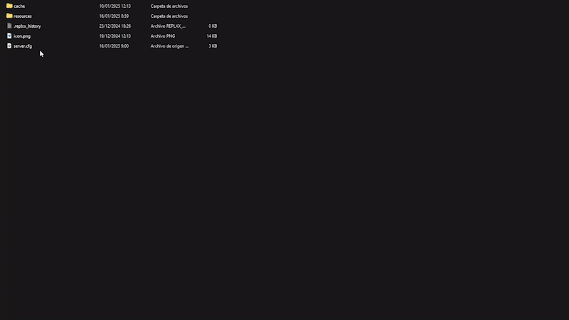

# Installation

## Script Download

Before starting, you must log in to the CFX portal to download the asset. You will be able to download it as many times as you want on the official CFX page. Just as you download it the first time, you will also download it multiple times in the future to get updates.



### Logging in to the CFX Portal

First, log in to the official CFX portal by [clicking here](https://portal.cfx.re/assets/granted-assets).



### Finding Your Assets

Once logged in, navigate to the **Granted Assets** section to access your purchased assets. You can download them by clicking the **"Download"** button.



Remember, if you encounter any issues or errors when starting the asset, you can check here to see if the problem is related.


[what-is-cfx-auth.md](../../getting-started/what-is-cfx-auth.md)


<div data-full-width="false"><figure><figcaption></figcaption></figure></div>

***

## Downloading Dependencies

The dependencies for this asset are mandatory, so please follow the dependency guide completely and use all required files.

When downloading a dependency, ensure the file is properly unzipped and does not include **"-main"** at the end of its name. If it does, please remove it.



### ox\_lib





### bob74\_ipl





### VehicleDeformation (optional)





<figure><figcaption></figcaption></figure>

***

## Update artifacts and gamebuild

Updating to the latest **artifacts** and **gamebuild** is essential to avoid common server issues. Here's how to do it properly:



### Update Artifacts

> To find the best FiveM artifact, visit [artifacts.jgscripts.com](https://artifacts.jgscripts.com). Thanks to JG Scripts.

Completely replace your current artifacts with the latest version. Download the appropriate artifacts for your operating system from the official links:

* **Windows**: [Windows Artifacts](https://runtime.fivem.net/artifacts/fivem/build_server_windows/master/).
* **Linux**: [Linux Artifacts](https://runtime.fivem.net/artifacts/fivem/build_proot_linux/master/).



### Update Gamebuild

Using gamebuild 3095 is recommended as it is the most stable version, ensuring optimal performance and avoiding compatibility issues.

Edit the `server.cfg` file and add the following line:

```plaintext
sv_enforceGameBuild 3095
```



You can see the complete guide to update your server here:


[how-to-update-my-server.md](../../development-guides/before-you-start/how-to-update-my-server.md)


<figure><figcaption></figcaption></figure>

***

## Server.cfg Positioning

To ensure the proper execution of the garage asset, it is crucial to follow a specific starting order in your server configuration. The garage asset should always be started:



### Below your framework

Whether you are using `es_extended` or `qb-core`, the framework must be started first to avoid dependency issues.



### **Below your inventory system**:

This ensures that any vehicle-related items or interactions are properly synced.



### Above your housing system

If you are using a housing asset, it should be started after the garage asset to maintain compatibility or you can put housing and garages in same folder \[folderName].



It is advised to organize the garage asset and its dependencies within a single folder, such as \[garages]. This keeps your server configuration clean and ensures all dependencies are loaded correctly. If dependencies are in separate folders, make sure they are started before the garage.

<figure><figcaption></figcaption></figure>

***

## **Database Installation**

For this step, we highly recommend using **HeidiSQL** to avoid issues, as it provides an updated version of MariaDB. We have a guide that explains step-by-step how to use HeidiSQL. If you choose to use phpMyAdmin, we will not be responsible for any errors that may occur in your database.


[how-to-install-heidisql.md](../../development-guides/before-you-start/how-to-install-heidisql.md)


Select the framework you are using and then execute the SQL in your HeidiSQL. If you encounter errors, ensure you are using the most current version of MariaDB. You can refer to our guide above or search online.

<details>

<summary>Database for esx</summary>

```sql
ALTER TABLE `users` ADD IF NOT EXISTS `shell_garage` TEXT NULL DEFAULT '';

DROP TABLE IF EXISTS `owned_vehicles`;
CREATE TABLE `owned_vehicles` (
    `id` INT(11) NOT NULL AUTO_INCREMENT,
    `owner` VARCHAR(255) NOT NULL COLLATE 'utf8mb4_bin',
    `tag` VARCHAR(50) NULL DEFAULT NULL COLLATE 'utf8mb4_bin',
    `plate` VARCHAR(250) NOT NULL COLLATE 'utf8mb4_bin',
    `vehicle` LONGTEXT NULL DEFAULT NULL COLLATE 'utf8mb4_bin',
    `type` VARCHAR(20) NOT NULL DEFAULT 'vehicle' COLLATE 'utf8mb4_bin',
    `garage` VARCHAR(200) NULL DEFAULT 'OUT' COLLATE 'utf8mb4_bin',
    `impound_data` TEXT NULL DEFAULT '' COLLATE 'utf8mb4_bin',
    `favorite` INT(3) NOT NULL DEFAULT '0',
    `stored` TINYINT(4) NULL DEFAULT '0',
    `jobVehicle` VARCHAR(50) NULL DEFAULT '' COLLATE 'utf8mb4_bin',
    `jobGarage` VARCHAR(50) NULL DEFAULT '' COLLATE 'utf8mb4_bin',
    PRIMARY KEY (`id`) USING BTREE
) COLLATE = 'utf8mb4_bin' ENGINE = InnoDB AUTO_INCREMENT = 1;

ALTER TABLE `owned_vehicles` CONVERT TO CHARACTER SET utf8mb4 COLLATE utf8mb4_bin;

DROP TABLE IF EXISTS `player_garages`;
CREATE TABLE `player_garages` (
    `id` INT(11) NOT NULL AUTO_INCREMENT,
    `owner` VARCHAR(50) NULL DEFAULT NULL COLLATE 'utf8mb4_unicode_ci',
    `name` VARCHAR(50) NULL DEFAULT NULL COLLATE 'utf8mb4_unicode_ci',
    `price` INT(11) NOT NULL,
    `coords` TEXT NULL DEFAULT NULL COLLATE 'utf8mb4_unicode_ci',
    `shell` TEXT NULL DEFAULT NULL COLLATE 'utf8mb4_unicode_ci',
    `type` VARCHAR(50) NULL DEFAULT 'vehicle' COLLATE 'utf8mb4_unicode_ci',
    `holders` TEXT NULL DEFAULT NULL COLLATE 'utf8mb4_unicode_ci',
    `available` INT(11) NULL DEFAULT NULL,
    `job` VARCHAR(50) NULL DEFAULT NULL COLLATE 'utf8mb4_unicode_ci',
    PRIMARY KEY (`id`) USING BTREE
) COLLATE = 'utf8mb4_unicode_ci' ENGINE = InnoDB AUTO_INCREMENT = 27;

ALTER TABLE
    `player_garages`
ADD
    COLUMN IF NOT EXISTS `gang` VARCHAR(50) NULL DEFAULT NULL COLLATE 'utf8mb4_unicode_ci';
```

</details>

<details>

<summary>Database for qbcore</summary>

```sql
ALTER TABLE `players`
    ADD COLUMN IF NOT EXISTS `shell_garage` TEXT NULL DEFAULT '';

ALTER TABLE `player_vehicles`
    ADD COLUMN IF NOT EXISTS `tag` VARCHAR(50) NULL DEFAULT NULL COLLATE 'utf8mb4_bin',
    ADD COLUMN IF NOT EXISTS `impound_data` TEXT NULL DEFAULT '' COLLATE 'utf8mb4_bin',
    ADD COLUMN IF NOT EXISTS `favorite` INT(3) NOT NULL DEFAULT '0',
    ADD COLUMN IF NOT EXISTS `garage` VARCHAR(200) NULL DEFAULT 'OUT' COLLATE 'utf8mb4_bin',
    ADD COLUMN IF NOT EXISTS `type` VARCHAR(50) NULL DEFAULT 'vehicle' COLLATE 'utf8mb4_bin',
    ADD COLUMN IF NOT EXISTS `jobVehicle` VARCHAR(50) NULL DEFAULT '' COLLATE 'utf8mb4_bin',
    ADD COLUMN IF NOT EXISTS `jobGarage` VARCHAR(50) NULL DEFAULT '' COLLATE 'utf8mb4_bin';

DROP TABLE IF EXISTS `player_garages`;
CREATE TABLE `player_garages` (
    `id` INT(11) NOT NULL AUTO_INCREMENT,
    `owner` VARCHAR(50) NULL DEFAULT NULL COLLATE 'utf8mb4_unicode_ci',
    `name` VARCHAR(50) NULL DEFAULT NULL COLLATE 'utf8mb4_unicode_ci',
    `price` INT(11) NOT NULL,
    `coords` TEXT NULL DEFAULT NULL COLLATE 'utf8mb4_unicode_ci',
    `shell` TEXT NULL DEFAULT NULL COLLATE 'utf8mb4_unicode_ci',
    `type` VARCHAR(50) NULL DEFAULT 'vehicle' COLLATE 'utf8mb4_unicode_ci',
    `holders` TEXT NULL DEFAULT NULL COLLATE 'utf8mb4_unicode_ci',
    `available` INT(11) NULL DEFAULT NULL,
    `job` VARCHAR(50) NULL DEFAULT NULL COLLATE 'utf8mb4_unicode_ci',
    PRIMARY KEY (`id`) USING BTREE
) COLLATE = 'utf8mb4_unicode_ci' ENGINE = InnoDB AUTO_INCREMENT = 27;

ALTER TABLE
    `player_garages`
ADD
    COLUMN IF NOT EXISTS `gang` VARCHAR(50) NULL DEFAULT NULL COLLATE 'utf8mb4_unicode_ci';
```

</details>

<figure><figcaption></figcaption></figure>

***

## Deformation and Repair

Quasar Advanced Garages includes a sophisticated Vehicle Deformation system that tracks and applies damage to vehicles persistently until they are repaired. This system operates independently of conventional repair systems found in ESX or QBCore, requiring users to integrate specific exports and commands for vehicle maintenance.&#x20;



### Vehicle Repair Through Exports

To repair vehicles, you can use dedicated exports to either repair a specific vehicle or the nearest one. These exports allow flexibility in integrating repairs into your server.

#### **Repair Specific Vehicle**

Use this export to repair a specific vehicle identified by its plate:

```lua
exports['qs-advancedgarages']:RepairSpecificVehicle(plate)
```

#### **Repair Nearest Vehicle**

Use this export to repair the nearest vehicle without specifying additional values:

```lua
exports['qs-advancedgarages']:RepairNearestVehicle()
```



### Repair by Command

The system includes an administrative command, /repairvehicle, which can repair either the nearby vehicle or the one the admin is currently inside. Command permissions can be configured in your framework by adjusting the PlayerIsAdmin function located in server/custom/framework/\*.

#### **Command: `/repairvehicle`**



### Using the Integrated Repairkit Item

The asset includes a preconfigured `repairkit` item designed to repair vehicles with a realistic animation. To enable the repair kit:

1. Open the `config.lua` file.
2. Set `Config.RepairKit` to true.
3. Ensure no conflicts exist with duplicate `RegisterUsableItem` or `CreateUsableItem` definitions.

The repair kit offers a native, immersive repair experience that integrates seamlessly with the garage system.



***

## Remove vehicles from the map <a href="#remove-vehicles-from-the-map" id="remove-vehicles-from-the-map"></a>

Our garage system, as you might notice, does not allow you to remove vehicles from the map using the classic dv command, since vehicles are persistent and will return to the map after deletion.

For this reason, we created two exclusive commands for administration, which will allow you to remove a specific car from the map or all player vehicles on the map.

<table><thead><tr><th width="232">Command</th><th>Description</th></tr></thead><tbody><tr><td>/mdv</td><td>Alternate command to /dv, this removes the closest car and sends it to impound.</td></tr><tr><td>/mdvall</td><td>Command that sends all OUT cars to impound.</td></tr></tbody></table>

***

## Key bind manipulation

All Quasar Store assets use the same process for modifying Key Binds to ensure consistency and optimized performance across all resources.&#x20;

Below is a clear and detailed guide on how to adjust them to your preferences.


[how-to-change-key-bindings.md](../../development-guides/configure-your-scripts/how-to-change-key-bindings.md)

